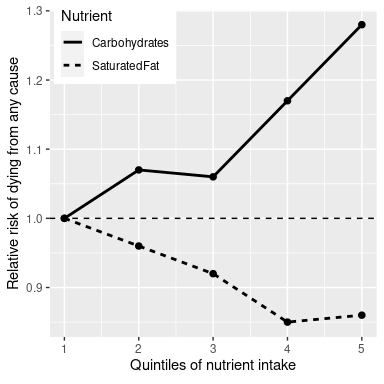

# 1 简介

"总有一天，统计思维会像基础读写那样，成为所有人高效工作的基础能力."——赫伯特·乔治·威尔斯

## 1.1 什么是统计思维？

统计思维是一种理解复杂世界的手段，它用相对简单的术语描述复杂的世界，但仍能捕捉到其结构或功能的本质，并让我们对不确定性知识有一定的感知。统计思维的基础主要来自数学和统计学，但也来自计算机科学、心理学和其他研究领域。

我们可以将统计思维与其他不太可能准确描述世界的思维形式区分开来。特别是，人类的直觉经常试图回答我们使用统计思维可以回答的相同问题，但经常得到错误的答案。例如，近年来大多数美国本土报告表明，他们认为暴力犯罪比前一年更严重。然而，对实际犯罪数据的统计分析表明，事实上自 20 世纪 90 年代以来，暴力犯罪已经稳步*下降*。直觉让我们失望，因为我们依赖最佳猜测(心理学家称之为*试探法*)，而这往往会出错。例如，人类经常使用*可用性试探法*来判断某个事件(如暴力犯罪)的流行程度——也就是说，我们可以非常容易地想到一个暴力犯罪的例子。由于这个原因，我们对犯罪率上升的判断可能更多地反映了新闻报道的增加，尽管犯罪率实际上是下降了。统计思维为我们提供了更准确地理解世界、并且克服人类判断偏见的工具。

## 1.2 应对统计焦虑

许多人带着一些恐惧和焦虑来到他们的第一堂统计学课，尤其是当他们听说为了分析数据他们还必须学习编码时。在我的课堂上，我在第一节课之前给学生做了一个调查，以测试他们对统计数据的态度，要求他们按照 1(非常不同意)到 7(非常同意)的等级对一些陈述进行评级。调查中有一项是“一想到要参加统计学课程，我就紧张”。在最近的一堂课上，几乎三分之二的学生给出了五分或更高的答案，大约四分之一的学生表示他们非常赞同这一说法。所以如果你对开始学习统计学感到紧张，不用感到焦虑，因为并不是你一个人有这样的感觉。

焦虑让人感觉不舒服，但心理学告诉我们，这种情绪的出现可以让我们的注意力更加集中，从而帮助我们在许多任务上做得更好。因此，如果你开始对本书中的内容感到焦虑，告诉你自己许多其他读者也有类似的感觉，这种情绪激发实际上可以帮助你更好地学习这本书(即使看起来不像！).

## 1.3 统计能为我们做什么？

我们可以利用统计数据做三件主要的事情:

*   *描述*:世界是复杂的，我们往往需要用一种我们能理解的简化方式来描述。

*   *决策*:我们经常需要根据数据做出决策，而且通常是在面临不确定性的情况下。
*   *预测*:我们经常希望根据我们对以前情况的了解来预测未来的情况。

让我们来看一个例子，围绕一个我们很多人都感兴趣的问题:我们如何决定吃什么是健康的？有许多不同的指导来源；政府饮食指南，饮食书籍，博客，等等。让我们关注一个具体的问题:食中的饱和脂肪对我们的健康有害吗？

我们可以用常识来回答这个问题。如果我们吃脂肪，那么它会直接转化为我们体内的脂肪，对吗？而且我们都看过动脉被脂肪堵塞的照片，所以吃脂肪会堵塞我们的动脉，对吧？

我们回答这个问题的另一种方式是听权威人士的意见。美国美国食品药品监督管理局的膳食指南将“健康的饮食模式限制饱和脂肪”作为其主要建议之一。你可能希望这些指南比较客观和科学，在某些情况下确实如此，但正如尼娜·泰科尔兹在她的书《大惊喜》中概述的那样，这一建议似乎更多地基于营养研究人员的经验，而不是实际证据。

最后，我们可以看看实际的科学研究。让我们先来看看一项名为 PURE study 的大型研究，该研究调查了来自 18 个不同国家的 13.5 万多人的饮食和健康结果(包括死亡)。在对这个数据集的分析之一(发表于 2017 年*The Lancet*； Dehghan 等人( [2017](ch020.xhtml#ref-dehg:ment:zhan:2017) ) )，纯粹的关于调查者报告做了一项分析，分析了在人们被观测的时间内，各类宏量营养素(包括饱和脂肪和碳水化合物)的摄入与死亡可能性之间的关系。人们被随访的中位时间为 7.4 年，这意味着研究中一半的人被随访的时间更短，另一半被随访超过 7.4 年。图 [1.1](#fig:PureDeathSatFat) 绘制了该研究的一些数据(摘自论文)，显示了饱和脂肪和碳水化合物的摄入与任何原因导致的死亡风险之间的关系。

图 1.1:PURE 研究的数据图，显示了任何原因导致的死亡与饱和脂肪和碳水化合物的相对摄入量之间的关系。

这个图是基于十个数字。为了获得这些数据，研究人员将 135，335 名研究参与者(我们称之为“样本”)分成 5 组(“五分位数”)，根据他们对任一种营养物质的摄入量进行排序；第一个五分位数包含摄入量最低的 20%的人，第五个五分位数包含摄入量最高的 20%的人。然后，研究人员计算了在他们被观测期间，每一组中的人死亡的频率。该图通过与最低五分之一人相比的相对死亡风险来表达这一点:如果该数字大于 1，则意味着该群体中的人比最低五分之一人口更有可能死亡，而如果该数字小于 1，则意味着该群体中的人更有可能死亡。数据非常清楚表明:在实验过程中，摄入更多饱和脂肪的人死亡的可能性更小，死亡率最低的是第四个五分之一人口(也就是说，他们摄入的脂肪比最低的 60%多，但比最高的 20%少)。碳水化合物则相反；一个人吃的碳水化合物越多，在研究过程中死亡的可能性就越大。这个例子展示了我们如何使用统计生成一组简单得多的数字，来描述复杂的数据集；如果我们必须同时查看来自每个研究参与者的数据，我们将会只见树木，不见森林，从而很观测到统计描述时出现的模式。

图 [1.1](#fig:PureDeathSatFat) 中的数字似乎表明，死亡率随着饱和脂肪的摄入减少而减少，随着碳水化合物的摄入增加而增加，但我们也知道，数据中存在很大的不确定性；有些人虽然吃了低碳水化合物食物，但还是过早死亡，同样，有些人吃了大量的碳水化合物，却活到了很老。鉴于这种可变性，我们希望*判定*我们在数据中看到的关系是否足可信，如果饮食和长寿之间没有真正的关系，我们不会期望它们随机发生。统计为我们提供了做出这种决定的工具，通常外界的人认为这是统计的主要目的*。但正如我们将在整本书中看到的那样，这种基于模糊证据的黑白决策的需求经常会让研究人员误入歧途。*

基于这些数据，我们还想对未来的结果做出预测。例如，一家人寿保险公司可能希望使用关于特定人的脂肪和碳水化合物摄入量的数据来预测他们可能会活多久。预测的一个重要方面是，它要求我们从已有的数据中归纳出一些其他情况，通常是在未来要有一定的泛化能力；如果我们的结论仅限于特定时间研究中的特定人群，那么这项研究就不会很有用。一般来说，研究人员必须假设他们的特定样本代表了更大的*人口*，这要求他们以在采样的时候不要带有偏见。例如，如果 PURE 研究招募了所有来自实践素食主义的宗教派别的参与者，那么我们可能不想将结果推广到遵循不同饮食标准的人。

## 1.4 统计学的大局观

有许多非常基础本质的观点贯穿了统计思维的方方面面。斯蒂格勒( [2016](19.html#ref-stig) ) 在其杰出的著作《统计智慧的七大支柱》中概述了其中几个，我在这里对其进行了补充。

### 1.4.1 从数据中学习

一种看待统计的方式是将它视为一套工具，使我们能够从数据中学习。在任何情况下，我们都是从一系列想法或假设开始的。在纯粹的研究中，考虑到关于饱和脂肪的普遍负面教条，研究人员可能已经开始预期吃更多的脂肪会导致更高的死亡率。在本课程的后面，我们将介绍*先验知识*的概念，这意味着反映我们对某一情况的了解。这种先验知识的强度可能不同，通常基于我们的经验量；如果我第一次去一家餐馆，我很可能会对它有多好有一个微弱的预期，但如果我去一家我以前吃过十次的餐馆，我的预期会强烈得多。类似地，如果我在一个餐馆评论网站上看到一家餐馆的平均四星评级仅仅基于三个评论，那么我的期望会比基于 300 个评论时更弱。

统计学为我们提供了一种方法，它用来让新数据更新我们的的置信度，这样统计学和心理学之间就有了很深的联系。事实上，许多来自心理学和生理学的生物学习理论都与来自一个新的领域*机器学习*的想法密切相关。机器学习是统计学和计算机科学两个学科交叉形成的产物，它专注于构建让计算机从经验中学习的算法。虽然统计学和机器学习经常试图解决相同的问题，但这些领域的研究人员经常采取非常不同的方法；著名的统计学家 Leo Breiman 曾经称他们为“两种文化”，以反映他们的方法是多么的不同 ( [Breiman 2001](19.html#ref-breiman2001) ) 。在本书中，我将尝试将两种文化融合在一起，因为这两种方法都为思考数据提供了有用的工具。

### 1.4.2 聚合

另一种思考统计学的方式是“丢弃数据的科学”。在上面纯研究的例子中，我们取了 100，000 多个数字，浓缩成 10 个。这种聚合是统计学中最重要的概念之一。当它第一次被提出时，这是革命性的:如果我们抛开每个参与者的所有细节，那么我们怎么能确定我们没有遗漏重要的东西呢？

正如我们将看到的，统计学为我们提供了表征数据集合结构的方法，并提供了解释为什么这种方法通常很有效的理论基础。然而，同样重要的是要记住，聚合可能会被滥用，以后我们会遇到这样的情况时会说明，聚合可能会提供非常误导性的信息。

### 1.4.3 不确定性

世界是一个不确定的地方。我们现在知道吸烟会导致肺癌，但这种因果关系是概率性的:一名 68 岁的男子在过去 50 年里每天抽两包烟，并继续吸烟，他患肺癌的风险为 15%(7 分之一)，远远高于不吸烟者患肺癌的风险。然而，这也意味着将有许多人一生都在吸烟，却从未患过肺癌。统计学为我们提供了描述不确定性的工具，在不确定性下做出决策，并做出我们可以量化其不确定性的预测。

人们经常看到记者写道，科学研究人员已经“证明”了一些假设。但是统计分析永远不能“证明”一个假设，也就是证明它一定是真的(就像逻辑或数学证明那样)。统计数据可以为我们提供证据，但它总是试探性的，并受制于现实世界中始终存在的不确定性。

### 1.4.4 采样

聚合的概念意味着我们可以通过压缩数据来获得有用的见解——但是我们需要多少数据呢？*采样*的想法是，只要这些样本是以正确的方式获得的，我们就可以所有样本中的少量样本来总结整个样本。例如，PURE 研究招募了约 135，000 人的样本，但其目标是提炼出构成这些人样本的数十亿人的规律。正如我们上面已经讨论过的，获取研究样本的方式至关重要，因为它决定了我们能够在多大程度上概括研究结果。关于抽样的另一个基本观点是，虽然样本越大越好(就其准确代表整个人口的能力而言)，但随着样本越大，回报也越小。事实上，较大样本的好处减少的速度遵循一个简单的数学规则，随着样本大小的平方根增长，因此为了使我们的估计精度加倍，我们需要将样本大小增加四倍。

## 1.5 因果关系和统计

这项纯粹的研究似乎为摄入饱和脂肪和长寿之间的积极关系提供了非常有力的证据，但这并没有告诉我们真正想知道的事情:如果我们吃更多的饱和脂肪，会导致我们长寿吗？这是因为我们不知道吃饱和脂肪和长寿之间是否有直接的因果关系。这些数据与这种关系是一致的，但它们同样与导致更高饱和脂肪和更长寿命的一些其他因素一致。例如，人们可能会想象，因为更富有的人吃更多的饱和脂肪，所以更富有的人往往更长寿，但他们更长寿不一定是因为脂肪的摄入——相反，这可能是因为更好的医疗保健，心理压力的减轻，更好的食品质量或许多其他因素。纯研究调查人员试图解释这些因素，但我们不能确定他们的努力完全消除了其他变量的影响。其他因素可能解释饱和脂肪摄入和死亡之间的关系，这一事实是为什么统计学导论课经常教授“相关性并不意味着因果关系”的一个例子，尽管著名的数据可视化专家爱德华·塔夫特补充说，“但它肯定是一个提示。”

虽然观察性研究(像纯研究)不能最终证明因果关系，我们通常认为因果关系可以通过实验控制和操纵特定因素的研究来证明。在医学上，这样的研究被称为*随机对照试验* (RCT)。比方说，我们想做一个 RCT 来检验增加饱和脂肪摄入量是否会延长寿命。为了做到这一点，我们将对一组人进行抽样，然后将他们分配到治疗组(他们将被告知增加饱和脂肪的摄入量)或对照组(他们将被告知保持和以前一样的饮食)。重要的是，我们要随机地将个人分配到这些组中。否则，选择治疗的人可能在某些方面与选择对照组的人不同——例如，他们可能也更有可能从事其他健康的行为。然后我们会跟踪这些参与者一段时间，看看每组中有多少人死亡。因为我们将参与者随机分配到治疗组或对照组，所以我们有理由相信两组之间没有其他差异会*混淆*治疗效果；然而，我们仍然不能确定，因为有时随机分组产生的治疗组与对照组相比*在某些重要方面有所不同。研究人员经常试图使用统计分析来解决这些混杂因素，但从数据中消除混杂因素的影响可能非常困难。*

许多随机对照试验研究了改变饱和脂肪摄入量是否会导致更健康和更长寿的问题。这些试验关注减少饱和脂肪，因为营养研究人员强烈认为饱和脂肪是致命的；这些研究人员中的大多数可能会争辩说，让人们吃更多的饱和脂肪是不道德的！然而，随机对照试验显示了一个非常一致的模式:总体而言，减少饱和脂肪摄入对死亡率没有明显的影响。

## 1.6 学习目标

阅读完本章后，您应该能够:

*   理解统计的中心目标和基本概念
*   接实验研究和观察研究在因果关系推断方面的区别
*   解释随机化如何提供对因果关系进行推断的能力。

## 1.7 建议读数

*   统计学的七大支柱
*   《品茶的女士:统计学如何让二十世科学发生变革》，作者大卫·萨尔斯堡
*   《直白的统计:从数据中剥丝抽茧》，作者查尔斯·惠兰

