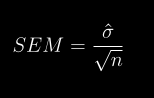

# 7 采样

统计学中的一个基本思想是，我们可以根据部分来推断出整体。在这一章中，我们将介绍统计学中抽样的概念，并讨论它的工作原理。

任何生活在美国的人都会熟悉从政治民意调查中取样的概念，这已经成为我们选举过程的一个核心部分。在某些情况下，这些民意调查在预测选举结果时会非常准确。最著名的例子来自 2008 年和 2012 年美国总统选举，当时民调专家内特·西尔弗(Nate Silver)正确预测了 2008 年 49/50 个州和 2012 年全部 50 个州的选举结果。西尔弗是通过综合了21个不同民调的数据得出这一结论的，这些民调结果在对共和党或民主党的倾向性上有所不同。每一项民意调查都包括来自大约1000名潜在选民的数据——这意味着Silver能够利用仅来自大约21，000人的数据以及其他知识(如这些州过去的投票情况)几乎完美地预测超过1.25亿选民的投票结果。

## 7.1 我们如何采样？

我们抽样的目的是确定感兴趣的总体的统计结果，只使用一个子集。我们这样做主要是为了节省时间和精力——当仅仅一个子集就足以准确估计感兴趣的统计数据时，为什么还要费事去观测整体中的每个样本呢？

在选举示例中，总体是被调查区域中的所有注册选民，样本是由投票组织选择的1000个人的集合。我们选择样本的原则要确保部分能够代表整体，这一点是至关重要的，这也是统计抽样的一个主要目标。很容易想象一个不具有代表性的部分样本；如果民意测验专家只打电话给他们从当地民主党那里得到名字的个人，那么民意测验的结果就不可能代表整体。一般来说，我们抽样时要确保每个成员都有平等的机会被选中。当这一点无法保证时，我们就不得不担心我们所抽样出来的样本带有*偏见*——也就是说，抽样结果无法代表整体(我们称之为*参数*)。请记住，我们通常不知道这个总体参数，因为如果我们知道，那么我们就不需要采样！但是我们会用例子来说明一些关键的观点，在这些例子中我们可以接触到整体。

区分两种不同的采样方式也很重要:有替换和没有替换。在使用**有替换的采样**中，在群体的一个样本被采样后，他们被放回池中，以便他们可能被再次采样。在**无替换的抽样**中，样本一旦被抽样，就没有资格再次被抽样。最常见的是使用无替换采样，但是在某些情况下我们会使用有替换采样，比如我们在第 [8](#resampling-and-simulation) 章中讨论一种叫做*引导*的技术。

## 7.2 采样误差

不管我们的抽样出来的样本有多有代表性，我们从样本中计算出的统计数据很可能会与总体参数略有不同。我们称之为*采样误差*。如果我们取多个样本，我们的统计估计值也会因样本而异；我们将样本间的统计分布称为*抽样分布*。

抽样误差直接关系到我们预测整体统计结果的质量。显然，我们希望从样本中获得的估计值尽可能接近总体统计结果的真实值。然而，即使我们的统计是无偏见的(即，我们期望它具有与总体参数相同的值)，任何特定估计的值都将不同于总体值，并且当抽样误差较大时，这些差异将会较大。因此，减少采样误差是提高测量质量的重要一步。

我们将使用 NHANES 数据集作为例子；我们将假设NHANES数据集的整体是现在我们需要统计的，然后我们将从该整体中随机抽取样本。我们将在下一章详细讲述在计算机中如何产生“随机”样本。

在本例中，我们知道成人身高的平均值(168.35)和标准差(10.16)，因为我们假设NHANES数据集代表了全体。表 [7.1](#tab:sampleExample) 显示了从NHANES数据集中抽取50个样本的统计数据。

<caption>Table 7.1: Example means and standard deviations for several samples of Height variable from NHANES.</caption>

| 身高均值 | 采样数量 |
| --- | --- |
| One hundred and sixty-seven | Nine point one |
| One hundred and seventy-one | Eight point three |
| One hundred and seventy | Ten point six |
| One hundred and sixty-six | Nine point five |
| One hundred and sixty-eight | Nine point five |

样本均值和标准差相似，但不绝对等于总体值。现在，让我们抽取比50样本更多的样本，来计算样本的平均值，并查看平均值的抽样分布。为了很好地估计抽样分布，我们必须决定取多少样本——在这种情况下，我们将取 5000 个样本，这样统计结果更加贴近与真实情况。请注意，像这样的模拟有时需要几分钟才能运行，可能会让您的计算机超负荷运作。图 [7.1](#fig:samplePlot) 中的直方图显示，50 个个体的每个样本的估计均值略有不同，但总体而言，它们以总体均值为中心。5000 个样本平均值(168.3463)非常接近真实总体平均值(168.3497)。

图 7.1:蓝色直方图显示了 NHANES 数据集中超过 5000 个随机样本的平均抽样分布。完整数据集的直方图以灰色显示，以供参考。

## 7.3 平均值的标准误差

在本书的后面，为了对样本统计数据进行推断，描述样本的可变性将变得至关重要。对于平均值，我们使用一个称为平均值(SEM)的*标准误差*的量来计算，可以将其视为平均值的采样分布的标准偏差。为了计算样本平均值的标准误差，我们将估计的标准偏差除以样本大小的平方根:

请注意，如果我们的样本很小(小于 30)，我们必须小心使用估计的标准偏差计算 SEM。

因为我们有来自 NHANES 总体的许多样本，并且我们实际上知道总体 SEM(我们通过将总体标准差除以总体大小来计算)，所以我们可以确认，使用总体参数(1.44)计算的 SEM 非常接近我们从 NHANES 数据集(1.43)获取的样本的均值的观测标准差。

平均值的标准误差公式意味着我们测量的质量涉及两个量:总体可变性和样本大小。因为样本大小是 SEM 公式中的分母，所以在保持总体可变性不变的情况下，较大的样本大小将产生较小的 SEM。我们无法控制人口的可变性，但是我们可以控制样本的大小。因此，如果我们希望改善我们的样本统计(通过减少他们的抽样可变性)，那么我们应该使用更多的样本。然而，这个公式也告诉我们一些关于统计抽样的非常基本的东西——也就是说，较大样本的效用随着样本大小的平方根而减少。这意味着加倍样本量将*而不是*加倍统计数据的质量；而是将其提高了根号2倍。在第 [10.3](#statistical-power) 节中，我们将讨论统计效率，它与这一概念密切相关。

## 7.4 中心极限定理

中心极限定理告诉我们，随着样本量变大，均值的抽样分布将变成正态分布，*即使每个样本内的数据不是正态分布*。

首先，我们来简单介绍一下正态分布。它也被称为*高斯*分布，以卡尔·弗里德里希·高斯的名字命名，虽然不是他发明的，但是高斯在推广正态分布的时候发挥了重要的作用。正态分布用两个参数来描述:平均值(可以认为是峰值的位置)和标准差(指定分布的宽度)。分布的钟形形状永远不会改变，只有它的位置和宽度会改变。正如我们已经在第 3 章中看到的，正态分布在现实世界中收集的数据中是常见的，中心极限定理解释了为什么会发生这种情况。

为了查看中心极限定理的作用，让我们使用NHANES数据集中的变量AlcoholYear，它是高度偏斜的，如图 [7.2](#fig:alcDist50) 的左图所示。由于没有更好的词来形容，暂且叫做时髦分布吧——可以肯定不是正态分布。现在让我们看看这个变量的均值的抽样分布。图 [7.2](#fig:alcDist50) 显示了该变量的抽样分布，通过从 NHANES 数据集中重复抽取 50 个样本并取平均值获得。尽管原始数据显然是非正态的，但抽样分布非常接近正态。

图 7.2:左:NHANES 数据集中变量 AlcoholYear 的分布，它反映了个人一年中饮酒的天数。右图:NHANES 数据集中酒精年份平均值的抽样分布，通过绘制 50 个蓝色重复样本获得。具有相同平均值和标准偏差的正态分布显示为红色。

中心极限定理对统计学很重要，因为它允许我们安全地假设在大多数情况下均值的抽样分布将是正态的。这意味着我们可以利用假设正态分布的统计技术，我们将在下一节中看到。它也很重要，因为它告诉我们为什么正态分布在现实世界中如此普遍；任何时候我们把许多不同的因素结合成一个单一的数字，结果很可能是一个正态分布。例如，任何成年人的身高都取决于他们的基因和经历的复杂混合；即使这些单独的影响可能不是正态分布的，当我们将它们组合起来时，结果也是正态分布的。

## 7.5 学习目标

阅读完本章后，您应该能够:

*   区分总体和样本，以及总体参数和样本统计
*   描述抽样误差和抽样分布的概念
*   计算平均值的标准误差
*   描述中心极限定理如何决定均值的抽样分布的性质

## 7.6 建议书籍

*   Nate Silver 的《信号与噪音:为什么这么多预测失败，但有些却没有》

