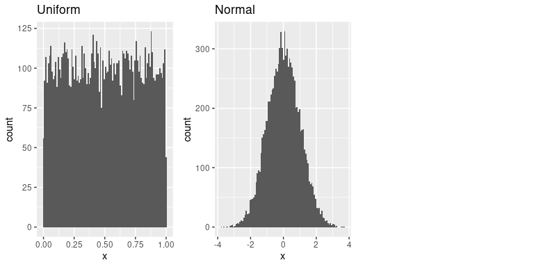
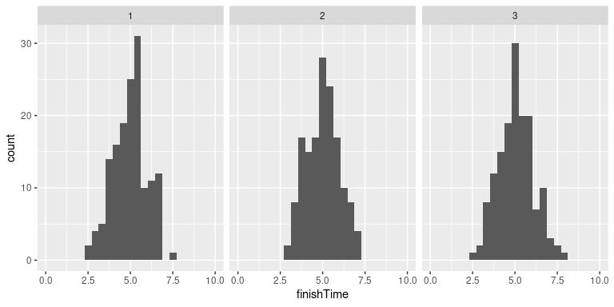
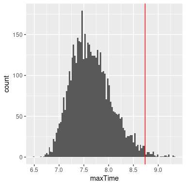

# 8 重采样和模拟

使用计算机的模拟能力已经成为现代统计学的一个重要方面。例如，在实用计算机科学中最重要的一本书，叫做**与数字共舞**，这样写道:

> “如果让我们在精通五英尺厚的分析统计学书籍和中等水平的统计蒙特卡罗模拟能力之间做出选择，我们肯定会选择后者。”

在本章中，我们将介绍蒙特卡罗模拟的概念，并讨论如何用它来进行统计分析。

## 8.1 蒙特卡洛模拟

蒙特卡洛模拟的概念是由数学家斯坦·乌拉姆和尼古拉斯·大都会提出的，作为曼哈顿计划的一部分，他们正在为美国开发一种原子武器。他们需要计算一个中子在与原子核碰撞之前在物质中传播的平均距离，但是他们不能用标准数学来计算。乌兰意识到这些计算可以用随机数来模拟，就像赌场游戏一样。在诸如轮盘赌之类的娱乐场游戏中，数字是随机产生的；为了估计一个特定结果的概率，一个人可以玩这个游戏几百次。乌兰的叔叔曾在摩纳哥的蒙特卡洛赌场赌博，这显然是这种新技术的名称来源。

执行蒙特卡洛模拟有四个步骤:

1.  定义一个可能值的域
2.  从概率分布生成该域内随机数
3.  使用随机数执行计算
4.  合并多次重复的结果

举个例子，假设我想算出课堂测验的时间。我们将假设我们知道测验完成时间的分布是正态分布，平均值为 5 分钟，标准差为 1 分钟。考虑到这一点，我们希望所有学生在 99%的时间内完成考试需要多长时间？有两种方法可以解决这个问题。第一种是用一种叫做极值统计学的数学理论来计算答案。然而，这涉及到复杂的数学。或者，我们可以使用蒙特卡罗模拟。为此，我们需要从正态分布中生成随机样本。

## 8.2 统计学中的随机性

术语“随机”通常在口语中用来指难以琢磨或意想不到的事情，但在统计学中，该术语有一个非常具体的含义:如果一个过程不可预测，它就是*随机的*。例如，如果我掷一枚普通硬币 10 次，一次掷的结果值并不能为我提供任何信息来预测下一次掷的结果。重要的是要注意，某件事不可预测的事实并不一定意味着它不是确定的。例如，当我们抛硬币时，抛硬币的结果是由物理定律决定的；如果我们足够详细地了解所有的条件，我们应该能够预测翻转的结果。然而，许多因素结合在一起，使得掷硬币的结果在实际过程中不可预测。

心理学家表明，人类实际上有相当糟糕的随机感。首先，我们倾向于看到不存在的模式。在极端情况下，这导致了 *pareidolia* 现象，在这种现象中，人们会在随机模式中感知熟悉的物体(例如将一朵云感知为人脸或在一片烤面包中看到圣母玛利亚)。第二，人类倾向于认为随机过程是自我修正的，这导致我们在一场概率游戏中输掉许多回合后，认为自己“应该赢”，这种现象被称为“赌徒心理”。

## 8.3 生成随机数

运行蒙特卡罗模拟需要我们生成随机数。产生真正的随机数(即完全不可预测的数字)只有通过物理过程才有可能，如原子衰变或掷骰子，这些过程或者因为很难获得，或者因为太慢而无法用于计算机模拟(尽管它们可以从 [NIST 随机性信标](https://www.nist.gov/programs-projects/nist-randomness-beacon%5D)中获得)。

一般来说，我们使用通过计算机算法产生的*伪随机数*，而不是真正的随机数；从很难预测的意义上来说，这些数字看起来是随机的，但实际上这一系列数字会在某个时候重复出现。例如，R语言中使用的随机数生成器会在$2^{19937} - 1$次后重复。这远远超过了宇宙的生命周期（以秒为单位），我们通常认为这对于以统计分析为目的的业务场景来应用是没问题的。

大多数统计软件都包括为每个主要概率分布生成随机数的功能，例如均匀分布(0 到 1 之间的所有值相等)、正态分布和二项式分布(例如掷骰子、掷硬币)。图 [8.1](#fig:rngExamples) 显示了从均匀分布函数和正态分布函数生成的数字示例。

图 8.1:从均匀分布(左)或正态分布(右)生成的随机数示例。

也可以使用分布的分位数函数为任何分布生成随机数。这是累积分布函数的倒数；分位数函数不是标识一组值的累积概率，而是标识一组累积概率的值。使用分位数函数，我们可以从均匀分布中生成随机数，然后通过分位数函数将它们映射到感兴趣的分布中。

默认情况下，统计软件中的随机数生成器每次运行时都会生成一组不同的随机数。然而，通过将所谓的*随机种子*设置为特定值，也可以生成完全相同的一组随机数。如果您要查看生成这些图的代码，我们将在本书的许多示例中这样做，以确保这些示例是可重复的。

## 8.4 使用蒙特卡罗模拟

让我们回到课堂测试时间的例子。假设我观测三次测验，并记录每个学生每次考试的完成时间，这可能看起来像图 [8.2](#fig:finishingTimes) 中呈现的分布。

图 8.2:模拟的结束时间分布。

现在想想我们想要回答的问题，我们真正想知道的不是完成时间的分布是什么样的，而是每次测验的最长完成时间的分布是什么样的。为了做到这一点，我们可以模拟一个测验的结束时间，假设结束时间是正态分布的，如上所述；对于每个模拟测验，我们会记录最长的完成时间。我们大量重复这种模拟(5000 次应该足够了)并记录完成次数的分布，如图 [8.3](#fig:finishTimeSim) 所示。

图 8.3:模拟中最大完成时间的分布。

这表明完成时间分布的第 99 个百分位数为 8.74，这意味着如果我们给测验那么多时间，那么每个人都应该完成 99%的时间。记住我们的假设很重要，这一点很重要——如果假设是错误的，那么模拟的结果就是无用的。在这种情况下，我们假设结束时间分布正态分布，具有特定的平均值和标准偏差；如果这些假设是不正确的(它们几乎肯定是不正确的，因为运行时间很少是正态分布的)，那么真实的答案可能会非常不同。

## 8.5 使用模拟进行统计:引导

到目前为止，我们已经使用模拟来演示统计原理，但我们也可以使用模拟来回答真正的统计问题。在这一节中，我们将介绍一个被称为 *bootstrap* 的概念，它让我们可以使用模拟来量化统计估计的不确定性。在本课程的后半部分，我们将会看到其他一些例子，说明如何经常使用模拟来回答统计问题，特别是当理论统计方法不可用或当它们的假设太难满足时。

### 8.5.1 计算bootstrap

在前一章中，我们使用了均值的抽样分布知识来计算均值的标准误差。但是如果我们不能假设估计值是正态分布的，或者我们不知道它们的分布，那该怎么办呢？bootstrap 的想法是使用数据本身来估计答案。这个名字来源于自我提升的想法，表达了我们没有任何外部杠杆来源，所以我们必须依赖数据本身的想法。自举法是由斯坦福大学统计系的布拉德利·埃夫隆提出的，他是世界上最有影响力的统计学家之一。

bootstrap 背后的想法是我们从实际的数据集中重复采样；重要的是，我们用替换的对进行采样，这样同一个数据点通常会在一个样本中出现多次。然后，我们计算每个 bootstrap 样本的感兴趣的统计量，并使用这些估计值的分布作为我们的采样分布。在某种意义上，我们将特定的样本视为整个总体，然后用替换重复采样，以生成我们的分析样本。这使得我们的特定样本是总体的准确反映的假设，这对于较大的样本可能是合理的，但是当样本较小时可能会失效。

让我们从使用 bootstrap 估计 NHANES 数据集中成人身高平均值的抽样分布开始，这样我们就可以将结果与我们之前讨论的平均值的标准误差(SEM)进行比较。

图 8.4:计算 NHANES 数据集中成人平均身高标准误差的自举示例。直方图显示了 bootstrap 样本的均值分布，而红线显示了基于样本均值和标准差的正态分布。

图 [8.4](#fig:bootstrapSEM) 显示自助样本的均值分布非常接近基于正态假设的理论估计值。我们通常不会使用 bootstrap 来计算均值的置信区间(因为我们通常可以假设正态分布适用于均值的抽样分布，只要我们的样本足够大)，但这个示例显示了该方法如何给出与基于正态分布的标准方法大致相同的结果。在我们知道或怀疑正态分布不合适的情况下，bootstrap 通常用于生成其他统计估计的标准误差。此外，在后面的章节中，你将看到我们如何使用 bootstrap 样本来生成样本统计中不确定性的估计。

## 8.6 学习目标

阅读本章后，您应该能够:

*   描述蒙特卡罗模拟的概念。
*   描述统计学中随机性的含义
*   描述伪随机数是如何产生的
*   描述bootstrap法的概念

## 8.7 建议书籍

*   Bradley Efron and Trevor Hastie写的：《计算机时代的统计推断:算法、证据和数据科学》

