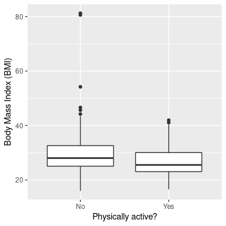
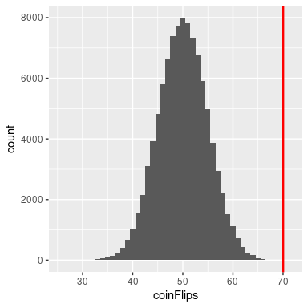
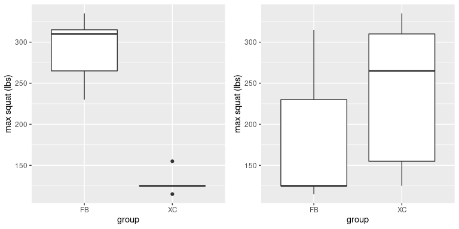
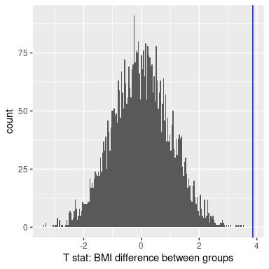
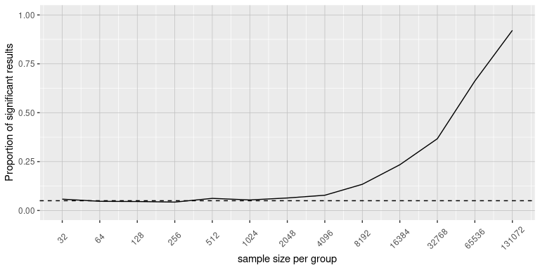

# 9 假设检验

在第一章中，我们讨论了统计学的三个主要目标:

*   形容
*   决定
*   预测

在这一章中，我们将介绍使用统计学进行决策背后的思想——特别是关于某一特定假设是否得到数据支持的决策。


## 9.1 零假设统计检验(NHST)

我们将要讨论的假设检验的具体类型被称为*零假设统计检验* (NHST)。如果你拿起几乎任何科学或生物医学研究出版物，你会看到 NHST 被用来测试假设，在他们的心理学入门教科书中，格里克&津巴多(2002)将 NHST 称为“心理学研究的支柱”。因此，学习如何使用和解释假设检验的结果对于理解许多研究领域的结果是至关重要的。

然而，让你知道 NHST 有很深的缺陷也很重要，许多统计学家和研究人员(包括我自己)认为这是科学中严重问题的原因，我们将在第 18 章讨论。50 多年来，一直有人呼吁放弃 NHST 而采用其他方法(比如我们将在以下章节中讨论的方法):

*   “心理学研究中的统计显著性检验可以被看作是研究过程中一种基本的盲目行为的一个例子”(巴坎，1966)
*   假设检验是“关于什么构成科学进步的错误观点”(卢斯，1988)

NHST 也被广泛误解，主要是因为它违背了我们关于统计假设检验应该如何工作的直觉。让我们看一个例子来了解这一点。


## 9.2 零假设统计检验:一个例子

人们对警察使用随身携带的相机很感兴趣，认为这可以减少武力的使用，改善警察的行为。然而，为了证明这一点，我们需要实验证据，而政府使用随机对照试验来检验这些想法已经变得越来越普遍。2015/2016 年，华盛顿州、DC 政府和 DC 大都会警察局进行了一项关于体戴相机有效性的随机对照试验。军官们被随机分配佩戴或不佩戴随身摄像机，然后随着时间的推移，他们的行为被跟踪，以确定摄像机是否导致更少使用武力和更少的平民对军官行为的投诉。

在我们得到结果之前，让我们问一下你认为统计分析可能如何工作。比方说，我们想具体测试佩戴摄像头是否会减少使用武力的假设。随机对照试验为我们提供了检验假设的数据——即被分配到摄像机组或对照组的官员使用武力的比率。下一个明显的步骤是查看数据，并确定它们是否为这一假设提供了令人信服的证据。那就是:给定数据和我们所知道的一切，随身携带的相机减少武力使用的可能性有多大？

原来这是*而不是*零假设检验的工作方式。相反，我们首先采用我们感兴趣的假设(即，体戴式相机减少使用武力)，并将其颠倒过来，创建一个*无效假设*——在这种情况下，无效假设将是相机不会减少使用武力。重要的是，我们假设零假设是真的。然后，我们查看数据，并确定如果零假设为真，数据的可能性有多大。如果数据在零假设下不太可能，我们可以拒绝零假设，而选择另一个假设*作为我们感兴趣的假设。如果没有足够的证据来拒绝零，那么我们说我们保留(或“未能拒绝”)零，坚持我们最初的假设，即零是真实的。*

理解 NHST 的一些概念，尤其是臭名昭著的“p 值”，在你第一次遇到它们时总是充满挑战，因为它们太反直觉了。正如我们将在后面看到的，还有其他方法提供了一种更直观的方法来处理假设检验(但是有它们自己的复杂性)。然而，在我们讨论这些之前，对你来说，深入了解假设检验的工作原理是很重要的，因为它显然不会很快消失。


## 9.3 零假设检验的过程

我们可以将零假设检验的过程分为几个步骤:

1.  制定一个体现我们预测的假设(*在看到数据*之前)
2.  指定无效假设和替代假设
3.  收集一些与假设相关的数据
4.  根据代表替代假设的数据拟合模型，并计算检验统计量
5.  假设零假设为真，计算该统计的观察值的概率
6.  评估结果的“统计显著性”

举个动手的例子，让我们用 NHANES 的数据提出以下问题:身体活动与身体质量指数有关吗？在 NHANES 数据集中，参与者被问及他们是否定期参加中等或剧烈强度的体育、健身或娱乐活动(存储在变量<math xmlns:epub="http://www.idpf.org/2007/ops" display="inline"><semantics><mrow><mi>P</mi><mi>h</mi><mi>y</mi><mi>s</mi><mi>A</mi><mi>c</mi><mi>t</mi><mi>I</mi><mi>v</mi><mi>e</mi></mrow><annotation encoding="application/x-tex">phy active</annotation></semantics>研究人员还测量了身高和体重，并用它们来计算身体质量指数(身体质量指数):</math>

<semantics><mrow>【B3】【b】<mi>【m】</mi><mi>【I】</mi><mo>=<mfrac><mrow><mi>w</mi></mrow></mfrac></mo></mrow></semantics>


### 9.3.1 第一步:制定感兴趣的假设

我们假设不参加体育活动的人比参加体育活动的人身体质量指数更大。


### 9.3.2 步骤 2:指定无效假设和替代假设

对于步骤 2，我们需要指定我们的零假设(我们称之为<math display="inline"><semantics><msub><mi>H</mi><mn>0</mn></msub><annotation encoding="application/x-tex">H _ 0</annotation></semantics></math>)和我们的替代假设(我们称之为<math display="inline"><semantics><msub><mi>A</mi></msub><annotation encoding="application/x-tex">H _ A</annotation></semantics></math>)。<math display="inline"><semantics><msub><mi>H</mi><mn>0</mn></msub><annotation encoding="application/x-tex">H _ 0</annotation></semantics></math>是我们测试我们感兴趣的假设的基线:也就是说，如果没有影响，我们会期望数据看起来像什么？零假设总是涉及到某种等式(=，<math display="inline"><semantics><mo>≤</mo><annotation encoding="application/x-tex">\乐</annotation></semantics></math> ，或者<math display="inline"><semantics><mo>≥</mo><annotation encoding="application/x-tex">\葛</annotation></semantics></math> )。<math display="inline"><semantics><msub><mi>H</mi><mi>A</mi></msub><annotation encoding="application/x-tex">H _ A</annotation></semantics></math>描述了如果确实存在一种效果，我们所期望的。备择假设总是涉及到某种不等式(<math display="inline"><semantics><mo>≦</mo><annotation encoding="application/x-tex">\ ne</annotation></semantics></math>、>或<)。重要的是，零假设检验是在假设零假设为真的情况下进行的，除非证据显示并非如此。

我们还必须决定是否要测试一个*方向性*或*非方向性*假设。一个无方向性的假设，只是简单的预测会有差异，而没有预测会往哪个方向走。对于身体质量指数/活动的例子，无方向性的零假设是:

<semantics><mrow><mi>【h】</mi><mn>【0】</mn><mo>:</mo><mi>【b】<mi>【m】</mi></mi></mrow></semantics>

相应的无方向性替代假设是:

<semantics><mrow><mi>【h】</mi><mi>【a】</mi><mo>:</mo><mi>【b】<mi>【m】</mi></mi></mrow></semantics>

另一方面，方向假说预测了差异的走向。例如，我们有很强的先验知识来预测从事体育活动的人应该比不从事体育活动的人体重轻，因此我们将提出以下方向性零假设:

<semantics><mrow><mi>【h】</mi><mn>【0】</mn><mo>:</mo><mi>【b】<mi>【m】</mi></mi></mrow></semantics>

和方向选择:

<semantics><mrow><mi>【h】</mi><mi>【a】</mi><mo>:</mo><mi>【b】<mi>【m】</mi></mi></mrow></semantics>

正如我们将在后面看到的，测试一个非方向性假设更为保守，所以这通常是首选，除非有一个强有力的*先验*理由来假设一个特定方向上的效应。假设，包括它们是否有方向性，应该总是在查看数据之前指定！


### 第三步:收集一些数据

在这种情况下，我们将从 NHANES 数据集中抽取 250 个样本。图 [9.1](#fig:bmiSample) 显示了这样一个样本的例子，身体质量指数分别显示了活跃和不活跃的个人，表 [9.1](#tab:summaryTable) 显示了每个组的汇总统计数据。

<caption>Table 9.1: Summary of BMI data for active versus inactive individuals</caption>
| 物理活性的 | 普通 | 意思是 | 存储卡 |
| --- | --- | --- | --- |
| 不 | One hundred and thirty-one | Thirty | Nine |
| 是 | One hundred and nineteen | Twenty-seven | Five point two |



图 9.1:来自 NHANES 数据集的成年人样本的身体质量指数数据的箱线图，根据他们是否报告参加定期身体活动来划分。


### 9.3.4 步骤 4:根据数据拟合模型，并计算测试统计量

接下来，我们想用这些数据来计算一个统计量，最终让我们决定是否拒绝零假设。要做到这一点，模型需要量化相对于数据可变性的支持替代假设的证据数量。因此，我们可以认为检验统计量提供了与数据可变性相比的效果大小的度量。一般来说，这个检验统计量会有一个与之相关的概率分布，因为这允许我们确定我们的统计量的观察值在零假设下的可能性有多大。

在身体质量指数的例子中，我们需要一个检验统计量来检验两个均值之间的差异，因为假设是以每组的身体质量指数均值来表述的。经常用来比较两个平均值的一个统计数据是统计学家威廉·西利·戈塞特(William Sealy Gossett)首先提出的 *t* 统计数据，他为都柏林的吉尼斯啤酒厂工作，并以“学生”为笔名写作——因此，它通常被称为“学生的 *t* 统计数据”。当样本量相对较小且总体标准差未知时， *t* 统计量适用于比较两组的平均值。用于比较两个独立组的 *t* 统计量计算如下:

<semantics><mrow><mi><mo>=</mo> <mrow><mover><mi><mi><mn>n</mn></mi></mi></mover></mrow></mi></mrow><annotation encoding="application/x-tex">【t = \ frac】{ \ bar { x _ 1 }-\ bar { x _ 2 } } { \ sqrt }+\ frac { s _ 1 ^ 2 } { n _ 1 }+\ frac</annotation></semantics>

其中<math xmlns:epub="http://www.idpf.org/2007/ops" display="inline"><semantics><msub><mover><mi>x</mi><mo accent="true">‾</mo></mover><mn>1</mn></msub><annotation encoding="application/x-tex">\ bar { x } _ 1</annotation></semantics></math>和<math xmlns:epub="http://www.idpf.org/2007/ops" display="inline"><semantics><msub><mover><mi>x</mi><mo accent="true">‾</mo></mover><mn>2</mn></msub><annotation encoding="application/x-tex">\ bar { x } _ 2</annotation></semantics></math>是两者的意思 <math xmlns:epub="http://www.idpf.org/2007/ops" display="inline">因为两个自变量之差的方差是每个单个变量的方差之和(<math xmlns:epub="http://www.idpf.org/2007/ops" display="inline"><semantics><mrow><mi>v</mi><mi>A</mi><mi>r</mi><mrow><mo stretchy="true" form="prefix">(</mo><mi>A</mi><mo>—<mi>B</mi></mo></mrow><mo>=</mo><mi>v</mi></mrow> <mo>+</mo><mi>v</mi><mi>A</mi><mi>r</mi><mrow><mo stretchy="true" form="prefix">(</mo><mi>B</mi><mo stretchy="true" form="postfix">)</mo></mrow><annotation encoding="application/x-tex">var(A-B)= var(A)+var(B)</annotation></semantics>【T141)，我们添加的方差为 因此，人们可以将</math></math> *t* 统计视为一种量化组间差异相对于均值间差异的抽样可变性有多大的方法。

根据被称为 *t* 分布的概率分布来分布 *t* 统计量。 *t* 分布看起来非常类似于正态分布，但是它根据自由度的数量而不同。当自由度较大时(比如 1000)，那么 *t* 分布看起来基本上像正态分布，但是当自由度较小时 *t* 分布比正态分布具有更长的尾部(见图 [9.2](#fig:tVersusNormal) )。在最简单的情况下，各组大小相同且方差相等，因为我们计算了两个平均值，因此放弃了两个自由度，所以 *t* 测试的自由度为观察值减 2。在这种情况下，从箱线图可以很清楚地看出，不活动组比活动组更易变，每组中的数字也不同，因此我们需要使用稍微复杂一点的自由度公式，这通常被称为“韦尔奇 t 检验”。公式是:

<math xmlns:epub="http://www.idpf.org/2007/ops" display="block"><semantics><mrow><mstyle mathvariant="normal"><mi>d</mi> <mi>。</mi> <mi>f</mi> <mi>。</mi></mstyle><mo>=</mo><mfrac><msup><mrow><mo stretchy="true" form="prefix">(</mo><mfrac><msubsup><mi>S</mi><mn>1</mn><mn>2</mn></msubsup><msub>T30】n<mn>1</mn></msub></mfrac><mo>+</mo><mfrac><msubsup><mi>S</mi><mn>2</mn><mn>2</mn></msubsup></mfrac></mrow> <mn>2</mn></msup><mrow><mfrac><msup><mrow><mo stretchy="true" form="prefix">(</mo><msubsup><mi>S</mi><mn>1</mn><mn>2</mn></msubsup><mi>/</mi><msub><mi>n</mi><mn>1</mn></msub><mo stretchy="true" form="postfix">)</mo></mrow> <mn>2</mn></msup><mrow><msub><mi>n</mi><mn>1</mn></msub><mo>—T97】1</mo></mrow></mfrac><mo>+</mo><mfrac><msup><mrow><mo stretchy="true" form="prefix">(</mo><msubsup><mi>S</mi><mn>2</mn></msubsup></mrow><mn>2</mn></msup><mrow><msub><mi>n</mi><mn>2</mn></msub><mo>—</mo><mn>1</mn></mrow></mfrac></mrow></mfrac></mrow><annotation encoding="application/x-tex">【mathrm { d . f . } = \frac{\left(\frac{s_1^2}{n_1}+\frac{s_2^2}{n_2}\right)^2}{\frac{\left(s_1^2/n_1\right)^2}{n_1-1}+\frac{\left(s_2^2/n_2\right)^2}{n_2-1}}</annotation></semantics></math> 这将等于<math xmlns:epub="http://www.idpf.org/2007/ops" display="inline"><semantics><mrow><msub><mi>n</mi><mn>1</mn></msub><mo>+</mo><msub><mi>n</mi><mn>2</mn></msub><mo>-<mn>2</mn></mo></mrow><annotation encoding="application/x-tex">n _ 1 对于本例，得出的值为 241.12，略低于从样本量中减去 2 得到的值 248。</annotation></semantics></math>


图 9.2:每个面板显示了叠加在正态分布(红色实线)上的 t 分布(蓝色虚线)。左图显示了具有 4 个自由度的 t 分布，在这种情况下，分布是相似的，但尾部略宽。右图显示了具有 1000 个自由度的 t 分布，在这种情况下，它实际上与正态分布相同。


### 9.3.5 第五步:确定零假设下观察结果的概率

这是 NHST 开始违背我们直觉的一步。我们不是确定给定数据的零假设为真的可能性，而是确定在零假设下观察到的统计数据至少与我们观察到的统计数据一样极端的可能性，因为我们一开始就假设零假设为真！要做到这一点，我们需要知道在零假设下统计的期望概率分布，这样我们就可以问在该分布下结果的可能性有多大。注意，当我说“结果会有多可能”时，我真正的意思是“观察到的结果或一个更极端的结果会有多可能”。(至少)有两个原因让我们需要添加这个警告。首先，当我们谈论连续值时，任何特定值的概率都是零(如果你上过微积分课，你可能还记得)。更重要的是，我们试图确定如果零假设是真的，我们的结果会有多奇怪，任何更极端的结果都会更奇怪，所以当我们计算零假设下的结果的概率时，我们希望计算所有这些更奇怪的可能性。

我们可以使用理论分布(如 *t* 分布)或使用随机化来获得这个“零分布”。在我们转到身体质量指数的例子之前，让我们从一些更简单的例子开始。


#### 9.3.5.1 P 值:一个非常简单的例子

让我们说，我们希望确定一个特定的硬币是否偏向着陆头。为了收集数据，我们将硬币抛 100 次，假设我们数了 70 个头。在这个例子中， <math xmlns:epub="http://www.idpf.org/2007/ops" display="inline"><semantics><mrow><msub><mi>H</mi><mn>0</mn></msub><mo>:</mo><mi>P</mi><mrow><mo stretchy="true" form="prefix">(</mo><mi>H<mi>e</mi><mi>a</mi><mi>d</mi><mi>s</mi><mo stretchy="true" form="postfix">)</mo></mi></mrow>≤<mn>0.5</mn></mrow><annotation encoding="application/x-tex">H \le 0.5</annotation></semantics></math> 和<math xmlns:epub="http://www.idpf.org/2007/ops" display="inline"><semantics><mrow><msub><mi>H</mi><mi>A</mi></msub><mo>:</mo><mi>P</mi><mrow><mo stretchy="true" form="prefix">(</mo><mi>H<mi><mi>A</mi><mi>d</mi><mi>s</mi><mo stretchy="true" form="postfix"><mo stretchy="true" form="postfix">) 我们接下来想问的问题是:如果正面的真实概率是 0.5，我们在 100 次抛硬币中观察到 70 个或更多正面的可能性有多大？我们可以想象这种情况偶尔会发生，但似乎不太可能。为了量化这个概率，我们可以使用*二项分布*:</mo></mo></mi></mi></mrow></mrow></semantics></math>

<math xmlns:epub="http://www.idpf.org/2007/ops" display="block"><semantics><mrow><mi>P</mi><mrow><mo stretchy="true" form="prefix">(</mo><mi>X</mi><mo>≤</mo><mi>k</mi><mo stretchy="true" form="postfix">)</mo></mrow><mo>=</mo><munderover><mo>∑</mo><mrow><mi>I</mi><mo>=</mo><mn>0</mn></mrow><mi>k</mi></munderover><mrow><mo stretchy="true" form="prefix">(</mo></mrow> <msup><mi>p</mi><mi>I</mi><msup><mrow><mo stretchy="true" form="prefix">(</mo><mn>1</mn><mo>—</mo>—t59】p<mo stretchy="true" form="postfix">)</mo></mrow><mrow><mo stretchy="true" form="prefix">(</mo><mi>n</mi>—t71】I</mrow></msup></msup></mrow></semantics></math> 这个等式将告诉我们一定数量的人头(<math xmlns:epub="http://www.idpf.org/2007/ops" display="inline"><semantics><mi>k</mi><annotation encoding="application/x-tex">k</annotation></semantics></math>)或更少的概率，给定特定概率的人头(<math xmlns:epub="http://www.idpf.org/2007/ops" display="inline">【T97)和事件数( <math xmlns:epub="http://www.idpf.org/2007/ops" display="inline"><semantics><mi>N</mi> ) 然而，我们真正想知道的是某个数字或更多数字的概率，我们可以根据概率规则通过从一个数字中减去一个数字来获得:</semantics></math></math>

<semantics><mrow><mi>【p】</mi><mrow><mo stretchy="true" form="prefix">(</mo><mi>【x】</mi>【k】</mrow></mrow></semantics>



图 9.3:100，000 次模拟运行中的头数分布(100 次翻转中)，观察到的 70 次翻转值用垂直线表示。

使用二项式分布，给定 P(头数)=0.5，69 头或更少头的概率是 0.999961，因此 70 头或更多头的概率就是 1 减去该值(0.000039)。这个计算告诉我们，如果硬币确实是公平的，得到 70 或更多人头的可能性非常小。

现在，如果我们没有一个标准的函数来告诉我们人头数的概率呢？我们可以通过模拟来确定它——我们使用 0.5 的真实概率重复投掷硬币 100 次，然后计算这些模拟运行中人头数量的分布。图 [9.3](#fig:coinFlips) 显示了模拟的结果。这里我们可以看到，通过模拟计算的概率(0.000030)非常接近理论概率(0.000039)。


#### 9.3.5.2 使用 *t* 分布计算 p 值

现在，让我们使用 *t* 分布来计算身体质量指数示例的 p 值。首先，我们使用上面计算的样本值来计算 *t* 统计量，我们发现 t = 3.86。我们接下来想问的问题是:如果组间的真实差异为零或更小(即方向性零假设)，我们找到这种规模的 *t* 统计量的可能性有多大？

我们可以用 *t* 分布来确定这个概率。上面我们注意到合适的自由度(校正方差和样本大小的差异后)是 t = 241.12。我们可以使用统计软件中的函数来确定找到大于或等于我们观察值的 *t* 统计值的概率。我们发现 p(t > 3.86，df = 241.12) = 0.000072，这告诉我们，如果零假设真的为真，我们观察到的 *t* 统计值 3.86 是相对不可能的。

在这种情况下，我们使用了方向假设，所以我们只需要查看零分布的一端。如果我们想测试一个无方向性的假设，那么我们就需要能够识别出这种效应的大小有多出乎意料，而不管它的方向如何。在 t 检验的上下文中，这意味着我们需要知道统计数据在正向或负向出现极端的可能性有多大。为此，我们将观察到的 *t* 值乘以-1，因为 *t* 分布以零为中心，然后将两个尾部概率加在一起，得到一个*双尾* p 值:p(t > 3.86 或 t < -3.86，df = 241.12) = 0.000145。这里我们看到，双尾检验的 p 值是单尾检验的两倍，这反映了一个事实，即一个极值不那么令人惊讶，因为它可能发生在任一方向上。

如何选择是使用单尾检验还是双尾检验？双尾检验总是更加保守，所以使用双尾检验总是一个好的选择，除非你有非常充分的理由使用单尾检验。在这种情况下，你应该在查看数据之前写下假设。在第 [18](#doing-reproducible-research) 章中，我们将讨论假设预登记的想法，这是在你看到实际数据之前写下假设的正式想法。你应该*永远不要*在看过数据后就决定如何进行假设检验，因为这会给结果带来严重的偏差。


#### 9.3.5.3 使用随机化计算 p 值

到目前为止，我们已经看到了如何使用 t 分布来计算零假设下的数据概率，但我们也可以使用模拟来完成此操作。基本思想是，我们生成模拟数据，就像我们在零假设下预期的那样，然后询问观察到的数据与那些模拟数据相比有多极端。关键问题是:我们如何生成零假设为真的数据？一般的答案是，我们可以以一种特定的方式随机地重新排列数据，使数据看起来就像 null 真的为真时一样。这类似于 bootstrapping 的想法，在某种意义上，它使用我们自己的数据来得出答案，但它以不同的方式做到这一点。


#### 9.3.5.4 随机化:一个简单的例子

让我们从一个简单的例子开始。假设我们想比较足球运动员和越野跑运动员的平均下蹲能力， 同<math xmlns:epub="http://www.idpf.org/2007/ops" display="inline"><semantics><mrow><msub><mi>H</mi><mn>0</mn></msub><mo>:</mo><msub><mi>μ</mi><mrow><mi>F</mi><mi>B</mi></mrow></msub><mo>≤</mo><msub><mi>μ</mi><mrow><mi>X</mi><mi>C</mi></mrow></msub></mrow><annotation encoding="application/x-tex">H _ 0:\ mu</annotation></semantics></math> <math xmlns:epub="http://www.idpf.org/2007/ops" display="inline"><semantics><mrow><msub><mi>H</mi><mi>A</mi></msub><mo><mo>:</mo><msub><mi>μ</mi><mrow><mi>F</mi><mi>B</mi></mrow></msub><mo>></mo><msub><mi>μ</mi><mrow><mi>X</mi> 我们测量 5 名足球运动员和 5 名越野跑运动员的最大下蹲能力(我们会随机产生，假设<math xmlns:epub="http://www.idpf.org/2007/ops" display="inline"><semantics><mrow><msub><mi>μ</mi><mrow><mi>F</mi><mi>B</mi></mrow></msub><mo>=</mo><mn>300</mn></mrow><annotation encoding="application/x-tex">\ mu _ { FB } = 300</annotation></semantics> <semantics><math xmlns:epub="http://www.idpf.org/2007/ops" display="inline"><semantics><mrow><msub><mi>μ</mi><mrow><mi>X</mi><mi>C</mi></mrow></msub><mo>=</mo><mn>140</mn></mrow><annotation encoding="application/x-tex">\ mu _ { XC } = 140</annotation></semantics></math>，以及<math xmlns:epub="http://www.idpf.org/2007/ops" display="inline"><semantics><mrow><mi>σ【T126 数据见表 [9.2](#tab:squatPlot) 。</mi></mrow></semantics></math></semantics></math></mrow></msub></mo></mrow></semantics></math>

<caption>Table 9.2: Squatting data for the two groups</caption>
| 组 | 蹲着的 | shuffledSquat |
| --- | --- | --- |
| 运货单(freight bill) | Two hundred and sixty-five | One hundred and twenty-five |
| 运货单(freight bill) | Three hundred and ten | Two hundred and thirty |
| 运货单(freight bill) | Three hundred and thirty-five | One hundred and twenty-five |
| 运货单(freight bill) | Two hundred and thirty | Three hundred and fifteen |
| 运货单(freight bill) | Three hundred and fifteen | One hundred and fifteen |
| 容抗 | One hundred and fifty-five | Three hundred and thirty-five |
| 容抗 | One hundred and twenty-five | One hundred and fifty-five |
| 容抗 | One hundred and twenty-five | One hundred and twenty-five |
| 容抗 | One hundred and twenty-five | Two hundred and sixty-five |
| 容抗 | One hundred and fifteen | Three hundred and ten |



图 9.4:左图:足球运动员和越野跑运动员模拟蹲姿能力的方框图。右图:打乱组标签后分配到每个组的受试者的方框图。

从图 [9.4](#fig:squatPlot) 左侧的图中可以明显看出两组之间有很大的差异。我们可以做一个标准的 t 检验来检验我们的假设；对于这个例子，我们将在 R 中使用`t.test()`命令，它给出如下结果:

```
## 
##  Welch Two Sample t-test
## 
## data:  squat by group
## t = 8, df = 5, p-value = 2e-04
## alternative hypothesis: true difference in means between group FB and group XC is greater than 0
## 95 percent confidence interval:
##  121 Inf
## sample estimates:
## mean in group FB mean in group XC 
##              291              129
```

如果我们查看这里报告的 p 值，我们会发现在零假设下这种差异的可能性非常小，使用 *t* 分布来定义零。

现在让我们看看如何用随机化回答同样的问题。基本思想是，如果组间无差异的零假设为真，那么哪一组来自哪一组(足球运动员对越野跑运动员)并不重要——因此，为了创建与我们的实际数据相似但又符合零假设的数据，我们可以随机对数据集中的个体数据进行重新排序，然后重新计算组间的差异。这种混洗的结果显示在表 [9.2](#tab:squatPlot) 中标有“shuffleSquat”的列中，所得数据的箱线图显示在图 [9.4](#fig:squatPlot) 的右侧面板中。


图 9.5:随机调整组成员后，足球组和越野组之间均值差异的 t 值直方图。垂直线表示在两组之间观察到的实际差异，虚线表示该分析的理论 t 分布。

在对数据进行排序后，我们看到两组现在更加相似，事实上越野组现在的平均值略高。现在让我们这样做 10000 次，并存储每次迭代的 *t* 统计数据；如果您在自己的计算机上执行此操作，将需要一段时间才能完成。图 [9.5](#fig:shuffleHist) 显示了所有随机洗牌的 *t* 值的直方图。正如在零假设下所预期的，这个分布以零为中心(分布的平均值是 0.007)。从图中我们还可以看到，洗牌后的 *t* 值的分布大致遵循零假设(均值=0)下的理论 *t* 分布，表明随机化产生了零数据。我们可以通过测量有多少混洗值至少与观察值一样极端来从随机化数据计算 p 值:p(t > 8.01，df = 8)使用随机化= 0.00410。这个 p 值与我们使用 *t* 分布获得的 p 值非常相似，两者都非常极端，表明如果零假设为真，观察到的数据不太可能出现——在这种情况下，我们*知道*这不是真的，因为我们生成了数据。


##### 9.3.5.4.1 随机化:身体质量指数/活动实例

现在，让我们使用随机化来计算身体质量指数/活动示例的 p 值。在这种情况下，我们将随机打乱`PhysActive`变量，并在每次打乱后计算各组之间的差异，然后将我们观察到的 *t* 统计数据与打乱数据集的 *t* 统计数据的分布进行比较。图 [9.6](#fig:simDiff) 显示了混洗样本中 *t* 值的分布，我们还可以计算出找到与观察值一样大或比观察值更大的值的概率。从随机化获得的 p 值(0.000000)非常类似于使用 *t* 分布获得的值(0.000075)。随机化检验的优点是，它不要求我们假设每个组的数据都是正态分布的，尽管 t 检验通常对违反该假设的情况非常稳健。此外，当我们没有像 t 检验那样的理论分布时，随机化检验可以允许我们计算统计的 p 值。



图 9.6:组标签重排后的 t 统计直方图，观察到的 t 统计值显示在垂直线中，值至少与观察到的值一样极端，以浅灰色显示

当我们使用随机化测试时，我们必须做一个主要假设，我们称之为*可交换性*。这意味着所有的观察值都以相同的方式分布，这样我们可以在不改变总体分布的情况下交换它们。当数据中有相关的观察值时，这种情况会出现。例如，如果我们有来自 4 个不同家庭的个体的数据，那么我们不能假设个体是可交换的，因为兄弟姐妹之间的关系会比他们与来自其他家庭的个体之间的关系更近。一般来说，如果数据是通过随机抽样获得的，那么可交换性假设应该成立。


### 9.3.6 步骤 6:评估结果的“统计显著性”

下一步是确定上一步得出的 p 值是否足够小，以至于我们愿意拒绝零假设，并得出替代方案为真的结论。我们需要多少证据？这是统计学中最有争议的问题之一，部分原因是它需要主观判断——没有“正确”的答案。

从历史上看，这个问题最常见的答案是，如果 p 值小于 0.05，我们应该拒绝零假设。这来自罗纳德·费雪的著作，他被称为“20 世纪统计学中最重要的人物” ( [Efron 1998](19.html#ref-efron1998) ) :

> “如果 P 在 0.1 和 0.9 之间，当然没有理由怀疑被检验的假设。如果低于 0.02，则强烈表明该假设未能解释全部事实。如果我们在 0.05 处画一条传统的线，我们就不会经常误入歧途……在我们可以说的水平上画这条线是方便的:要么在治疗中有什么东西，要么发生了巧合，比如在二十次试验中不超过一次" ( [R. A. Fisher 1925](19.html#ref-fisher1925statistical) )

然而，费希尔从未打算将<math display="inline"><semantics><mrow><mi>p</mi><mo><</mo><mn>0.05</mn></mrow><annotation encoding="application/x-tex">p<0.05</annotation></semantics></math>作为一个固定的规则:

> “没有一个科学工作者有一个固定的重要性水平，年复一年，在所有情况下，他拒绝假设；他会根据自己的证据和想法来考虑每一个具体的案例

相反，p < .05 很可能成为一种惯例，这是因为在计算使计算统计数据的任意值的 p 值变得容易之前，依赖于使用的 p 值表。所有的表都有一个 0.05 的条目，这使得很容易确定一个人的统计值是否超过了达到该显著性水平所需的值。

统计阈值的选择仍然存在很大争议，最近(Benjamin et al .，2018)有人建议将默认阈值从. 05 更改为. 005，使其更加严格，从而更难拒绝零假设。这一举动在很大程度上是由于人们越来越担心，从一个显著结果中获得的证据在<math display="inline"><semantics><mrow><mo><</mo></mrow><annotation encoding="application/x-tex">p<</annotation></semantics></math>处相对薄弱；我们将在第 [18](#doing-reproducible-research) 章讨论再现性时回到这一点。


#### 9.3.6.1 假设检验作为决策:尼曼-皮尔逊方法

费希尔认为 p 值可以为特定的假设提供证据，但统计学家杰吉·内曼和埃贡·皮尔森强烈反对。相反，他们建议我们从长期误差率的角度来考虑假设检验:

> “没有一个基于概率理论的测试本身能够提供任何有价值的证据来证明一个假设的真假。但是我们可以从另一个角度来看测试的目的。我们不希望知道每一个单独的假设是对还是错，我们可以寻找规则来管理我们对它们的行为，在遵循这些规则的过程中，我们可以确保，在长期的经验中，我们不会经常错" ( [J. Neyman 和 Pearson 1933](19.html#ref-Neyman289) )

那就是:我们无法知道哪些具体的决定是对的还是错的，但是如果我们遵守规则，我们至少可以知道我们的决定从长远来看会有多少次是错的。

为了理解尼曼和皮尔森提出的决策框架，我们首先需要讨论统计决策可能出现的结果。现实有两种可能的状态(<math xmlns:epub="http://www.idpf.org/2007/ops" display="inline"><semantics><msub><mi>H</mi><mn>0</mn></msub><annotation encoding="application/x-tex">H _ 0</annotation></semantics></math>为真，或者<math xmlns:epub="http://www.idpf.org/2007/ops" display="inline"><semantics><msub><mi>H</mi><mn>0</mn></msub><annotation encoding="application/x-tex">H _ 0</annotation></semantics></math>为假)，以及两种可能的决策(拒绝<math xmlns:epub="http://www.idpf.org/2007/ops" display="inline"><semantics><msub><mi>H</mi><mn>0【T33)有两种方法可以让我们做出正确的决定:</mn></msub></semantics></math>

*   我们可以拒绝<math display="inline"><semantics><msub><mi>H</mi><mn>0</mn></msub><annotation encoding="application/x-tex">H _ 0</annotation></semantics></math>当它为假时(在信号检测理论的语言中，我们称这为*击中*
*   我们可以保留<math display="inline"><semantics><msub><mi>H</mi><mn>0</mn></msub><annotation encoding="application/x-tex">H _ 0</annotation></semantics></math>当它为真时(在这个上下文中有点令人困惑，这叫做*正确拒绝*)

我们还会犯两种错误:

*   我们可以拒绝<math display="inline"><semantics><msub><mi>H</mi><mn>0</mn></msub><annotation encoding="application/x-tex">H _ 0</annotation></semantics></math>当它实际上是真的时候(我们称之为*虚警*，或*I 型错误*
*   我们可以保留<math display="inline"><semantics><msub><mi>H</mi><mn>0</mn></msub><annotation encoding="application/x-tex">H _ 0</annotation></semantics></math>当它实际上是假的时候(我们称这个为*错过*，或者*类型二错误*

奈曼和皮尔森创造了两个术语来描述这两种错误的长期概率:

*   p(类型 I 错误)=<semantics><mi><annotation encoding="application/x-tex">\ alpha</annotation></mi></semantics>
*   p(ⅱ型误差)=<math display="inline"><semantics><mi>β</mi><annotation encoding="application/x-tex">\β</annotation></semantics></math>

也就是说，如果我们将<math display="inline"><semantics><mi>α</mi><annotation encoding="application/x-tex">\α</annotation></semantics></math>设置为. 05，那么从长远来看，我们应该有 5%的时间犯 I 型错误。尽管通常将<math display="inline"><semantics><mi>α</mi><annotation encoding="application/x-tex">\α</annotation></semantics></math>设置为 0.05，但对于一个真实存在的效应，可接受水平的标准值是 0.2——也就是说，我们愿意接受有 20%的时间无法检测到它。当我们在第 [10.3 节](#statistical-power)中讨论统计功效时，我们将回到这一点，这是第二类错误的补充。


### 9.3.7 重大结果是什么意思？

关于 p 值的实际含义有很大的混乱(Gigerenzer，2004)。假设我们做了一个实验，比较不同条件下的平均值，我们发现一个 p 值为 0.01 的差异。人们可能会有几种可能的解释。


#### 9.3.7.1 是否意味着零假设为真的概率是 0.01？

不记得在零假设检验中，P 值是给定零假设的数据的概率(<math xmlns:epub="http://www.idpf.org/2007/ops" display="inline"><semantics><mrow><mi>P</mi><mrow><mo stretchy="true" form="prefix">(</mo><mi>d</mi><mi>a</mi><mi>t</mi><mi>a</mi><mo stretchy="false" form="prefix">|</mo><msub><mi>H</mi><mn>0</mn></msub></mrow></mrow><annotation encoding="application/x-tex">P(数据它并不保证关于给定数据的零假设概率的结论(<math xmlns:epub="http://www.idpf.org/2007/ops" display="inline"><semantics><mrow><mi>P</mi><mrow><mo stretchy="true" form="prefix">(</mo><msub><mi>H</mi><mn>0</mn></msub><mo stretchy="false" form="prefix">|</mo><mi>d</mi><mi>a</mi><mi>t</mi><mi>a</mi></mrow></mrow><annotation encoding="application/x-tex">P 当我们在下一章讨论贝叶斯推断时，我们将回到这个问题，因为贝叶斯定理让我们以一种允许我们在给定数据的情况下确定假设的概率的方式来反演条件概率。</annotation></semantics></math></annotation></semantics></math>


#### 9.3.7.2:这是否意味着你做出错误决定的概率是 0.01？

不.这将是<math display="inline"><semantics><mrow><mi>P</mi><mrow><mo stretchy="true" form="prefix">(</mo><msub><mi>H</mi><mn>0</mn></msub><mo stretchy="false" form="prefix">|</mo><mi>d</mi><mi>a</mi><mi>t</mi><mi>a</mi><mo stretchy="true" form="postfix">)</mo></mrow></mrow><annotation encoding="application/x-tex">P(H _ 0 | data)</annotation></semantics></math>但记住为


#### 9.3.7.3:这是不是意味着如果你再次进行这项研究，99%的情况下你都会得到同样的结果？

不。p 值是关于特定数据集在空值下的可能性的陈述；它不允许我们对未来事件(如复制)的可能性做出推断。


#### 9.3.7.4:这是否意味着你发现了一个实际上很重要的效应？

不会。*统计意义*和*实际意义*有本质区别。举个例子，假设我们进行了一项随机对照试验来检查特定饮食对体重的影响，我们发现在 p<0.05 时有显著的统计学影响。这并不能告诉我们实际减少了多少重量，我们称之为*效应大小*(将在第 [10 章](#ci-effect-size-power)中详细讨论)。如果我们考虑一项关于减肥的研究，那么我们可能不认为减掉一盎司(即几片薯片的重量)有什么实际意义。让我们看看随着样本量的增加，我们检测 1 盎司显著差异的能力。

图 [9.7](#fig:sigResults) 显示了显著结果的比例如何随着样本量的增加而增加，因此，对于非常大的样本量(总共约 262，000 名受试者)，当两种饮食之间的体重减轻量相差 1 盎司时，我们将在超过 90%的研究中发现显著结果。虽然这些在统计学上是显著的，但大多数医生不会认为体重减轻一盎司在实践上或临床上是显著的。当我们回到第 [10.3 节](#statistical-power)中的*统计功效*的概念时，我们将更详细地探讨这种关系，但是从这个例子中应该已经清楚，统计显著性不一定表示实际显著性。



图 9.7:非常小的变化(1 盎司，大约 0.001 标准偏差)的显著结果的比例与样本大小的函数关系。


## 现代背景下的 NHST:多重考验

到目前为止，我们已经讨论了我们感兴趣的测试单个统计假设的例子，这与通常一次只测量几个变量的传统科学是一致的。然而，在现代科学中，我们经常可以测量每个人的数百万个变量。例如，在量化整个基因组的遗传研究中，每个个体可能有数百万个测量值，而在我的小组所做的脑成像研究中，我们经常同时从大脑中超过 100，000 个位置收集数据。当在这些环境中应用标准假设检验时，除非我们采取适当的措施，否则会发生不好的事情。

让我们看一个例子来看看这是如何工作的。人们对了解可能使个体易患精神分裂症等重大精神疾病的遗传因素有很大兴趣，因为我们知道，患有精神分裂症的个体之间约 80%的差异是由于遗传差异。人类基因组计划和随之而来的基因组科学革命提供了工具来检查人类在基因组上的许多不同之处。近年来使用的一种方法被称为*全基因组关联研究* (GWAS)，其中每个人的基因组在一百万或更多的地方被表征，以确定他们在每个位置具有遗传密码的哪些字母，重点关注人类往往经常不同的位置。在确定这些之后，研究人员在基因组的每个位置进行了统计测试，以确定被诊断患有精神分裂症的人是否更有可能或更不可能在该位置具有特定版本的遗传序列。

让我们想象一下，如果研究人员只是简单地问测试在来自零分布的 p <.05 at="" each="" location="" when="" in="" fact="" there="" is="" no="" true="" effect="" any="" of="" the="" locations.="" to="" do="" this="" we="" generate="" a="" large="" number="" simulated="" xmlns:epub="http://www.idpf.org/2007/ops"> t 值处是否显著，并问其中有多少在 p<0.05 处显著，会发生什么。让我们这样做很多次，每次都计算出有多少测试结果是显著的(见图 [9.8](#fig:nullSim) )。


图 9.8:左图:当实际上没有真实效果时，每组一百万个统计测试中显著结果数量的直方图。右图:对多个测试应用 Bonferroni 校正后，所有模拟运行的重要结果数量的直方图。

这表明，在每次运行中，大约 5%的测试是显著的，这意味着如果我们使用 p< .05 as our threshold for statistical significance, then even if there were no truly significant relationships present, we would still “find” about 500 genes that were seemingly significant in each study (the expected number of significant results is simply <math xmlns:epub="http://www.idpf.org/2007/ops" display="inline"><semantics><mrow><mi>n</mi><mo>*</mo><mi>α</mi></mrow><annotation encoding="application/x-tex">n * \α</annotation></semantics></math>)。这是因为虽然我们控制了每个测试的错误，但是我们没有控制整个*系列*测试的错误率(称为*系列错误*),如果我们要查看大量测试的结果，这是我们真正想要控制的。使用 p < .05，我们在上面例子中的家庭误差率是 1——也就是说，我们几乎可以保证在任何特定的研究中至少犯一个错误。

控制家族误差的一个简单方法是将α水平除以测试次数；这就是所谓的 *Bonferroni* 修正，以意大利统计学家 Carlo Bonferroni 命名。使用上面例子中的数据，我们在图 [9.8](#fig:nullSim) 中看到，只有大约 5%的研究使用 0.000005 的校正α水平而不是 0.05 的名义水平显示出任何显著的结果。我们已经有效地控制了家族误差，因此在我们的研究中出现任何*误差的概率被控制在 0 . 05 左右。*


## 9.5 学习目标

*   确定假设检验的组成部分，包括感兴趣的参数、无效假设和替代假设，以及检验统计量。
*   描述 p 值的正确解释以及常见的误解
*   区分假设检验中的两种错误，以及决定它们的因素。
*   描述如何使用重采样来计算 p 值。
*   描述多重测试的问题，以及如何解决
*   描述对零假设统计测试的主要批评


## 9.6 建议读数

*   [Gerd Gigerenzer 的无脑统计](https://library.mpib-berlin.mpg.de/ft/gg/GG_Mindless_2004.pdf)


