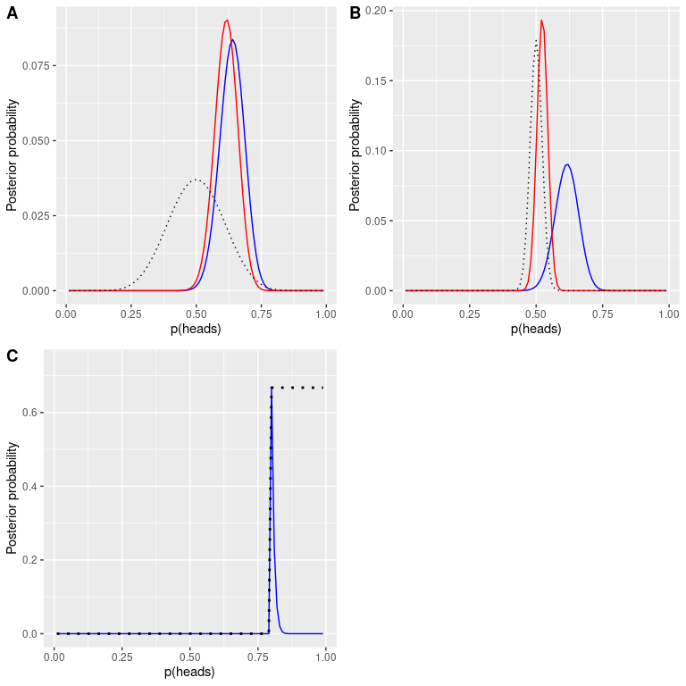
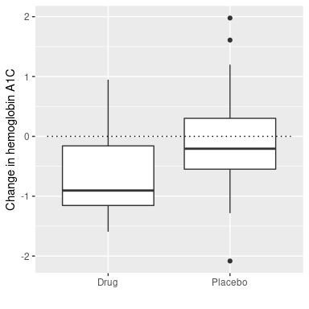
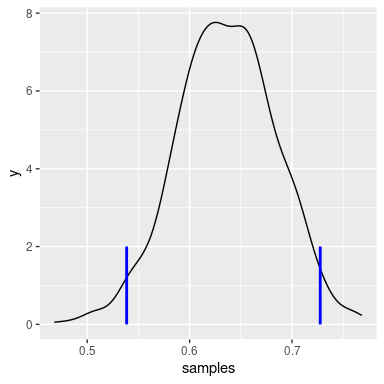
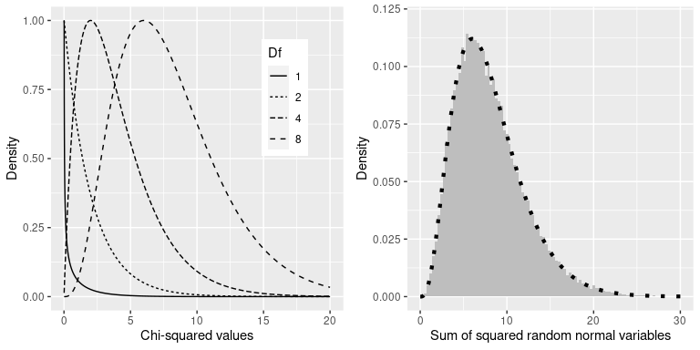

## 10.1 置信区间

到目前为止，我们在这本书中的重点是估计统计数据的具体值。例如，假设我们想估计 nhanes 数据集中成年人的平均体重。我们可以从数据集中提取一个样本并估计平均值：

```r
# take a sample from adults in NHANES and summarize their weight

sampSize <- 250
NHANES_sample <- sample_n(NHANES_adult, sampSize)

sample_summary <-
  NHANES_sample %>%
  summarize(
    meanWeight = mean(Weight),
    sdWeight = sd(Weight)
  )
pander(sample_summary)
```

<colgroup><col style="width: 18%"> <col style="width: 13%"></colgroup> 
| 平均重量 | S 重量 |
| --- | --- |
| 82.77 美元 | 22.27 条 |

在这个样本中，平均重量是 82.77 千克。我们将其称为 _ 点估计 _，因为它为我们提供了一个描述差异的单一数字。然而，我们从前面对抽样误差的讨论中知道，这个估计有一些不确定性，用标准误差来描述。您还应该记住，标准误差由两个部分决定：总体标准偏差（分子）和样本大小的平方根（分母）。总体标准偏差是一个未知但固定的参数，不在我们的控制范围内，而样本量 _ 在我们的控制范围内。因此，我们可以通过增加样本量来降低估计的不确定性——达到整个群体规模的极限，此时完全没有不确定性，因为我们可以直接从整个群体的数据中计算群体参数。_

您可能还记得之前我们引入了 _ 置信区间 _ 的概念，这是一种描述统计估计不确定性的方法。请记住，置信区间描述了一个平均包含给定概率的真实总体参数的区间；例如，95%置信区间是一个将捕获 95%时间的真实总体参数的区间。请再次注意，这不是关于填充参数的语句；任何特定的置信区间都包含或不包含真参数。正如信任区间的发明者 Jerzy Neyman 所说：

> “参数是一个未知常数，不能对其值作出概率陈述。”（J Neyman 1937）

平均值的置信区间计算如下：


其中临界值由估计值的抽样分布确定。那么，重要的问题是抽样分布是什么。

#

## 10.1.1 使用正态分布的置信区间

如果我们知道总体标准差，那么我们可以用正态分布来计算置信区间。我们通常不这样做，但对于我们的 nhanes 数据集示例，我们这样做（重量为 21.3）。

假设我们要计算平均值的 95%置信区间。临界值将是标准正态分布的值，它捕获了 95%的分布；这些仅仅是分布的 2.5%和 97.5%，我们可以使用 r 中的`qnorm()`函数计算得出。因此，平均值（）的置信区间为：


利用样本（82.77）的估计平均值和已知的总体标准差，我们可以计算出[80.13,85.41]的置信区间。

#

## 10.1.2 使用 t 分布的置信区间

如上所述，如果我们知道总体标准差，那么我们可以使用正态分布来计算我们的置信区间。但是，一般情况下，我们不会——在这种情况下，_t_ 分布更适合作为采样分布。记住，t 分布比正态分布略宽，特别是对于较小的样本，这意味着置信区间将比我们使用正态分布时的置信区间略宽。这包含了当我们基于小样本得出结论时产生的额外不确定性。

我们可以用类似于上述正态分布的方法计算 95%的置信区间，但临界值是由 _t_ 分布的 2.5%和 97.5%确定的，我们可以用 r 中的`qt()`函数计算，因此平均值（）的 ence 间隔为：


其中是临界 t 值。对于 nhanes 权重示例（样本大小为 250），置信区间为：

```r
# compute confidence intervals for weight in NHANES data

sample_summary <-
  sample_summary %>%
  mutate(
    cutoff_lower = qt(0.025, sampSize),
    cutoff_upper = qt(0.975, sampSize),
    CI_lower = meanWeight + cutoff_lower * sdWeight / sqrt(sampSize),
    CI_upper = meanWeight + cutoff_upper * sdWeight / sqrt(sampSize)
  )
pander(sample_summary)
```

<colgroup><col style="width: 17%"> <col style="width: 14%"> <col style="width: 19%"> <col style="width: 19%"> <col style="width: 14%"> <col style="width: 14%"></colgroup> 
| meanWeight | sdWeight | 切断阀 | 上切断 | Ci_ 下 | Ci_ 上部 |
| --- | --- | --- | --- | --- | --- |
| 82.77 | 22.27 | -1.97 条 | 1.97 条 | 80 | 85.54 美元 |

请记住，这并不能告诉我们关于真实总体值在这个区间内的概率，因为它是一个固定参数（我们知道它是 81.77，因为在这种情况下我们有整个总体），并且它或者不在这个特定区间内（i 在这种情况下，确实如此）。相反，它告诉我们，从长远来看，如果我们使用这个过程计算置信区间，95%的置信区间将捕获真正的总体参数。

#

## 10.1.3 置信区间和样本量

由于标准误差随样本量的减小而减小，平均置信区间应随着样本量的增大而变窄，从而为我们的估计提供了越来越严格的界限。图[10.1](#fig:CISampSize)显示了置信区间将如何作为权重示例的样本大小函数而变化的示例。从图中可以明显看出，随着样本量的增加，置信区间变得越来越紧，但是增加样本会产生递减的回报，这与置信区间项的分母与样本量的平方根成正比的事实相一致。E.



图 10.1 样本量对平均值置信区间宽度影响的示例。

#

## 10.1.4 使用引导程序计算置信区间

在某些情况下，我们不能假定正态性，或者我们不知道统计的抽样分布。在这些情况下，我们可以使用引导程序（我们在[8](#resampling-and-simulation)章中介绍了它）。作为提醒，引导程序需要重复地用替换项对数据 _ 进行重采样，然后使用这些样本上计算的统计分布作为统计分布的抽样代理。_

早些时候，我们使用手工编写的代码运行引导程序，但是 R 包含一个名为`boot`的包，我们可以使用它运行引导程序并计算置信区间。让我们用它来计算 nhanes 样本中权重的置信区间。

```r
# compute bootstrap confidence intervals on NHANES weight data

meanWeight <- function(df, foo) {
  return(mean(df[foo, ]$Weight))
}

bs <- boot(NHANES_sample, meanWeight, 1000)

# use the percentile bootstrap
bootci <- boot.ci(bs, type = "perc")
print("Bootstrap confidence intervals:")
```

```r
## [1] "Bootstrap confidence intervals:"
```

```r
tibble(
  lower = bootci$perc[4],
  upper = bootci$perc[5]
) %>%
  pander()
```

<colgroup><col style="width: 11%"> <col style="width: 11%"></colgroup> 
| 降低 | 上面的 |
| --- | --- |
| 第 80.12 条 | 85.71 美元 |

这些值与使用上面的 t 分布得到的值相当接近，尽管不完全相同。

#

## 10.1.5 置信区间与假设检验的关系

置信区间与假设检验有着密切的关系。尤其是，如果置信区间不包括无效假设，那么相关的统计检验将具有统计学意义。例如，如果您使用测试样本的平均值是否大于零，您可以简单地检查是否在平均值的 95%置信区间内包含零。

如果我们想比较两个条件的平均值，事情会变得更棘手（Schenker 和绅士 2001）。有几个情况是清楚的。首先，如果每个均值都包含在另一个均值的置信区间内，那么在所选置信水平上肯定没有显著差异。其次，如果置信区间之间没有重叠，那么在所选水平上肯定存在显著差异；事实上，该测试基本上是 _ 保守 _，因此实际误差率将低于所选水平。但是，如果置信区间彼此重叠，但不包含另一组的平均值，情况会怎样呢？在这种情况下，答案取决于两个变量的相对可变性，没有一般的答案。一般来说，我们应该避免对重叠的置信区间使用“视觉测试”，因为它通常会导致较高的假阴性（II 型）错误率。

## 10.2 效果大小

> “统计显著性是最不有趣的结果。你应该用数量尺度来描述结果——不仅仅是治疗对人有影响，还有它对人有多大的影响。”基因玻璃（Ref）

在最后一章中，我们讨论了统计学意义不一定反映实际意义的观点。为了讨论实际意义，我们需要一种标准的方法来根据实际数据描述效应的大小，我们称之为 _ 效应大小 _。在本节中，我们将介绍这个概念，并讨论计算影响大小的各种方法。

效应大小是一种标准化的测量，它将某些统计效应的大小与参考量（如统计的可变性）进行比较。在一些科学和工程领域中，这个概念被称为“信噪比”。有许多不同的方法可以量化效果大小，这取决于数据的性质。

#

## 10.2.1 科恩

影响大小最常见的度量之一是以统计学家雅各布·科恩（Jacob Cohen）的名字命名的 _ 科恩的 D_，他在 1994 年发表的题为“地球是圆的（P&lt；.05）”的论文中最为著名。它用于量化两种方法之间的差异，根据它们的标准偏差：


其中和是两组的平均值，而是合并标准偏差（这是两个样本的标准偏差的组合，由样本大小加权）：


其中和是样品尺寸，和分别是两组的标准偏差。

有一个常用的尺度可以用科恩的 D 来解释效应的大小：

<colgroup><col style="width: 8%"> <col style="width: 22%"></colgroup> 
| D | 解释 |
| --- | --- |
| 0.2 条 | 小的 |
| 0.5 倍 | 中等的 |
| 0.8 倍 | 大的 |

观察一些常见的理解效果，有助于理解这些解释。

```r
# compute effect size for gender difference in NHANES

NHANES_sample <-
  NHANES_adult %>%
  drop_na(Height) %>%
  sample_n(250)

hsum <-
  NHANES_sample %>%
  group_by(Gender) %>%
  summarize(
    meanHeight = mean(Height),
    varHeight = var(Height),
    n = n()
  )

#pooled SD
s_height_gender <- sqrt(
  ((hsum$n[1] - 1) * hsum$varHeight[1] + (hsum$n[2] - 1) * hsum$varHeight[2]) / 
    (hsum$n[1] + hsum$n[2] - 2)
)

#cohen's d
d_height_gender <- (hsum$meanHeight[2] - hsum$meanHeight[1]) / s_height_gender

sprintf("Cohens d for male vs. female height = %0.2f", d_height_gender)
```

```r
## [1] "Cohens d for male vs. female height = 1.95"
```

参照上表，身高性别差异的影响大小（d=1.95）很大。我们也可以通过观察样本中男性和女性身高的分布来看到这一点。图[10.2](#fig:genderHist)显示，这两个分布虽然仍然重叠，但分离得很好，突出了这样一个事实：即使两个组之间的差异有很大的影响大小，每个组中的个体也会更像另一个组。



图 10.2 nhanes 数据集中男性和女性身高的平滑柱状图，显示了明显不同但明显重叠的分布。

同样值得注意的是，我们很少在科学中遇到这种规模的影响，部分原因是它们是如此明显的影响，以至于我们不需要科学研究来找到它们。正如我们将在第[17](#doing-reproducible-research)章中看到的那样，在科学研究中报告的非常大的影响往往反映出有问题的研究实践的使用，而不是自然界中真正的巨大影响。同样值得注意的是，即使有如此巨大的影响，这两种分布仍然是重叠的——会有一些女性比普通男性高，反之亦然。对于最有趣的科学效应来说，重叠的程度会大得多，所以我们不应该马上就基于一个大的效应大小得出关于不同人群的强有力的结论。

#

## 10.2.2 皮尔逊 R

Pearson 的 _r_ 也称为 _ 相关系数 _，是对两个连续变量之间线性关系强度的度量。我们将在[13](#modeling-continuous-relationships)章中更详细地讨论相关性，因此我们将保存该章的详细信息；这里，我们简单地介绍 _r_ 作为量化两个变量之间关系的方法。

_r_ 是一个在-1 到 1 之间变化的度量值，其中值 1 表示变量之间的完全正关系，0 表示没有关系，而-1 表示完全负关系。图[10.3](#fig:corrFig)显示了使用随机生成的数据的各种相关级别的示例。



图 10.3 不同水平皮尔逊 R 的示例。

#

## 10.2.3 优势比

在我们之前关于概率的讨论中，我们讨论了概率的概念——也就是说，某些事件发生与未发生的相对可能性：


优势比只是两个优势比。例如，让我们以吸烟和肺癌为例。2012 年发表在《国际癌症杂志》上的一项研究（Pesch 等人 2012 年）关于吸烟者和从未吸烟的个体肺癌发生率的综合数据，通过许多不同的研究。请注意，这些数据来自病例对照研究，这意味着这些研究的参与者之所以被招募，是因为他们要么患了癌症，要么没有患癌症；然后检查他们的吸烟状况。因此，这些数字并不代表一般人群中吸烟者的癌症患病率，但它们可以告诉我们癌症与吸烟之间的关系。

```r
# create table for cancer occurrence depending on smoking status
smokingDf <- tibble(
  NeverSmoked = c(2883, 220),
  CurrentSmoker = c(3829, 6784),
  row.names = c("NoCancer", "Cancer")
)
pander(smokingDf)
```

<colgroup><col style="width: 19%"> <col style="width: 22%"> <col style="width: 15%"></colgroup> 
| 从不吸烟 | 当前吸烟者 | 行名称 |
| --- | --- | --- |
| 2883 个 | 3829 年 | 无癌症者 |
| 220 | 6784 个 | 癌症 |

我们可以将这些数字转换为每个组的优势比：

```r
# convert smoking data to odds

smokingDf <-
  smokingDf %>%
  mutate(
    pNeverSmoked = NeverSmoked / sum(NeverSmoked),
    pCurrentSmoker = CurrentSmoker / sum(CurrentSmoker)
  )

oddsCancerNeverSmoked <- smokingDf$NeverSmoked[2] / smokingDf$NeverSmoked[1]
oddsCancerCurrentSmoker <- smokingDf$CurrentSmoker[2] / smokingDf$CurrentSmoker[1]
```

从未吸烟的人患肺癌的几率为 0.08，而目前吸烟者患肺癌的几率为 1.77。这些比值告诉我们两组患者患癌症的相对可能性：

```r
#compute odds ratio

oddsRatio <- oddsCancerCurrentSmoker/oddsCancerNeverSmoked
sprintf('odds ratio of cancer for smokers vs. nonsmokers: %0.3f',oddsRatio)
```

```r
## [1] "odds ratio of cancer for smokers vs. nonsmokers: 23.218"
```

23.22 的比值比告诉我们，吸烟者患癌症的几率大约是不吸烟者的 23 倍。

## 10.3 统计能力

请记住，在上一章中，根据 Neyman-Pearson 假设检验方法，我们必须指定我们对两种错误的容忍程度：假阳性（他们称之为 _I 型错误 _）和假阴性（他们称之为 _II 型错误 _）。人们经常把重点放在 I 型错误上，因为作出假阳性的声明通常被视为一件非常糟糕的事情；例如，韦克菲尔德（1999）现在不可信的声称自闭症与疫苗接种有关，导致了反疫苗情绪的大幅上升。儿童疾病，如麻疹。同样，我们也不想声称一种药物如果真的不能治愈一种疾病，这就是为什么 I 型错误的耐受性通常被设定为相当低的原因，通常是在。但是 II 型错误呢？

_ 统计功率 _ 的概念是对第二类错误的补充，也就是说，如果存在的话，很可能会得到一个正的结果：


Neyman-Pearson 模型的另一个重要方面，我们没有在上面讨论过，事实上，除了说明 I 型和 II 型错误的可接受水平外，我们还必须描述一个特定的替代假设——即，我们希望检测的影响大小计算机断层扫描？否则，我们无法解释——发现大效应的可能性总是高于发现小效应的可能性，因此将根据我们试图检测的效应大小而有所不同。

影响功率的因素有三个：

*   样本量：较大的样本提供更大的统计能力
*   效果大小：给定的设计总是比小效果有更大的发现大效果的能力（因为发现大效果更容易）
*   I 型错误率：I 型错误与功率之间存在一种关系，因此（其他所有情况相同）减少 I 型错误也会降低功率。

我们可以通过模拟看到这一点。首先，让我们模拟一个单独的实验，在这个实验中，我们使用标准 t 检验比较两组的平均值。我们将改变影响的大小（根据 Cohen's d 的规定）、I 类错误率和样本大小，并针对每一个，我们将检查重要结果（即功率）的比例是如何受到影响的。图[10.4](#fig:plotPowerSim)显示了功率如何随这些因素的函数而变化的示例。

```r
# Simulate power as a function of sample size, effect size, and alpha

# create a set of functions to generate simulated results
powerDf <-
  expand.grid(
    sampSizePerGroup = c(12, 24, 48, 96),
    effectSize = c(.2, .5, .8),
    alpha = c(0.005, 0.05)
  ) %>%
  tidyr::expand(effectSize, sampSizePerGroup, alpha) %>%
  group_by(effectSize, sampSizePerGroup, alpha)

runPowerSim <- function(df, nsims = 1000) {
  p <- array(NA, dim = nsims)
  for (s in 1:nsims) {
    data <- data.frame(
      y = rnorm(df$sampSizePerGroup * 2),
      group = array(0, dim = df$sampSizePerGroup * 2)
    )

    data$group[1:df$sampSizePerGroup] <- 1
    data$y[data$group == 1] <- data$y[data$group == 1] + df$effectSize
    tt <- t.test(y ~ group, data = data)
    p[s] <- tt$p.value
  }
  return(data.frame(power = mean(p < df$alpha)))
}

# run the simulation
powerSimResults <- powerDf %>%
  do(runPowerSim(.))
```



图 10.4 功率模拟结果，显示功率与样本大小的函数关系，效果大小显示为不同颜色，alpha 显示为线条类型。80%功率的标准标准标准用虚线黑线表示。

这个模拟表明，即使样本大小为 96，我们也几乎没有能力用找到一个小的效果（）。这意味着，一项旨在实现这一目标的研究将是徒劳的，也就是说，即使存在这种规模的真实效应，也几乎可以保证什么也找不到。

至少有两个重要的原因需要关注统计能力，一个是我们在这里讨论的，另一个是我们将在第[17 章](#doing-reproducible-research)中讨论的。如果你是一名研究人员，你可能不想花时间做无用的实验。运行一个动力不足的研究基本上是徒劳的，因为这意味着即使它存在，人们也很难找到效果。

#

## 10.3.1 功率分析

幸运的是，有一些工具可以帮助我们确定实验的统计能力。这些工具最常见的用途是在计划一个实验时，我们想确定我们的样本需要多大才能有足够的能力发现我们感兴趣的效果。

假设我们有兴趣进行一项研究，研究 iOS 和 Android 设备用户之间的特定个性特征是如何不同的。我们的计划是收集两组个体并测量他们的人格特征，然后用 t 检验比较这两组。为了确定必要的样本大小，我们可以使用`pwr`库中的`pwr.t.test()`函数。

```r
# power analysis for Cohen's d = 0.5, for 80% power with alpha = 0.05
pwr.t.test(d = 0.5, power = 0.8, sig.level = 0.05)
```

```r
## 
##      Two-sample t test power calculation 
## 
##               n = 64
##               d = 0.5
##       sig.level = 0.05
##           power = 0.8
##     alternative = two.sided
## 
## NOTE: n is number in *each* group
```

这告诉我们，为了有足够的力量找到中等规模的效果，我们需要每组至少 64 名受试者。在开始一项新的研究之前进行一次功率分析总是很重要的，以确保研究不会因为样本太小而无效。

您可能会想到，如果效果大小足够大，那么所需的样本将非常小。例如，如果我们运行相同的功率分析，效果大小为 d=3，那么我们将看到，每个组中只有大约 3 个受试者有足够的功率来发现差异。

```r
## 
##      Two-sample t test power calculation 
## 
##               n = 3.1
##               d = 3
##       sig.level = 0.05
##           power = 0.8
##     alternative = two.sided
## 
## NOTE: n is number in *each* group
```

然而，在科学界很少有人做这样一个实验，我们期望能发现如此巨大的影响——正如我们不需要统计数据来告诉我们 16 岁的孩子比 6 岁的孩子高一样。当我们进行功率分析时，我们需要指定一个对我们的研究合理的效应大小，这通常来自以前的研究。然而，在第[17 章](#doing-reproducible-research)中，我们将讨论一种被称为“赢家诅咒”的现象，这种现象可能导致公布的效果大小大于实际效果大小，因此也应记住这一点。

## 10.4 阅读建议

*   [Hoekstra 等人对置信区间的强大误解。[高温 1]](http://www.ejwagenmakers.com/inpress/HoekstraEtAlPBR.pdf)