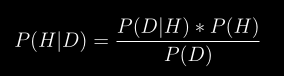
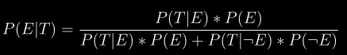
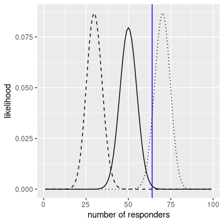
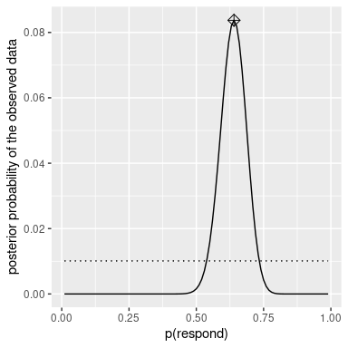
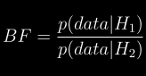

# 11 贝叶斯统计

在这一章中，我们将采用统计建模和推断的方法，与你在第 [9](#hypothesis-testing) 章中遇到的零假设检验架构形成对比。这就是以托马斯·贝叶斯牧师命名的“贝叶斯统计”，他的定理你已经在第六章[中遇到过。在本章中，您将了解贝叶斯定理如何提供了一种理解数据的方法，解决了我们讨论的关于零假设检验的许多概念问题，同时也引入了一些新的挑战。](#probability)


## 11.1 生成式模型

假设你正走在街上，你的一个朋友路过，但没有打招呼。你可能会试着判断为什么会发生这种情况——他们没有看到你吗？他们生你的气吗？你突然披上了魔法隐身衣吗？贝叶斯统计背后的一个基本思想是，我们希望根据数据本身来推断数据是如何生成的细节。在这种情况下，您希望使用数据(即，您的朋友没有打招呼的事实)来推断生成数据的过程(例如，他们是否真的看到了您，他们对您的感觉如何，等等)。

生成模型背后的想法是，一个*潜在的*(看不见的)过程生成我们观察到的数据，通常在这个过程中有一定的随机性。当我们从总体中抽取一个数据样本，并从样本中估计一个参数时，我们所做的事情实质上是试图学习一个潜在变量(总体均值)的值，该变量通过对观察数据(样本均值)的抽样而产生。图 [11.1](#fig:GenerativeModel) 显示了这个想法的示意图。


图 11.1:生成模型的概念示意图。

如果我们知道潜在变量的值，那么很容易重建观察到的数据应该是什么样子。例如，假设我们正在抛一个硬币，我们知道这是一枚正常的硬币，所以我们会期望它有 50%的机会正面朝上。我们可以用一个值为<math display="inline"><semantics><mrow><msub><mi>P</mi><mrow><mi>h</mi><mi>e</mi><mi>a</mi><mi>d</mi><mi>s</mi></mrow></msub><mo>=</mo><mn>0.5</mn></mrow><annotation encoding="application/x-tex">P _ { 正面朝上 } = 0.5</annotation></semantics></math>的二项分布来描述硬币结果的分布情况，然后我们可以生成随机样本然而，总的来说，我们现在的情况截然相反:我们不知道感兴趣的潜在变量的值，但我们有一些数据，我们想用它们来估计它。


## 11.2 贝叶斯定理和逆推理

贝叶斯统计之所以得名，是因为它利用贝叶斯定理从数据中推断出生成数据的基本过程。假设我们想知道一枚硬币是否正常。为了测试这一点，我们将硬币抛 10 次，得到 7 个头。在这次测试之前，我们非常确定,<math xmlns:epub="http://www.idpf.org/2007/ops" display="inline"><semantics><mrow><msub><mi>P</mi><mrow><mi>h</mi><mi>e</mi><mi>d</mi><mi>s</mi></mrow></msub><mo>=</mo></mrow><annotation encoding="application/x-tex">P _ { heads } = 0.5</annotation></semantics></math>， 但是如果我们相信<math xmlns:epub="http://www.idpf.org/2007/ops" display="inline"><semantics><mrow><msub><mi>P</mi><mrow><mi>h</mi><mi>e</mi><mi>a</mi><mi>d</mi><mi>s</mi></mrow></msub><mo>=</mo><mn>0.5</mn></mrow><annotation encoding="application/x-tex">P _ { heads } = 0.5</annotation></semantics>的话，那么在 10 次翻转中找到 7 次正面肯定会让我们停下来 我们已经知道如何计算条件概率，如果硬币真的是正常的，我们将从 10 个硬币中掷出 7 个或更多的正面(<math xmlns:epub="http://www.idpf.org/2007/ops" display="inline"><semantics><mrow><mi>P</mi><mrow><mo stretchy="true" form="prefix">(</mo><mi>n</mi><mo>≥</mo><mo stretchy="false" form="prefix">|</mo><msub><mi>P</mi><mrow><mi>h</mi></mrow></msub></mrow></mrow></semantics></math></math>

得到的概率是 0.055。这是一个相当小的数字，但这个数字并没有真正回答我们要问的问题——它告诉我们在给定某种特定局面情况下的概率，出现7次或更多正面朝上的可能性，而我们真正想知道的是这种特定硬币正面的真实概率。这听起来应该很熟悉，因为这正是我们在零假设测试中的情况，它告诉我们数据的可能性，而不是假设的可能性。

请记住，贝叶斯定理为我们提供了反演条件概率所需的工具:



我们可以认为这个定理有四个部分:
- 先验概率（P（假设））：在观看数据D之前，我们对假设H之前的置信程度，
- 似然（P（数据|假设））：观测到的数据 D 的可能性有多大在假设H下？
- 边际似然（P（数据））：观测到的数据的可能性有多大，对所有可能的假设进行分析？
- 后验概率（P（假设|数据））：我们对假设的最新信念H，给定数据 D

以我们掷硬币的例子，这四个部分是这样的:
- 先验概率（P(正面朝上)）：我们对翻转头部的可能性的信念程度，这是P(正面朝上) = 0.5
- 可能性（P（10次翻转中有7次或更多次|Pheads = 0.5））：可能性有多大如果 Pheads = 0.5），则 10 次翻转中有 7 个或更多次正面朝上？
- 边际似然（P（10 次翻转中有 7 个或更多人头）：一般来说，我们观察10次掷硬币其中7次朝上的概率有多大？
- 后验概率（Pheads |10次掷硬币中的7个或更多头））：我们更新的在观察到的硬币翻转的情况下对Pheads的信念

这里我们看到了频率主义者和贝叶斯统计之间的一个主要区别。频率学派的不相信假设的概率(即我们对假设的相信程度)——对他们来说，假设要么是真的，要么不是。另一种说法是，对于频率学派来说，假设是固定的，数据是随机的，这就是为什么频率学派的推断侧重于描述给定一个假设的数据的概率(即 p 值)。另一方面，贝叶斯学派热衷于对数据和假设进行概率陈述。


## 11.3 做贝叶斯估计

我们最终希望使用贝叶斯统计来对假设做出决策，但在此之前，我们需要估计做出决策所需的参数。在这里，我们将再把贝叶斯估计的过程演示一遍。我们再举一个筛查的例子:机场安检。如果你经常坐飞机，那么放过一个携带爆炸物的人只是时间问题；2001年9月11日之后不久，我就有过这种特别不幸的经历，当时机场安检人员特别紧张。

安全人员想知道的是，在机器测试结果为没有携带爆炸物的情况下，一个人携带爆炸物的可能性有多大。让我们看看如何使用贝叶斯分析来计算这个值。


### 11.3.1 约定在先

要使用贝叶斯定理，我们首先需要指定假设的先验概率。在这种情况下，我们不知道真实的数字，但我们可以假设它很小。根据 [FAA](https://www.faa.gov/air_traffic/by_the_numbeimg/Air_Traffic_by_the_Numbers_2018.pdf) 的数据，2017 年美国共有 971，595，898 名航空乘客。假设这些旅行者中有一个在包里携带了爆炸物——这将给出 9.71 亿分之一的先验概率，这非常小！在 9/11 袭击后的几个月里，安全人员把这个先验概率进行了适当的放大，所以让我们假设每一百万个旅客中有一个携带爆炸物。


### 11.3.2 收集一些数据

数据由爆炸物筛选试验的结果组成。假设安检人员用他们的测试仪器测试这个包 3 次，在 3 次测试中有3次给出了肯定的结果。


### 11.3.3 计算可能性

我们想在假设包里有炸药的情况下计算数据的可能性。假设我们(从机器制造商那里)知道测试的灵敏度是 0.99——也就是说，当一个爆炸物存在时，它将在有 99%的概率能检测到它。为了在假设设备存在的情况下确定我们的数据的可能性，我们可以将每个测试视为成功概率为 0.99 的伯努利试验(即，结果为真或假的试验)，我们可以使用二项式分布对其进行建模。


### 11.3.4 计算边际可能性

我们还需要知道数据的总体可能性，也就是说，从 3 次测试中找出 3 次阳性。计算边际可能性通常是贝叶斯分析最困难的方面之一，但对于我们的例子来说，这很简单，因为我们可以利用我们在第 [6.7](#bayestheorem) 节中介绍的二元结果的贝叶斯定理的特定形式:



其中<math display="inline"><semantics><mi>E</mi><annotation encoding="application/x-tex">E</annotation></semantics></math>表示存在爆炸物，<math display="inline"><semantics><mi>T</mi><annotation encoding="application/x-tex">T</annotation></semantics></math>表示检测结果为阳性。

在这种情况下，边际可能性是存在或不存在爆炸物情况下数据可能性的加权平均值，乘以爆炸物存在的概率(即先验)。在这种情况下，假设我们(从制造商处)知道测试的准确率为 0.99，这样在没有炸药的情况下出现阳性结果的可能性为0.01。


### 11.3.5 计算后验概率

我们现在有了计算爆炸物存在的后验概率所需的所有部分，给出了 3 次试验中观察到的 3 个阳性结果。
这一结果向我们表明，在这些阳性测试中，行李中爆炸物的后验概率(0.492)略低于 50%，这再次强调了这样一个事实，即对罕见事件的测试几乎总是容易产生大量假阳性，即使特异性和敏感性非常高。

贝叶斯分析的一个重要方面是它可以是连续的。一旦我们从一个分析中获得了后验概率，它就可以成为下一个分析的先验概率！


## 11.4 估计后验分布

在前面的例子中，只有两种可能的结果——爆炸物要么存在，要么不存在——我们想知道在给定数据的情况下，哪种结果最有可能出现。然而，在其他情况下，我们希望使用贝叶斯估计来估计参数的数值。比方说，我们想知道一种新止痛药的疗效；为了测试这一点，我们可以给一组病人服用这种药物，然后问他们服药后疼痛是否得到改善。我们可以使用贝叶斯分析来估计该药物对使用这些数据的人群有效的比例。


### 11.4.1 约定在先

在这种情况下，我们没有任何关于药物有效性的先验信息，所以我们将使用一个*均匀分布*作为我们的先验概率，因为所有值在均匀分布下的概率是相等的。为了简化示例，我们将只查看 99 个可能的有效性值的子集(从. 01 到. 99，步长为. 01)。因此，每个可能值的先验概率为 1/99。


### 11.4.2 收集一些数据

我们需要一些数据来估计药物的效果。假设我们给 100 个人服用这种药物，我们发现64个人觉得这药有效。


### 11.4.3 计算可能性

我们可以使用二项式密度函数计算任何特定有效性参数值下观察数据的似然性。在图 [11.2](#fig:like2) 中可以看到<math xmlns:epub="http://www.idpf.org/2007/ops" display="inline"><semantics><msub><mi>P</mi><mrow><mi>r</mi><mi>e</mi><mi>s</mi><mi>P</mi><mi>o</mi><mi>n</mi><mi>d</mi></mrow></msub><annotation encoding="application/x-tex">P _ { respond }</annotation></semantics></math>。看这个，似乎我们观测到的数据在<math xmlns:epub="http://www.idpf.org/2007/ops" display="inline"><semantics><mrow><msub><mi>P</mi><mrow><mi>r</mi><mi>e</mi><mi>s</mi><mi>P</mi><mi>o</mi><mi>n</mi><mi>d</mi></mrow></msub><mo>=</mo><mn>0.7</mn></mrow> 在<math xmlns:epub="http://www.idpf.org/2007/ops" display="inline"><semantics><mrow><msub><mi>P</mi><mi>r</mi><mi>e<mi>s<mi>P</mi><mi>o</mi><mi>n</mi><mi>d</mi></mi></mi></msub></mrow><mo>=</mo><mn>0。 而且在<math xmlns:epub="http://www.idpf.org/2007/ops" display="inline"><semantics><mrow><msub><mi>P</mi><mrow><mi>r</mi><mi>e</mi><mi>s</mi><mi>P</mi><mi>o</mi><mi>d</mi></mrow></msub><mo>=</mo><mn>0.3 <mi>贝叶斯推理的一个基本思想是，我们应该提高我们对感兴趣的参数值的信念，与数据在这些值之下的可能性成比例，与我们在看到数据之前对参数值的信念(我们的先验知识)相平衡。</mi></mn></mrow></semantics></math></mn></semantics></math></semantics></math>



图 11.2:在几种不同的假设下，每个可能的响应者数量的可能性(p(响应)=0.5(实线)，0.7(虚线)，0.3(虚线)。观察值显示在垂直线中


### 11.4.4 计算边际可能性

除了不同假设下数据的可能性，我们需要知道数据的总体可能性，结合所有假设(即边际可能性)。这个边际可能性非常重要，因为它有助于确保后验值是真实的概率。在这种情况下，我们使用一组离散的可能参数值可以很容易地计算边际可能性，因为我们可以计算每个假设下每个参数值的可能性，并将它们相加。


### 11.4.5 计算后验概率

我们现在已经得到了计算所有可能值的后验概率分布所需的所有部分，这些值为<math xmlns:epub="http://www.idpf.org/2007/ops" display="inline"><semantics><msub><mi>p</mi><mrow><mi>r</mi><mi>e</mi><mi>s</mi><mi>p</mi><mi>o</mi><mi>n</mi><mi>d</mi></mrow></msub><annotation encoding="application/x-tex">p _ { respond }</annotation></semantics></math>，如图 [11.3 所示](#fig:posteriorDist)



图 11.3:观察数据的后验概率分布，实线表示均匀先验分布(虚线)。最大后验概率(MAP)值由菱形符号表示。


### 11.4.6 最大后验概率估计

给定我们的数据，我们希望获得我们的样本的估计值<math display="inline"><semantics><msub><mi>p</mi><mrow><mi>r</mi><mi>e</mi><mi>s</mi><mi>p</mi><mi>o</mi><mi>n</mi><mi>d</mi></mrow></msub><annotation encoding="application/x-tex">p _ { respond }</annotation></semantics></math>。一种方法是找出后验概率最高的<math display="inline"><semantics><msub><mi>p</mi><mrow><mi>r</mi><mi>e</mi><mi>s</mi><mi>p</mi><mi>o</mi><mi>n</mi><mi>d</mi></mrow></msub><annotation encoding="application/x-tex">p _ { respond }</annotation></semantics></math>的值，我们可以从 [11.3](#fig:posteriorDist) 中的数据中找到这一点——这是在分布顶部用标记显示的值。请注意，结果(0.64)只是我们样本中响应者的比例——这是因为先验是一致的，因此不会影响我们的估计。


### 11.4.7 可信区间

通常我们不仅想知道后验概率的单个估计，还想知道后验概率下降的区间。我们以前在频繁推理的上下文中讨论过置信区间的概念，您可能还记得置信区间的解释特别复杂:它是一个在 95%的时间里包含参数值的区间。我们真正想要的是一个区间，在这个区间内我们有信心让参数下降，贝叶斯统计可以给我们这样一个区间，我们称之为*可信区间*。

对这个可信区间的解释更接近我们在置信区间想得到（但又得不到）的概念：它告诉我们有95%的概率prespond的值落在这两者之间值。重要的是，在这种情况下，它表明我们有很高的信心prespond>0.0，这意味着该药物似乎具有积极作用。
在某些情况下，可信区间可以基于已知分布，但更常见的是生成可信区间从后验分布抽样，然后计算示例。当我们没有简单的方法来用数字表示后验分布，这在实际情况下经常发生贝叶斯数据分析。解释了一种这样的方法（剔除采样）更详细地在本章的附录中介绍。


### 11.4.8 不同先验的影响

在前面的例子中我们使用了一个*平坦的先验*，这意味着我们没有任何理由去假设<math display="inline"><semantics><msub><mi>p</mi><mrow><mi>r</mi><mi>e</mi><mi>s</mi><mi>p</mi><mi>o</mi><mi>n</mi><mi>d</mi></mrow></msub><annotation encoding="application/x-tex">p _ { respond }</annotation></semantics></math>值应该是多少。然而，假设我们从一些以前的数据开始:在以前的研究中，研究人员测试了 20 个人，发现其中 10 个人做出了积极的回应。这将使我们从先前的信念进行假设，即这种治疗对 50%的人有效。我们可以进行与上述相同的计算，但是使用来自我们先前研究的信息来通知我们的先验(参见图 [11.4](#fig:posteriorDistPrior) 中的子图 A)。

请注意，可能性和边际可能性没有改变，只有先验发生了变化。“先验”更改的效果是将“后验”拉近到新“先验”的质量，该质量以 0.5 为中心。

现在让我们看看，如果我们带着更强的先验信念进行分析，会发生什么。假设先前的研究不是观察 20 个人中的 10 个响应者，而是测试 500 个人，发现 250 个响应者。原则上，这应该给我们一个更强的先验，正如我们在图 [11.4](#fig:posteriorDistPrior) 的子图 B 中看到的，这就是所发生的:先验更加集中在 0.5 左右，后验也更加接近先验。一般的想法是，贝叶斯推理结合了先验和似然的信息，然后进行相应的加权操作。

这个例子也强调了贝叶斯分析的顺序性质——一个分析的后验可以成为下一个分析的先验。

最后，重点是您要认知到如果先验足够强，它们可以完全代表数据。假设您有一个绝对的先验，即<math display="inline"><semantics><msub><mi>p</mi><mrow><mi>r</mi><mi>e</mi><mi>s</mi><mi>p</mi><mi>o</mi><mi>n</mi><mi>d</mi></mrow></msub><annotation encoding="application/x-tex">p _ { respond }</annotation></semantics></math>为 0.8 或更大，这样您就将所有其他值的先验概率设置为零。如果我们计算后验概率会发生什么？

![A: Effects of priors on the posterior distribution.  The original posterior distribution based on a flat prior is plotted in blue. The prior based on the observation of 10 responders out of 20 people is plotted in the dotted black line, and the posterior using this prior is plotted in red.  B: Effects of the strength of the prior on the posterior distribution. The blue line shows the posterior obtained using the prior based on 50 heads out of 100 people.  The dotted black line shows the prior based on 250 heads out of 500 flips, and the red line shows the posterior based on that prior. C: Effects of the strength of the prior on the posterior distribution. The blue line shows the posterior obtained using an absolute prior which states that p(respond) is 0.8 or greater.  The prior is shown in the dotted black line.](img/file63.png)

图 11.4: A:先验对后验分布的影响。基于平坦先验的原始后验分布以蓝色绘制。基于 20 个人中 10 个应答者的观察的先验以黑色虚线绘制，使用该先验的后验以红色绘制。b:先验强度对后验分布的影响。蓝线表示基于 100 个人中的 50 个人使用先验获得的后验概率。黑色虚线表示基于 500 次翻转中 250 次翻转的先验，红线表示基于该先验的后验。c:先验强度对后验分布的影响。蓝线显示使用绝对先验获得的后验概率，表明 p(响应)为 0.8 或更大。先验以黑色虚线显示。

在图 [11.4](#fig:posteriorDistPrior) 的子图 C 中，我们看到，先验设置为零的任何值的后验密度为零——数据被绝对先验淹没。

* 

 *

## 11.5 选择优先

先验对所得推论的影响是贝叶斯统计中最有争议的方面。使用前的条件是什么？如果先验的选择决定了结果(即后验)，你怎么能确定你的结果是可信的呢？这些都是难题，但我们不应该因为面临难题就退缩。正如我们之前讨论的，贝叶斯分析给我们提供了可解释的结果(可信区间等)。).仅此一点就应该激励我们认真思考这些问题，以便我们能够得出合理和可解释的结果。

有各种方式来选择一个人的先验，这(正如我们在上面看到的)会影响最终的推论。有时我们有一个非常具体的先验，比如我们期望硬币有 50%的机会正面朝上，但在很多情况下，我们没有这么强的起点。*无信息先验*试图尽可能少地影响结果后验，正如我们在上面的均匀先验的例子中看到的。使用*弱信息先验*(或*默认先验*)也很常见，这对结果的影响非常小。例如，如果我们使用基于两次抛硬币中有一次正面朝上的二项式分布，则先验值将集中在 0.5 左右，但相当平坦，对后验值的影响很小。也可以使用基于科学文献或现有数据的先验知识，我们称之为*经验先验知识*。然而，总的来说，我们将坚持使用无信息/弱信息先验，因为它们最不可能我们的结果。


## 11.6 贝叶斯假设检验

已经学习了如何进行贝叶斯估计，我们现在转向使用贝叶斯方法进行假设检验。假设有两个政治家，他们对公众是否赞成征收额外的税来支持国家公园的建设有不同的看法。参议员史密斯认为只有 40%的人赞成这项税收，而参议员琼斯认为 60%的人赞成。他们安排了一个民意测验来测试这一点，随机选择了 1000 个人来询问他们是否支持这样的税。结果是在民意测验样本中有 490 的人赞成征税。基于这些数据，我们想知道:这些数据是否支持一位参议员的观点，支持程度如何？我们可以使用一个称为[贝叶斯因子](https://bayesfactor.blogspot.com/2014/02/the-bayesfactor-package-this-blog-is.html)的概念来测试这一点，它通过比较每个假设对观察数据的预测程度来量化哪个假设更好。


### 11.6.1 贝叶斯因子

贝叶斯因子描述了两种不同假设下数据的相对似然性。它被定义为:



对于两个假设<math xmlns:epub="http://www.idpf.org/2007/ops" display="inline"><semantics><msub><mi>H</mi><mn>1</mn></msub><annotation encoding="application/x-tex">H _ 1</annotation></semantics></math>和<math xmlns:epub="http://www.idpf.org/2007/ops" display="inline"><semantics><msub><mi>H</mi><mn>2</mn></msub><annotation encoding="application/x-tex">H _ 2</annotation></semantics></math>。在我们两位参议员的例子中，我们知道如何使用二项式分布计算每个假设下数据的可能性；让我们暂时假设我们每个参议员正确的先验概率是相同的(<math xmlns:epub="http://www.idpf.org/2007/ops" display="inline"><semantics><mrow><msub><mi>P</mi><msub><mi>H</mi><mn>1</mn></msub></msub><mo>=</mo><msub><mi>P</mi><msub><mi>H</mi><mn>2</mn></msub></msub><mo>=</mo><mn>0.5</mn>我们将把参议员史密斯放在分子中，将参议员琼斯放在分母中，这样，大于 1 的值将反映参议员史密斯的观点得到支持，小于 1 的值将反映参议员琼斯的观点得到支持。由此产生的贝叶斯因子(3325.26)提供了数据提供的关于两个假设的证据的度量-在这种情况下，它告诉我们数据支持参议员 Smith 的程度比支持参议员 Jones 的程度强 3000 多倍。</mrow></semantics></math>


### 11.6.2 统计假设的贝叶斯因子

在前面的例子中，我们有每个参议员的具体预测，我们可以使用二项式分布来量化其可能性。此外，我们两个假设的先验概率是相等的。然而，在实际数据分析中，我们通常必须处理参数的不确定性，这使贝叶斯因子变得复杂，因为我们需要计算边际似然性(即，所有可能的模型参数的似然性的综合平均值，按其先验概率加权)。然而，作为交换，我们获得了量化相对数量的证据的能力，这有利于零假设与替代假设。

假设我们是一名医学研究人员，正在进行一项治疗糖尿病的临床试验，我们希望知道与安慰剂相比，某种药物是否能降低血糖。我们招募了一组志愿者，并将他们随机分配到药物组或安慰剂组，并在服用药物或安慰剂期间，测量每组的血红蛋白 A1C(血糖水平的标志)的变化。我们想知道的是:这种药物和安慰剂之间有区别吗？

首先，让我们生成一些数据，并使用零假设检验对它们进行分析(见图 [11.5](#fig:bayesTesting) )。然后，让我们进行独立样本 t 检验，结果显示两组之间存在显著差异:


图 11.5:显示药物组和安慰剂组数据的箱线图。

```
## 
##  Welch Two Sample t-test
## 
## data:  hbchange by group
## t = 2, df = 32, p-value = 0.02
## alternative hypothesis: true difference in means between group 0 and group 1 is greater than 0
## 95 percent confidence interval:
##  0.11  Inf
## sample estimates:
## mean in group 0 mean in group 1 
##          -0.082          -0.650
```

这个测试告诉我们两组之间有显著差异，但它没有量化证据支持无效假设和替代假设的力度。为了测量它，我们可以使用 R:

```
## Bayes factor analysis
## --------------
## [1] Alt., r=0.707 0<d<Inf    : 3.4  ±0%
## [2] Alt., r=0.707 !(0<d<Inf) : 0.12 ±0.01%
## 
## Against denominator:
##   Null, mu1-mu2 = 0 
## ---
## Bayes factor type: BFindepSample, JZS
```

我们对大于零的效应的贝叶斯因子特别感兴趣，它列在报告中标有“[1]”的行中。这里的贝叶斯因子告诉我们，在给定数据的情况下，替代假设(即差异大于零)比点零假设(即平均差异正好为零)的可能性大约高 3 倍。因此，尽管这种影响是显著的，但它为我们提供的支持另一种假设的证据却相当薄弱。


#### 11.6.2.1 片面测试

我们通常对检验特定点值的零假设(例如，平均差= 0)不感兴趣，而对检验方向零假设(例如，差小于或等于 0)不感兴趣。我们还可以使用来自`ttestBF`分析的结果执行定向(或*单侧*)测试，因为它提供了两个贝叶斯因子:一个用于平均差大于零的替代假设，一个用于平均差小于零的替代假设。如果我们想要评估正面效应的相对证据，我们可以通过简单地将函数返回的两个贝叶斯因子相除来计算比较正面效应和负面效应的相对证据的贝叶斯因子:

```
## Bayes factor analysis
## --------------
## [1] Alt., r=0.707 0<d<Inf : 29 ±0.01%
## 
## Against denominator:
##   Alternative, r = 0.707106781186548, mu =/= 0 !(0<d<Inf) 
## ---
## Bayes factor type: BFindepSample, JZS
```

现在我们看到，正面效应相对于负面效应的贝叶斯因子要大得多(几乎是 30)。


#### 11.6.2.2 解读贝叶斯因素

我们如何知道 2 或 20 的贝叶斯因子是好是坏？由[卡斯&拉弗蒂(1995)](https://www.andrew.cmu.edu/user/kk3n/simplicity/KassRaftery1995.pdf) 提出了解释贝叶斯因子的一般准则:

| 贝叶斯因子 | 证据的力度 |
| --- | --- |
| 1 到 3 | 不值一提 |
| 3 到 20 岁 | 积极的 |
| 20 到 150 | 强烈的 |
| >150 | 很强 |

基于这一点，即使统计结果是重要的，支持替代假设和点零假设的证据数量是如此之少，以至于几乎不值得一提，而方向假设的证据却是相对有力的。


### 11.6.3 评估无效假设的证据

因为贝叶斯因子是比较两个假设的证据，它还允许我们评估是否有支持零假设的证据，这是我们用标准零假设检验无法做到的(因为它从零假设为真的假设开始)。这对于确定一个不重要的结果是否真的提供了强有力的证据证明没有影响，或者只是反映了总体上的弱证据是非常有用的。


## 11.7 学习目标

阅读完本章后，应该能够:

*   描述贝叶斯分析和零假设检验之间的主要区别
*   描述并执行贝叶斯分析中的步骤
*   描述不同先验的影响，以及选择先验的考虑因素
*   描述置信区间和贝叶斯可信区间在概念上的区别


## 11.8 建议读物

*   《不会消亡的理论:贝氏法则如何破解英格玛密码，追捕俄罗斯潜艇，并从两个世纪的争议中脱颖而出》
*   *做贝叶斯数据分析:R 的教程介绍*，作者 John K. Kruschke


## 11.9 附录:


### 11.9.1 拒绝取样

我们将使用一种称为 [*拒绝抽样*](https://am207.github.io/2017/wiki/rejectionsampling.html) 的简单算法，从我们的后验分布中生成样本。其思路是我们选择一个随机值 x(本例中为<math xmlns:epub="http://www.idpf.org/2007/ops" display="inline"><semantics><msub><mi>p</mi><mrow><mi>r</mi><mi>e</mi><mi>s</mi><mi>p</mi><mi>o</mi><mi>n</mi><mi>d</mi></mrow></msub><annotation encoding="application/x-tex">p _ { respond }</annotation></semantics></math>)和一个随机值 y(本例中 <math xmlns:epub="http://www.idpf.org/2007/ops" display="inline"><semantics><msub><mi>p</mi><mrow><mi>r</mi><mi>e</mi><mi>s</mi><mi>p</mi><mi>o</mi><mi>n</mi><mi>d</mi></mrow></msub><annotation encoding="application/x-tex">p _ { respond }</annotation></semantics></math>)的后验概率各自来自一个均匀分布。 我们这时只接受样本如果<math xmlns:epub="http://www.idpf.org/2007/ops" display="inline"><semantics><mrow><mi>y</mi><mo><</mo><mi>f</mi><mrow><mo stretchy="true" form="prefix"><mo stretchy="true" form="prefix">(</mo><mi><mo stretchy="true" form="postfix">)</mo></mi></mo></mrow></mrow><annotation encoding="application/x-tex">y<</annotation></semantics></math>——在这种情况下，如果随机选取的值？ )。

|  | x |
| --- | --- |
| 2.5% | Zero point five four |
| 97.5% | Zero point seven three |


图 11.6:剔除抽样示例。黑线表示 p(响应)所有可能值的密度；蓝线显示分布的 2.5 和 97.5 个百分点，代表 p(响应)估计值的 95%可信区间。


* 