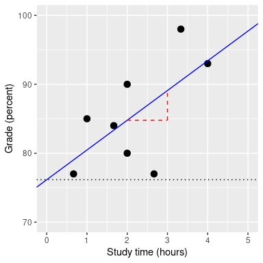
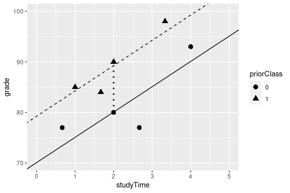

# 十二、分类关系建模

到目前为止，我们已经讨论了统计建模和假设检验的一般概念，并将它们应用到一些简单的分析中。在本章中，我们将重点介绍 _ 分类 _ 关系的建模，通过建模，我们可以表示在名义（有时是序数）尺度上测量的变量之间的关系。这些数据通常用计数来表示；也就是说，对于变量的每个值（或多个变量的值的组合），有多少观测值取这个值？例如，当我们计算每个专业有多少人在我们班上时，我们将根据数据拟合一个分类模型。

## 12.1 示例：糖果颜色

假设我买了一袋 100 颗糖果，上面写着有 1/3 巧克力、1/3 甘草和 1/3 胶球。当我数包里的糖果时，我们得到以下数字：

```r
candyDf <-
  tibble(
    candyType = c("chocolate", "licorice", "gumball"),
    count = c(30, 33, 37)
  )
pander(candyDf)
```

<colgroup><col style="width: 16%"> <col style="width: 9%"></colgroup> 
| 糖果型 | 计数 |
| --- | --- |
| 巧克力 | 30 个 |
| 甘草 | 33 |
| 胶球 | 37 岁 |

因为我更喜欢巧克力，而不是甘草或树胶球，我觉得有点被撕了。我想知道的是：如果每种糖果的真实概率是每种糖果平均 1/3 的比例，那么这种计数的可能性有多大？

## 12.2 皮尔逊卡方检验

皮尔逊卡方检验为我们提供了一种方法来检验观察到的计数数据是否与定义零假设的某些特定预期值不同：


在我们的糖果例子中，无效假设是每种糖果的比例是相等的。我们可以计算我们观察到的糖果计数的卡方统计，如下所示：

```r
# compute chi-squared statistic

nullExpectation <- c(1 / 3, 1 / 3, 1 / 3) * sum(candyDf$count)

chisqVal <- 
  sum(
    ((candyDf$count - nullExpectation)**2) / nullExpectation
  )
```

这个分析的卡方统计结果是 0.74，这本身是不可解释的，因为它取决于加在一起的不同值的数量。然而，我们可以利用这样一个事实：卡方统计量是根据零假设下的特定分布分布分布的，这就是所谓的 _ 卡方 _ 分布。这种分布被定义为一组标准正态随机变量的平方和；它有若干自由度，等于被加在一起的变量数。分布的形状取决于自由度的数量。图[12.1](#fig:chisqDist)显示了几种不同自由度的分布示例。



图 12.1 不同自由度的卡方分布示例。

让我们通过模拟来验证卡方分布是否准确地描述了一组标准正态随机变量的平方和。

```r
# simulate 50,000 sums of 8 standard normal random variables and compare
# to theoretical chi-squared distribution

# create a matrix with 50k columns of 8 rows of squared normal random variables
d <- replicate(50000, rnorm(n = 8, mean = 0, sd = 1)**2) 
# sum each column of 8 variables
dMean <- apply(d, 2, sum)

# create a data frame of the theoretical chi-square distribution 
# with 8 degrees of freedom
csDf <-
  data.frame(x = seq(0.01, 30, 0.01)) %>%
  mutate(chisq = dchisq(x, 8))
```

图[12.2](#fig:chisqSim)显示，理论分布与重复将一组随机正态变量的平方相加的模拟结果非常吻合。



图 12.2 平方随机正态变量和的模拟。柱状图是基于 5 万组 8 个随机正态变量的平方和；蓝线显示了 8 个自由度下理论卡方分布的值。

对于糖果的例子，我们可以计算在所有糖果的相同频率的零假设下，我们观察到的卡方值为 0.74 的可能性。我们使用自由度等于 k-1（其中 k=类别数）的卡方分布，因为我们在计算平均值以生成预期值时失去了一个自由度。

```r
pval <- pchisq(chisqVal, df = 2, lower.tail = FALSE) #df = degrees of freedom
sprintf("p-value = %0.3f", pval)
```

```r
## [1] "p-value = 0.691"
```

这表明，观察到的糖果数量并不是特别令人惊讶的，基于印刷在糖果袋上的比例，我们不会拒绝等比的无效假设。

## 12.3 应急表及双向试验

我们经常使用卡方检验的另一种方法是询问两个分类变量是否相互关联。作为一个更现实的例子，让我们来考虑一个问题，当一个黑人司机被警察拦下时，他们是否比一个白人司机更有可能被搜查，斯坦福公开警务项目（[https://open policing.stanford.edu/](https://openpolicing.stanford.edu/)）研究了这个问题，并提供了我们可以用来分析问题的数据。我们将使用来自康涅狄格州的数据，因为它们相当小。首先清理这些数据，以删除所有不必要的数据（参见 code/process_ct_data.py）。

```r
# load police stop data
stopData <-
  read_csv("data/CT_data_cleaned.csv") %>%
  rename(searched = search_conducted)
```

表示分类分析数据的标准方法是通过 _ 列联表 _，列联表显示了属于每个变量值的每个可能组合的观测值的数量或比例。

让我们计算一下警察搜索数据的应急表：

```r
# compute and print two-way contingency table
summaryDf2way <-
  stopData %>%
  count(searched, driver_race) %>%
  arrange(driver_race, searched) 

summaryContingencyTable <-
  summaryDf2way %>%
  spread(driver_race, n)

pander(summaryContingencyTable)
```

<colgroup><col style="width: 15%"> <col style="width: 11%"> <col style="width: 11%"></colgroup> 
| 已搜索 | 黑色 | 白色 |
| --- | --- | --- |
| 错误的 | 36244 个 | 239241 个 |
| 真的 | 1219 年 | 3108 个 |

使用比例而不是原始数字查看应急表也很有用，因为它们更容易在视觉上进行比较。

```r
# Compute and print contingency table using proportions 
# rather than raw frequencies
summaryContingencyTableProportion <-
  summaryContingencyTable %>%
  mutate(
    Black = Black / nrow(stopData), #count of Black individuals searched / total searched
    White = White / nrow(stopData)
  )
pander(summaryContingencyTableProportion, round = 4)
```

<colgroup><col style="width: 15%"> <col style="width: 12%"> <col style="width: 12%"></colgroup> 
| searched | Black | White |
| --- | --- | --- |
| FALSE | 0.1295 年 | 0.855 个 |
| TRUE | 0.0044 美元 | 0.0111 个 |

Pearson 卡方检验允许我们检验观察到的频率是否与预期频率不同，因此我们需要确定如果搜索和种族不相关，我们期望在每个细胞中出现的频率，我们可以定义为 _ 独立。_ 请记住，如果 x 和 y 是独立的，那么：


也就是说，零独立假设下的联合概率仅仅是每个变量的 _ 边际 _ 概率的乘积。边际概率只是每一个事件发生的概率，与其他事件无关。我们可以计算这些边际概率，然后将它们相乘，得到独立状态下的预期比例。

|  | 黑色 | 白色 |  |
| --- | --- | --- | --- |
| 未搜索 | P（ns）*P（b） | P（ns）*P（w） | P（纳秒） |
| 已搜索 | P（S）*P（B） | P（S）*P（W） | P（S） |
|  | P（B） | P（宽） |  |

我们可以使用称为“外积”的线性代数技巧（通过`outer()`函数）来轻松计算。

```r
# first, compute the marginal probabilities

# probability of being each race
summaryDfRace <-
  stopData %>%
  count(driver_race) %>% #count the number of drivers of each race
  mutate(
    prop = n / sum(n) #compute the proportion of each race out of all drivers
  )

# probability of being searched 
summaryDfStop <-
  stopData %>%
  count(searched) %>% #count the number of searched vs. not searched
  mutate(
    prop = n / sum(n) # compute proportion of each outcome out all traffic stops
  )
```

```r
# second, multiply outer product by n (all stops) to compute expected frequencies
expected <- outer(summaryDfRace$prop, summaryDfStop$prop) * nrow(stopData)

# create a data frame of expected frequencies for each race 
expectedDf <- 
  data.frame(expected, driverRace = c("Black", "White")) %>% 
  rename(
    NotSearched = X1,
    Searched = X2
  )

# tidy the data frame
expectedDfTidy <-
  gather(expectedDf, searched, n, -driverRace) %>%
  arrange(driverRace, searched)
```

```r
# third, add expected frequencies to the original summary table
# and fourth, compute the standardized squared difference between 
# the observed and expected frequences

summaryDf2way <-
  summaryDf2way %>%
  mutate(expected = expectedDfTidy$n)

summaryDf2way <-
  summaryDf2way %>%
  mutate(stdSqDiff = (n - expected)**2 / expected)

pander(summaryDf2way)
```

<colgroup><col style="width: 15%"> <col style="width: 19%"> <col style="width: 12%"> <col style="width: 15%"> <col style="width: 15%"></colgroup> 
| searched | 车手比赛 | N 号 | 预期 | 标准平方差 |
| --- | --- | --- | --- | --- |
| FALSE | 黑色 | 36244 | 36883.67 个 | 2009 年 11 月 |
| TRUE | Black | 1219 | 579.33 条 | 第 706.31 条 |
| FALSE | 白色 | 239241 | 238601.3 条 | 1.71 条 |
| TRUE | White | 3108 | 3747.67 美元 | 109.18 条 |

```r
# finally, compute chi-squared statistic by 
# summing the standardized squared differences
chisq <- sum(summaryDf2way$stdSqDiff)
sprintf("Chi-squared value = %0.2f", chisq)
```

```r
## [1] "Chi-squared value = 828.30"
```

在计算了卡方统计之后，我们现在需要将其与卡方分布进行比较，以确定它与我们在无效假设下的期望相比有多极端。这种分布的自由度是——因此，对于类似于这里的 2x2 表，。这里的直觉是计算预期频率需要我们使用三个值：观察总数和两个变量的边际概率。因此，一旦计算出这些值，就只有一个数字可以自由变化，因此有一个自由度。鉴于此，我们可以计算卡方统计的 p 值：

```r
pval <- pchisq(chisq, df = 1, lower.tail = FALSE)
sprintf("p-value = %e", pval)
```

```r
## [1] "p-value = 3.795669e-182"
```

的 p 值非常小，表明如果种族和警察搜查之间真的没有关系，观察到的数据就不太可能，因此我们应该拒绝独立性的无效假设。

我们还可以使用 r 中的`chisq.test()`函数轻松执行此测试：

```r
# first need to rearrange the data into a 2x2 table
summaryDf2wayTable <-
  summaryDf2way %>%
  dplyr::select(-expected, -stdSqDiff) %>%
  spread(searched, n) %>%
  dplyr::select(-driver_race)

chisqTestResult <- chisq.test(summaryDf2wayTable, 1, correct = FALSE)
chisqTestResult
```

```r
## 
##  Pearson's Chi-squared test
## 
## data:  summaryDf2wayTable
## X-squared = 800, df = 1, p-value <2e-16
```

## 12.4 标准化残差

当我们发现卡方检验的显著效果时，这告诉我们，在无效假设下，数据是不可能的，但它并没有告诉我们 _ 数据有什么不同。为了更深入地了解数据与我们在零假设下预期的差异，我们可以检查模型的残差，该残差反映了数据（即观察到的频率）与每个单元中模型的偏差（即预期频率）。而不是查看原始残差（仅根据数据中观察的数量而变化），更常见的是查看其他 _ 标准化残差 _，其计算如下：_


其中和分别是行和列的索引。我们可以为警察局的数据计算这些数据：

```r
# compute standardized residuals
summaryDf2way <- 
  summaryDf2way %>% 
  mutate(stdRes = (n - expected)/sqrt(expected))

pander(summaryDf2way)
```

<colgroup><col style="width: 15%"> <col style="width: 19%"> <col style="width: 12%"> <col style="width: 15%"> <col style="width: 16%"> <col style="width: 11%"></colgroup> 
| 已搜索 | 车手比赛 | N 号 | 预期 | 标准平方差 | 标准普尔 |
| --- | --- | --- | --- | --- | --- |
| 错误的 | 黑色 | 36244 个 | 36883.67 个 | 2009 年 11 月 | -3.33 条 |
| 真的 | Black | 1219 年 | 579.33 条 | 第 706.31 条 | 26.58 美元 |
| FALSE | 白色 | 239241 个 | 238601.3 条 | 1.71 条 | 1.31 条 |
| TRUE | White | 3108 个 | 3747.67 美元 | 109.18 条 | -10.45 美元 |

这些标准化的残差可以解释为 z 分数——在这种情况下，我们看到，基于独立性，对黑人个体的搜索次数大大高于预期，而对白人个体的搜索次数大大低于预期。这为我们提供了解释显著的卡方结果所需的上下文。

## 12.5 优势比

我们还可以使用前面介绍的优势比在应急表中表示不同结果的相对可能性，以便更好地了解影响的大小。首先，我们表示每一场比赛被阻止的几率：


根据这一数据集，优势比显示，黑人和白人驾驶员被搜索的几率要高出 2.59 倍。

## 12.6 贝叶斯系数


我们在关于贝叶斯统计的前一章中讨论了贝叶斯因子——你可能记得它代表了两种假设下数据的可能性比：贝叶斯因子在某种程度上类似于 p 值和影响大小，也就是说它们的解释是某种意义上的。t 主观。他们的解释有各种各样的指导方针——这是来自 Kass 和 Raftery（1995）的一个：

| 高炉 | 解释 |
| --- | --- |
| 1 到 3 | 不值得一提 |
| 3 至 20 | 积极的 |
| 20 至 150 | 坚强的 |
| 150 及以上 | 非常强壮 |

我们可以使用 BayesFactor 包中的`contingencyTableBF()`函数计算警察搜索数据的 Bayes 因子：

```r
# compute Bayes factor 
# using independent multinomial sampling plan in which row totals (driver race)
# are fixed

bf <- 
  contingencyTableBF(as.matrix(summaryDf2wayTable),
  sampleType = "indepMulti",
  fixedMargin = "cols"
)
bf
```

```r
## Bayes factor analysis
## --------------
## [1] Non-indep. (a=1) : 1.8e+142 ±0%
## 
## Against denominator:
##   Null, independence, a = 1 
## ---
## Bayes factor type: BFcontingencyTable, independent multinomial
```

这表明，在这个数据集中，支持驾驶员种族和警察搜索之间关系的证据非常有力。

## 12.7 超出 2 x 2 表的分类分析

分类分析也可以应用于应急表，其中每个变量有两个以上的类别。

例如，让我们看一下 nhanes 的数据，比较变量 _depressed_，它表示“参与者感到沮丧、沮丧或绝望的自我报告天数”。此变量编码为`None`、`Several`或`Most`。让我们测试这个变量是否与 _sleeptrouble_ 变量相关，这个变量报告个人是否向医生报告了睡眠问题。

```r
# summarize depression as a function of sleep trouble
depressedSleepTrouble <-
  NHANES_adult %>%
  drop_na(SleepTrouble, Depressed) %>%
  count(SleepTrouble, Depressed) %>%
  arrange(SleepTrouble, Depressed)

depressedSleepTroubleTable <-
  depressedSleepTrouble %>%
  spread(SleepTrouble, n) %>% 
  rename(
    NoSleepTrouble = No,
    YesSleepTrouble = Yes
  )

pander(depressedSleepTroubleTable)
```

<colgroup><col style="width: 16%"> <col style="width: 23%"> <col style="width: 23%"></colgroup> 
| 沮丧的 | 无阻力 | 是的，可重复 |
| --- | --- | --- |
| 无 | 2614 个 | 676 个 |
| 几个 | 418 个 | 249 个 |
| 大多数 | 138 个 | 145 个 |

简单地看一下这些数据，我们就可以知道这两个变量之间可能存在某种关系；特别是，尽管睡眠问题患者的总数比没有睡眠问题的患者要少很多，但对于大多数时间都处于抑郁状态的患者来说，睡眠问题患者的数量更大。比没有的要水。我们可以直接使用卡方检验对其进行量化；如果我们的数据框只包含两个变量，那么我们可以简单地将数据框作为参数提供给`chisq.test()`函数：

```r
# need to remove the column with the label names
depressedSleepTroubleTable <-
  depressedSleepTroubleTable %>%
  dplyr::select(-Depressed)

depressedSleepChisq <- chisq.test(depressedSleepTroubleTable)
depressedSleepChisq
```

```r
## 
##  Pearson's Chi-squared test
## 
## data:  depressedSleepTroubleTable
## X-squared = 200, df = 2, p-value <2e-16
```

这项测试表明，抑郁和睡眠问题之间有很强的关系。我们还可以计算贝叶斯因子来量化有利于替代假设的证据的强度：

```r
# compute bayes factor, using a joint multinomial sampling plan
bf <-
  contingencyTableBF(
    as.matrix(depressedSleepTroubleTable),
    sampleType = "jointMulti"
  )
bf
```

```r
## Bayes factor analysis
## --------------
## [1] Non-indep. (a=1) : 1.8e+35 ±0%
## 
## Against denominator:
##   Null, independence, a = 1 
## ---
## Bayes factor type: BFcontingencyTable, joint multinomial
```

在这里，我们看到贝叶斯系数非常大，这表明支持抑郁和睡眠问题之间关系的证据非常有力。

## 12.8 注意辛普森悖论

上述应急表是对大量观察结果的总结，但有时会产生误导。让我们以棒球为例。下表显示了 1995-1997 年间德里克·杰特和大卫·贾斯汀的击球数据（击数/击数和平均击球数）：

| 玩家 | 1995 年 |  | 1996 年 |  | 1997 年 |  | 合并 |  |
| --- | --- | --- | --- | --- | --- | --- | --- | --- |
| 基特 | 12 月 48 日 | 0.250 | 183/582 年 | .314 条 | 190/654 年 | .291 条 | 385/1284 年 | **.300** |
| 大卫·正义 | 104/411 号 | **.253** | 45/140 分 | **.321** | 163/495 年 | **.329** | 312/1046 年 | .298 条 |

如果你仔细观察，你会发现有些奇怪的事情正在发生：在每一年，正义比杰特有一个更高的击球平均值，但当我们结合所有三年的数据，杰特的平均值实际上高于正义！这是一个被称为 _ 辛普森悖论 _ 的现象的例子，在这种现象中，组合数据集中的模式可能不存在于数据的任何子集中。当有另一个变量可能在不同的子集之间发生变化时，就会发生这种情况——在这种情况下，AT 蝙蝠的数量随着时间的推移而变化，1995 年司法部的击球次数更多（击球平均数较低时）。我们把它称为一个潜伏变量（htg2），每当我们检查分类数据时，注意这些变量总是很重要的。