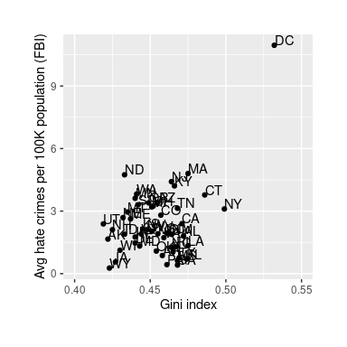
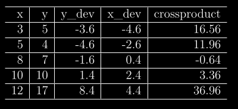
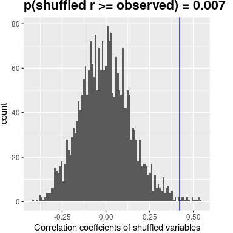
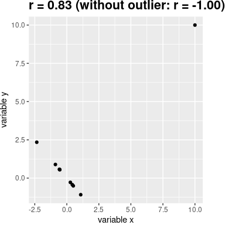
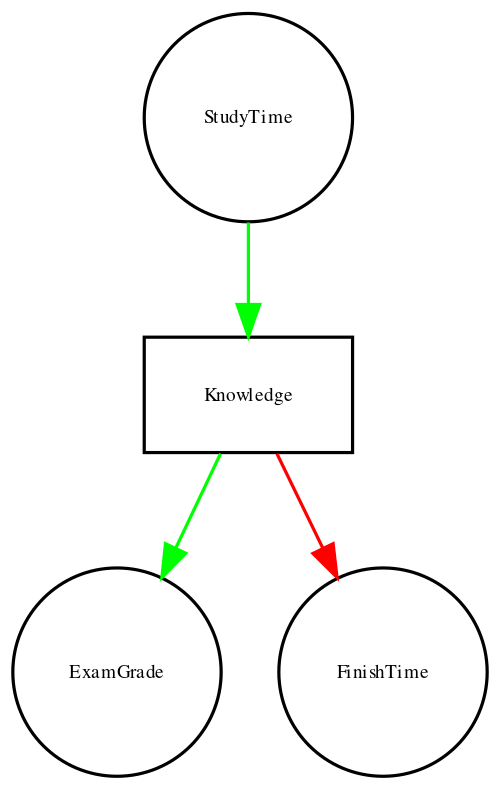
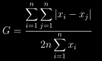
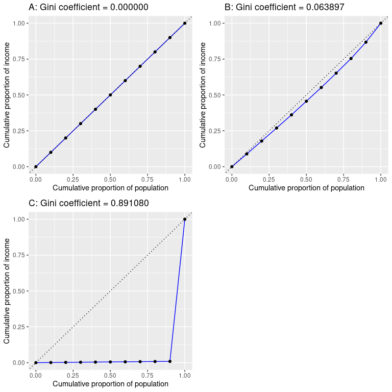

# 13 连续关系模型

大多数人都很熟悉*相关性*这个概念，在本章中我们将为这个常用且容易被误解的概念提供一个更官方的解释。


## 一个例子:仇恨犯罪和收入不平等关系

2017 年，Fivethirtyeight.com 网站发表了一篇名为 [*的报道，仇恨犯罪的高发生率与收入不平等有关*](https://fivethirtyeight.com/features/higher-rates-of-hate-crimes-are-tied-to-income-inequality/) ，该报道讨论了 2016 年总统大选后仇恨犯罪的流行与收入不平等之间的关系。这篇报道报道了美国联邦调查局和南方贫困法律中心对仇恨犯罪数据的分析，在此基础上，他们报告说:

> “我们发现，收入不平等是造成美国各地仇恨犯罪事件增加的最重要因素”。

分析这个数据，我们使用的是R统计软件的`fivethirtyeight`这个包，这个包用起来非常方便，推荐大家使用。报道中的分析集中在收入不平等(由一个叫做*基尼指数*的数量定义——更多细节见附录)和各州仇恨犯罪流行率之间的关系。


## 13.2 收入不平等与仇恨犯罪有关吗？



图 13.1:仇恨犯罪率与基尼指数的关系图。

收入不平等和仇恨犯罪率之间的关系如图 [13.1](#fig:hateCrimeGini) 所示。从数据来看，这两个变量之间似乎可能存在正相关关系。我们如何量化这种关系？


## 13.3 协方差和相关性

量化两个变量之间关系的一种方法是*协方差*。请记住，单个变量的方差计算为每个数据点与平均值之间的平均平方差:

$$
s^2 = \frac{\sum_{i=1}^n (x_i - \bar{x})^2}{N - 1}
$$

这告诉我们每个观察值离平均值有多远，以平方单位表示。协方差告诉我们两个不同变量的偏差之间是否有关系。它被定义为:

$$
covariance = \frac{\sum_{i=1}^n (x_i - \bar{x})(y_i - \bar{y})}{N - 1}
$$

当单个数据点偏离其各自平均值的量相似时，该值将远离零；如果它们在相同的方向上偏离，那么协方差是正的，而如果它们在相反的方向上偏离，那么协方差是负的。我们先来看一个简单的例子。表 [13.1](#tab:covTable) 中显示了这些数据，以及它们与平均值的个别偏差和它们的叉积。

<caption>Table 13.1: Data for toy example of covariance</caption>



协方差就是叉积的平均值，在本例中为 17.05。我们通常不使用协方差来描述变量之间的关系，因为它随数据的总体方差水平而变化。相反，我们通常会使用*相关系数*(通常被称为*皮尔逊相关*，以统计学家卡尔·皮尔逊命名)。相关性是通过用两个变量的标准偏差缩放协方差来计算的:

$$
r = \frac{covariance}{s_xs_y} = \frac{\sum_{i=1}^n (x_i - \bar{x})(y_i - \bar{y})}{(N - 1)s_x s_y}
$$
(相关系数是有用的，因为不管数据的性质如何，它都在-1 和 1 之间变化。事实上，我们在前面讨论效应大小时已经讨论过相关系数。正如我们在前一章中看到的，相关性为 1 表示完全线性关系，相关性为-1 表示完全负相关，相关性为零表示没有线性关系。


### 13.3.1 相关性假设检验

仇恨犯罪和收入不平等之间的相关值为 0.42，这似乎表明两者之间有相当强的关系，但我们也可以想象，即使没有关系，这也可能是偶然发生的。我们可以使用一个简单的等式将相关值转换成一个 *t* 统计量，来测试相关性为零的零假设:


$$
\textit{t}_r =  \frac{r\sqrt{N-2}}{\sqrt{1-r^2}}
$$

在零假设下$H_0:r=0$这个统计量分布为一个带有<math xmlns:epub="http://www.idpf.org/2007/ops" display="inline"><semantics><mrow><mi>N</mi><mo>—<mn>2</mn>的 t 分布我们可以用我们的统计软件来计算:</mo></mrow></semantics></math>

```
## 
##  Pearson's product-moment correlation
## 
## data:  hateCrimes$avg_hatecrimes_per_100k_fbi and hateCrimes$gini_index
## t = 3, df = 48, p-value = 0.002
## alternative hypothesis: true correlation is not equal to 0
## 95 percent confidence interval:
##  0.16 0.63
## sample estimates:
##  cor 
## 0.42
```

这一检验表明，在零假设下，r 值达到或超过这一极值的可能性相当低，因此我们拒绝零假设<math display="inline"><semantics><mrow><mi>r</mi><mo>=</mo><mn>0</mn></mrow><annotation encoding="application/x-tex">r = 0</annotation></semantics></math>。注意，这个测试假设两个变量都是正态分布的。

我们也可以通过随机化来测试这一点，在随机化中，我们反复打乱其中一个变量的值并计算相关性，然后将我们观察到的相关值与该零分布进行比较，以确定我们观察到的值在零假设下的可能性有多大。结果如图 [13.2](#fig:shuffleCorr) 所示。使用随机化计算的 p 值相当类似于 t 检验给出的答案。



图 13.2:零假设下相关值的直方图，通过混排值获得。观察值用蓝线表示。

我们也可以使用贝叶斯推理来估计相关性；请参阅附录了解更多相关信息。


### 13.3.2 稳健相关性

您可能已经注意到图 [13.1](#fig:hateCrimeGini) 中有些奇怪的地方——其中一个数据点(哥伦比亚特区的数据点)似乎与其他数据点完全不同。我们称之为*异常点*，标准相关系数对异常值非常敏感。例如，在图 [13.3](#fig:outlierCorr) 中，我们可以看到一个孤立的数据点如何导致非常高的正相关值，即使其他数据点之间的实际关系完全是负的。



图 13.3:异常值对相关性影响的模拟示例。在没有异常值的情况下，其余的数据点具有完美的负相关，但是单个异常值将相关值变为高度正相关。

解决异常值的一种方法是在排序后计算数据等级的相关性，而不是数据本身的相关性；这就是所谓的*斯皮尔曼相关*。图 [13.3](#fig:outlierCorr) 中的例子的皮尔逊相关性为 0.83，而斯皮尔曼相关性为-0.45，表明等级相关性降低了异常值的影响，并反映了大多数数据点之间的负相关关系。

我们还可以计算仇恨犯罪数据的等级相关性:

```
## 
##  Spearman's rank correlation rho
## 
## data:  hateCrimes$avg_hatecrimes_per_100k_fbi and hateCrimes$gini_index
## S = 20146, p-value = 0.8
## alternative hypothesis: true rho is not equal to 0
## sample estimates:
##   rho 
## 0.033
```

现在我们看到相关性不再显著(事实上非常接近于零)，这表明由于异常值的影响，这也说明FiveThirtyEight 博客帖子的说法可能是不正确的。


## 13.4 关联和因果关系

当我们说一件事*引起另一件事*时，我们指的是什么？在哲学中，关于因果关系的意义的讨论有很长的历史，但是在统计学中，我们通常认为因果关系的一种方式是根据实验控制。也就是说，如果我们认为因素 X 导致因素 Y，那么 X 的值改变也应该导致 Y 值的改变。

在医学上，有一套被称为 [*科赫公设*](https://en.wikipedia.org/wiki/Koch%27s_postulates) 的想法，历史上曾被用于确定某一特定生物体是否会引发疾病。基本思想是，这种微生物应该存在于患病人群中，而不存在于未患病人群中——因此，消除这种微生物后也该应该治疗相应的疾病。此外，用这种有机体感染某人会导致他们感染这种疾病。这方面的一个例子见于 Barry Marshall 博士的工作，他假设胃溃疡是由细菌引起的(*幽门螺杆菌*)。为了证明这一点，他用这种细菌感染了自己，此后不久，他的胃部出现了严重的炎症。然后他用抗生素治疗自己，他的胃很快就恢复了。他后来因为这项工作获得了诺贝尔医学奖。

我们经常想测试因果假设，但我们常常么有条件做实际实验，因为这往往是不可能的(比如说“人类碳排放和地球气候之间有什么关系？”)或者(“严重虐待对孩子大脑发育有什么影响？”).然而，我们仍然可以收集可能与这些问题相关的数据。例如，我们可以从受虐待和未受虐待的儿童那里收集数据，然后我们可以询问他们的大脑发育是否不同。

假设我们做了这样一个分析，我们发现受虐儿童的大脑发育比非受虐儿童差。这能证明虐待导致大脑发育不良吗？不。每当我们观察两个变量之间的统计关联时，这两个变量中的一个必然会导致另一个。然而，也有可能两个变量都受到第三个变量的影响；在这个例子中，虐待儿童可能与家庭压力有关，家庭压力也可能通过智力参与较少、食物压力或许多其他可能的因素导致大脑发育不良。关键是，两个变量之间的相关性通常会告诉我们，某个东西*可能*会导致其他东西，但它不会告诉我们什么会导致什么。


### 13.4.1 因果图

描述变量之间因果关系的一个有用的方法是通过*因果图*，它将变量显示为圆圈，将变量之间的因果关系显示为箭头。例如，图 [13.4](#fig:simpleCausalGraph) 显示了学习时间和我们认为应该受其影响的两个变量之间的因果关系:考试成绩和考试结束时间。

然而，实际上，对完成时间和成绩的影响并不直接归因于花在学习上的时间，而是学生通过学习获得的知识量。我们通常会说知识是一个*潜在的*变量——也就是说，我们不能直接测量它，但我们可以看到它反映在我们可以测量的变量中(如分数和完成时间)。图 [13.5](#fig:latentCausalGraph) 显示了这一点。


图 13.4:显示三个变量之间因果关系的图表:学习时间、考试成绩和考试用时。绿色箭头表示正相关关系(即更多的学习时间导致考试成绩提高)，红色箭头表示负相关关系(即更多的学习时间导致更快完成考试)。



图 13.5:一个图表显示了与上面相同的因果关系，但是现在也用一个方框显示了潜在变量(知识)。

这里我们可以说，知识*调节了*学习时间和成绩/完成时间之间的关系。这意味着，如果我们能够保持知识不变(例如，通过服用一种导致立即遗忘的药物)，那么学习时间的长短就不再会对成绩和完成时间产生影响。

请注意，如果我们简单地测量考试成绩和完成时间，我们通常会看到它们之间的负相关关系，因为通常最快完成考试的人会得到最高的成绩。然而，如果我们将这种相关性解释为因果关系，这将告诉我们，为了取得更好的成绩，我们应该更快地完成考试！这个例子显示了从非实验数据中推断因果关系是多么困难。

在统计学和机器学习领域，有一个非常活跃的研究团体，目前正在研究我们何时以及如何从非实验数据中推断因果关系的问题。然而，这些方法通常需要强有力的假设，并且通常使用起来要非常谨慎。


## 13.5 学习目标

阅读本章后，您应该能够:

*   描述相关系数的概念及其解释
*   计算两个连续变量之间的相关性
*   描述异常数据点对相关性的影响以及如何解决它们。
*   描述可能导致观察到的相关性的潜在因果影响。


## 13.6 建议读物

*   朱迪亚·珀尔的《为什么》一书——对因果推理背后思想的极好介绍。


## 13.7 附录:


### 13.7.1 量化不平等:基尼指数

在我们看这篇报道中的分析之前，首先有必要了解基尼指数是如何用来量化不平等的。基尼指数通常被定义为一条曲线，描述收入与收入等于或低于该水平的人口比例之间的关系，称为*洛伦茨曲线*。然而，另一种思考方式更直观:它是收入之间的相对平均绝对差除以二(来自 https://en.wikipedia.org/wiki/Gini_coefficient[):](https://en.wikipedia.org/wiki/Gini_coefficient)




图 13.6:洛伦茨曲线表示 A)完全平等，B)正常分配的收入，以及 C)高度不平等(除了一个非常富有的人之外，收入相等)。

图 [13.6](#fig:gini0) 显示了几种不同收入分布的洛伦兹曲线。左上图(A)显示了一个有 10 个人的例子，其中每个人的收入完全相同。两点之间的间隔长度相等，表明每个人在总收入中所占的份额相同。右上角的面板(B)显示了收入正态分布的示例。左下方的面板显示了一个高度不平等的示例；每个人都有相等的收入(40，000 美元)，除了一个人，他的收入为 40，000，000 美元。根据美国人口普查，2010 年美国的基尼指数为 0.469，大约介于正态分布和最大不平等之间。


### 13.7.2 贝叶斯相关分析

我们还可以使用贝叶斯分析来分析 FiveThirtyEight 数据，这有两个好处。首先，它为我们提供了后验概率——在这种情况下，是相关值超过零的概率。第二，贝叶斯估计将观察到的证据与之前的*相结合，这具有*正则化*相关性估计的效果，有效地将其拉向零。这里我们可以用 r 中的 *BayesFactor* 包来计算*

 *```
## Bayes factor analysis
## --------------
## [1] Alt., r=0.333 : 21 ±0%
## 
## Against denominator:
##   Null, rho = 0 
## ---
## Bayes factor type: BFcorrelation, Jeffreys-beta*
```

```
## Summary of Posterior Distribution
## 
## Parameter | Median |       95% CI |     pd |          ROPE | % in ROPE |    BF |         Prior
## ----------------------------------------------------------------------------------------------
## rho       |   0.38 | [0.13, 0.58] | 99.88% | [-0.05, 0.05] |        0% | 20.85 | Beta (3 +- 3)
```

请注意，使用贝叶斯方法估计的相关性(0.38)略小于使用标准相关系数估计的相关性(0.42)，这是因为估计是基于证据和先验的组合，这有效地将估计缩小到零。但是，请注意，贝叶斯分析对异常值并不稳健，它仍然表示有相当强的证据表明相关性大于零(贝叶斯因子大于 20)。* 


