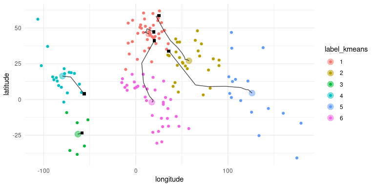
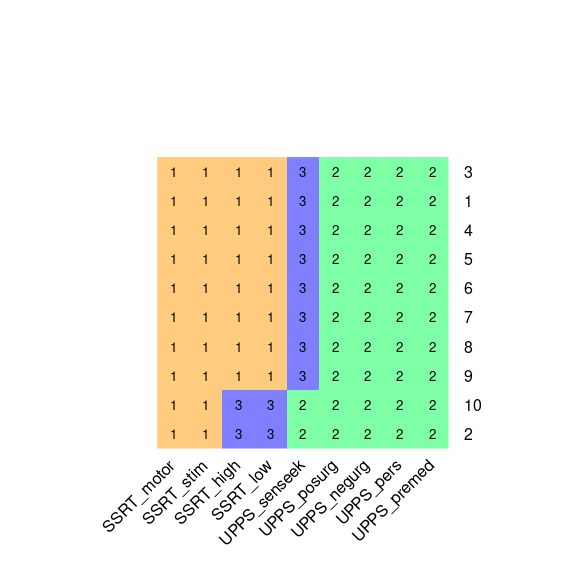
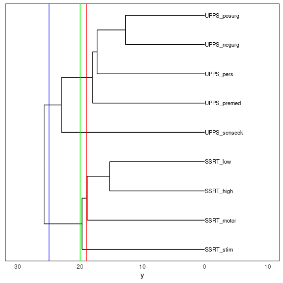
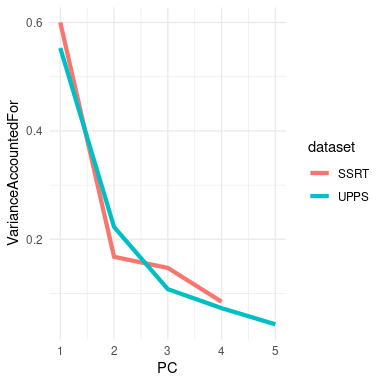
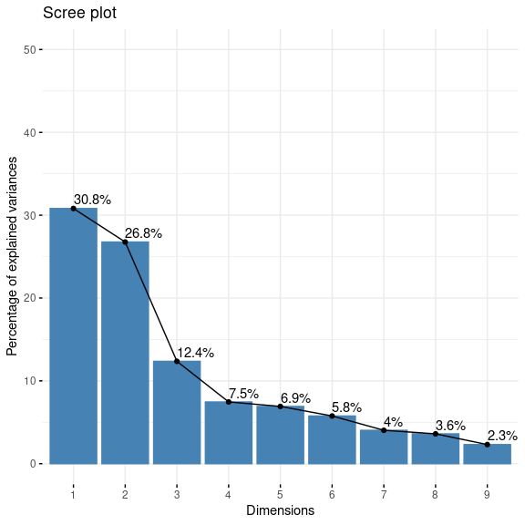
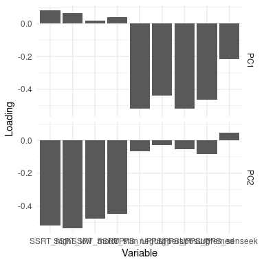

# 十五、比较方法

在统计学中，我们要问的最常见的问题之一是两个不同组的平均值是否存在差异。假设我们想知道经常吸食大麻的人是否会看更多的电视。我们可以使用 nhanes 数据集来问这个问题；让我们从数据集中抽取 200 个人的样本，测试每天看电视的时间是否与正常使用大麻有关。图[15.1](#fig:PotTVViolin)显示了使用小提琴绘图的这些数据。

```r
# create sample with tv watching and marijuana use
NHANES_sample <-
  NHANES_adult %>%
  drop_na(TVHrsDay, RegularMarij) %>%
  mutate(
    TVHrsNum = recode( #recode character values into numerical values
      TVHrsDay,
      "More_4_hr" = 5,
      "4_hr" = 4, 
      "2_hr" = 2,
      "1_hr" = 1, 
      "3_hr" = 3, 
      "0_to_1_hr" = 0.5,
      "0_hrs" = 0
    )
  ) %>%
  sample_n(200)
```



图 15.1 显示电视观看分布的小提琴图，由正常的大麻使用分开。

## 15.1 学生 T 考试

在上一章的假设检验中，我们已经遇到了学生 t 统计量。这一统计数据为我们提供了一种测试两组独立观测值之间差异的方法；我们将在本章后面的部分讨论观测值不独立的情况。作为提醒，两个独立组比较的 t 统计量计算如下：


其中和是两组的平均值，和是每组的方差，和是两组的大小。在均值无差的零假设下，该统计量按自由度为 n-2 的 t 分布进行分布（因为我们计算了两个参数估计，即两组的均值）。我们可以使用`t.test()`函数计算 r 中的 t 检验。在本例中，我们从吸烟大麻与更大的电视收看量相关的具体假设开始，因此我们将使用单尾测试。由于 t.test 函数按字母顺序排列条件，“no”组排在第一位，因此我们需要测试第一组是否小于第二组（“yes”）的替代假设；因此，我们指定“less”作为替代。

```r
# compute t test for tv watching as function of marijuana use
t.test(
  TVHrsNum ~ RegularMarij,
  data = NHANES_sample,
  var.equal = TRUE,
  alternative = 'less'
)
```

```r
## 
##  Two Sample t-test
## 
## data:  TVHrsNum by RegularMarij
## t = -3, df = 200, p-value = 0.001
## alternative hypothesis: true difference in means is less than 0
## 95 percent confidence interval:
##   -Inf -0.29
## sample estimates:
##  mean in group No mean in group Yes 
##               2.2               2.8
```

在这种情况下，我们发现，在预期的方向上，两组之间有统计学上的显著差异——普通的大麻吸烟者看更多的电视。

## 15.2 t 检验作为线性模型

t 检验是比较平均值的一种专用工具，但也可以看作是一般线性模型的一种应用。在这种情况下，模型如下所示：


然而，吸烟是一个二元变量，因此我们将其作为一个 _ 虚拟变量 _，正如我们在上一章中讨论的那样，将其设置为吸烟者为 1，不吸烟者为零。在这种情况下，只是两组之间平均值的差，是编码为零的组的平均值。我们可以使用`lm()`函数来拟合这个模型，并看到它给出与上面的 t 检验相同的 t 统计量：

```r
# print summary of linear regression to perform t-test
s <- summary(lm(TVHrsNum ~ RegularMarij, data = NHANES_sample))
s
```

```r
## 
## Call:
## lm(formula = TVHrsNum ~ RegularMarij, data = NHANES_sample)
## 
## Residuals:
##    Min     1Q Median     3Q    Max 
## -2.810 -1.165 -0.166  0.835  2.834 
## 
## Coefficients:
##                 Estimate Std. Error t value Pr(>|t|)    
## (Intercept)        2.165      0.115   18.86   <2e-16 ***
## RegularMarijYes    0.645      0.213    3.02   0.0028 ** 
## ---
## Signif. codes:  0 '***' 0.001 '**' 0.01 '*' 0.05 '.' 0.1 ' ' 1
## 
## Residual standard error: 1.4 on 198 degrees of freedom
## Multiple R-squared:  0.0441, Adjusted R-squared:  0.0393 
## F-statistic: 9.14 on 1 and 198 DF,  p-value: 0.00282
```

我们还可以以图形方式查看 lm（）结果（参见图[15.2](#fig:ttestFig)）：



图 15.2 显示每组数据的小提琴图，蓝色线连接每组的预测值，根据线性模型的结果计算。

在这种情况下，不吸烟者的预测值为（2.17），吸烟者的预测值为（2.81）。

为了计算这个分析的标准误差，我们可以使用与线性回归完全相同的方程——因为这实际上只是线性回归的另一个例子。事实上，如果将上述 t 检验中的 p 值与大麻使用变量的线性回归分析中的 p 值进行比较，您会发现线性回归分析中的 p 值正好是 t 检验中的 p 值的两倍，因为线性回归分析正在执行双尾测试。

#

## 15.2.1 比较两种方法的效果大小

两种方法之间比较最常用的效果大小是 Cohen's D（如您在第[10](#ci-effect-size-power)章中所记得的），它是用标准误差单位表示效果的表达式。对于使用上文概述的一般线性模型（即使用单个虚拟编码变量）估计的 t 检验，其表示为：


我们可以从上面的分析输出中获得这些值，得出 d=0.47，我们通常将其解释为中等大小的效果。

我们也可以计算这个分析的，它告诉我们看电视的差异有多大。这个值（在 lm（）分析的摘要中报告）是 0.04，这告诉我们，虽然效果在统计上有显著意义，但它在电视观看方面的差异相对较小。

## 15.3 平均差的贝叶斯因子

正如我们在贝叶斯分析一章中所讨论的，贝叶斯因子提供了一种更好地量化证据的方法，支持或反对零差异假设。在这种情况下，我们要针对零假设进行测试，即差异小于零，因为差异是由第一组（“否”）和第二组（“是”）之间的函数计算得出的。因此，我们指定了一个从零到无穷大的“空间隔”，这意味着替代值小于零。

```r
# compute bayes factor for group comparison
bf <- ttestBF(
  formula = TVHrsNum ~ RegularMarij, 
  data = NHANES_sample, 
  nullInterval = c(0, Inf)
)
bf
```

```r
## Bayes factor analysis
## --------------
## [1] Alt., r=0.707 0<d<Inf    : 0.043 ±0%
## [2] Alt., r=0.707 !(0<d<Inf) : 22    ±0%
## 
## Against denominator:
##   Null, mu1-mu2 = 0 
## ---
## Bayes factor type: BFindepSample, JZS
```

这表明，反对无效假设的证据是相当有力的。

## 15.4 配对 t 检验

在实验研究中，我们经常在受试者设计中使用 _，在设计中我们比较同一个人的多个测量值。例如，在 nhanes 数据集中，血压测量了三次。假设我们有兴趣测试第一次和第二次测量之间的平均血压是否存在差异（图[15.3](#fig:BPfig)）。_



图 15.3 NHANES 第一次和第二次记录的收缩压小提琴图。

我们发现，在不同的时间点（大约一点）之间，平均血压似乎没有太大的差异。首先，让我们使用一个独立的样本 t 检验来测试差异，它忽略了数据点对来自同一个人的事实。

```r
t.test(
  BPsys ~ timepoint,
  data = NHANES_sample_tidy,
  paired = FALSE, 
  var.equal = TRUE
)
```

```r
## 
##  Two Sample t-test
## 
## data:  BPsys by timepoint
## t = 0.5, df = 400, p-value = 0.6
## alternative hypothesis: true difference in means is not equal to 0
## 95 percent confidence interval:
##  -2.8  4.6
## sample estimates:
## mean in group BPSys1 mean in group BPSys2 
##                  122                  121
```

这一分析显示没有显著差异。然而，这种分析是不适当的，因为它假定两个样本是独立的，而事实上它们不是独立的，因为数据来自同一个人。我们可以用每一个人的一行来绘制数据来显示这一点（参见图[15.4](#fig:BPLinePlot)）。


图 15.4 每一次记录的收缩压小提琴图，每一次记录的两个数据点之间都有连接线。

在这个分析中，我们真正关心的是两次测量之间每个人的血压是否有系统的变化，所以表示数据的另一种方法是计算每个人的两个时间点之间的差异，然后分析这些差异。而不是分析单个测量值。在图[15.5](#fig:BPDiffHist)中，我们显示了这些差异分数的柱状图，蓝色线表示平均差异。



图 15.5 第一次和第二次血压测量的差分柱状图。

#

## 15.4.1 标志试验

测试差异的一个简单方法是使用一个名为 _ 符号测试 _ 的测试，它询问正差异的比例（忽略它们的大小）是否不同于我们所期望的偶然性。为了做到这一点，我们利用这些差异计算它们的符号，然后我们使用二项式测试来询问阳性符号的比例是否与 0.5 不同。

```r
# compute sign test for differences between first and second measurement
npos <- sum(NHANES_sample$diffPos)
bt <- binom.test(npos, nrow(NHANES_sample))
bt
```

```r
## 
##  Exact binomial test
## 
## data:  npos and nrow(NHANES_sample)
## number of successes = 100, number of trials = 200, p-value = 0.4
## alternative hypothesis: true probability of success is not equal to 0.5
## 95 percent confidence interval:
##  0.46 0.60
## sample estimates:
## probability of success 
##                   0.53
```

在这里我们看到，在无效假设下，有阳性迹象的个体比例（0.53）不足以令人惊讶。然而，符号测试的一个问题是它丢弃了关于差异大小的信息，因此可能遗漏了一些东西。

#

## 15.4.2 配对 t 检验

更常见的策略是使用 _ 对 t 检验 _，这相当于一个样本 t 检验，以确定测量值之间的平均差是否为零。我们可以使用 r 中的`t.test()`函数和设置`paired=TRUE`来计算这个值。

```r
# compute paired t-test
t.test(BPsys ~ timepoint, data = NHANES_sample_tidy, paired = TRUE)
```

```r
## 
##  Paired t-test
## 
## data:  BPsys by timepoint
## t = 2, df = 200, p-value = 0.02
## alternative hypothesis: true difference in means is not equal to 0
## 95 percent confidence interval:
##  0.17 1.69
## sample estimates:
## mean of the differences 
##                    0.93
```

通过这些分析，我们发现两个测量值实际上存在显著差异。让我们计算一下贝叶斯因子，看看这种影响有多强：

```r
# compute Bayes factor for paired t-test
ttestBF(x = NHANES_sample$BPSys1, y = NHANES_sample$BPSys2, paired = TRUE)
```

```r
## Bayes factor analysis
## --------------
## [1] Alt., r=0.707 : 1.3 ±0%
## 
## Against denominator:
##   Null, mu = 0 
## ---
## Bayes factor type: BFoneSample, JZS
```

这表明，虽然在配对 t 检验中效果显著，但实际上它几乎没有提供支持替代假设的证据。

#

## 15.4.3 配对 t 检验作为线性模型

我们也可以用一般线性模型来定义配对 t 检验。为了做到这一点，我们将每个主题的所有度量都作为数据点（在整洁的数据框架内）。然后，我们在模型中包含一个变量，该变量编码每个人的身份（在本例中，是包含每个人的主题 ID 的 ID 变量）。这被称为 _ 混合模型 _，因为它包括独立变量的影响以及个体的影响。标准模型拟合程序`lm()`不能做到这一点，但我们可以使用流行的 R 包 _lme4_ 中的`lmer()`函数来实现这一点，该包专门用于估计混合模型。公式中的`(1|ID)`告诉`lmer()`为`ID`变量的每个值（即数据集中的每个个体）估计一个单独的截距（即`1`所指的截距），然后估计一个与 bp 相关的公共斜率。

```r
# compute mixed model for paired test

lmrResult <- lmer(BPsys ~ timepoint + (1 | ID), data = NHANES_sample_tidy)
summary(lmrResult)
```

```r
## Linear mixed model fit by REML. t-tests use Satterthwaite's method [
## lmerModLmerTest]
## Formula: BPsys ~ timepoint + (1 | ID)
##    Data: NHANES_sample_tidy
## 
## REML criterion at convergence: 2982
## 
## Scaled residuals: 
##     Min      1Q  Median      3Q     Max 
## -2.6985 -0.4478  0.0058  0.3996  2.7395 
## 
## Random effects:
##  Groups   Name        Variance Std.Dev.
##  ID       (Intercept) 342      18.49   
##  Residual              15       3.87   
## Number of obs: 400, groups:  ID, 200
## 
## Fixed effects:
##                 Estimate Std. Error      df t value Pr(>|t|)    
## (Intercept)      121.770      1.336 207.545    91.2   <2e-16 ***
## timepointBPSys2   -0.930      0.387 199.000    -2.4    0.017 *  
## ---
## Signif. codes:  0 '***' 0.001 '**' 0.01 '*' 0.05 '.' 0.1 ' ' 1
## 
## Correlation of Fixed Effects:
##             (Intr)
## tmpntBPSys2 -0.145
```

您可以看到，这向我们显示了一个 p 值，它非常接近于使用`t.test()`函数计算的成对 t 检验的结果。

## 15.5 比较两种以上的方法

通常我们想比较两种以上的方法来确定它们之间是否存在差异。假设我们正在分析一项治疗高血压的临床试验的数据。在研究中，志愿者被随机分为三种情况：药物 1、药物 2 或安慰剂。让我们生成一些数据并绘制它们（参见图[15.6](#fig:DrugTrial)）



图 15.6 显示我们临床试验中三个不同组的血压的方框图。

#

## 15.5.1 方差分析

我们首先要验证一个无效的假设，即所有组的平均值都是相等的——也就是说，两种治疗都没有任何效果。我们可以使用一个名为 _ 方差分析 _（anova）的方法来实现这一点。这是心理统计学中最常用的方法之一，我们将只触及表面。方差分析背后的基本思想是我们在关于一般线性模型的章节中已经讨论过的，事实上，方差分析只是这种模型具体实现的一个名称。

记住，从上一章我们可以将数据中的总方差（）划分为模型（）解释的方差和非模型（）解释的方差。然后我们可以通过除以它们的自由度来计算每一个的 _ 均方 _；对于误差，这是（其中是我们计算的平均数），对于模型，这是：


通过方差分析，我们想要检验在平均值之间没有差异的无效假设下，模型所解释的方差是否大于我们所期望的偶然值。而对于 t 分布，零假设下的期望值是零，这里不是这样，因为平方和总是正数。幸运的是，还有另一个标准分布描述了在零假设下平方和的比率是如何分布的：f 分布（见图[15.7](#fig:FDist)）。这个分布有两个自由度，分别对应分子的自由度（在本例中是模型）和分母（在本例中是误差）。



图 15.7 零假设下，自由度不同值的 F 分布。

为了创建一个方差分析模型，我们扩展了您在上一章中遇到的 _ 伪编码 _ 的思想。记住，对于比较两个平均值的 t 检验，我们创建了一个虚拟变量，其中一个条件的值为 1，另一个条件的值为零。在这里，我们通过创建两个虚拟变量来扩展这一想法，一个是为药物 1 状态编码，另一个是为药物 2 状态编码。正如在 t 检验中一样，我们将有一个条件（在本例中是安慰剂）没有一个虚拟变量，因此代表了与其他变量进行比较的基线；其平均值定义了模型的截距。让我们创建药物 1 和 2 的虚拟编码。

```r
# create dummy variables for drug1 and drug2
df <-
  df %>%
  mutate(
    d1 = as.integer(group == "drug1"), # 1s for drug1, 0s for all other drugs
    d2 = as.integer(group == "drug2")  # 1s for drug2, 0s for all other drugs
  )
```

现在，我们可以使用上一章中使用的相同方法来拟合模型：

```r
# fit ANOVA model
lmResultANOVA <- lm(sysBP ~ d1 + d2, data = df)
summary(lmResultANOVA)
```

```r
## 
## Call:
## lm(formula = sysBP ~ d1 + d2, data = df)
## 
## Residuals:
##     Min      1Q  Median      3Q     Max 
## -29.084  -7.745  -0.098   7.687  23.431 
## 
## Coefficients:
##             Estimate Std. Error t value Pr(>|t|)    
## (Intercept)   141.60       1.66   85.50  < 2e-16 ***
## d1            -10.24       2.34   -4.37  2.9e-05 ***
## d2             -2.03       2.34   -0.87     0.39    
## ---
## Signif. codes:  0 '***' 0.001 '**' 0.01 '*' 0.05 '.' 0.1 ' ' 1
## 
## Residual standard error: 9.9 on 105 degrees of freedom
## Multiple R-squared:  0.169,  Adjusted R-squared:  0.154 
## F-statistic: 10.7 on 2 and 105 DF,  p-value: 5.83e-05
```

这个命令的输出为我们提供了两件事。首先，它向我们展示了每一个虚拟变量的 t 检验结果，这基本上告诉我们每一个条件是否与安慰剂不同；药物 1 似乎不同，而药物 2 则不同。但是，请记住，如果我们想要解释这些测试，我们需要更正 p 值，以说明我们已经进行了多个假设测试；我们将在下一章中看到如何进行此操作的示例。

记住，我们开始想要测试的假设是，任何条件之间是否存在任何差异；我们将其称为 _ 综合假设测试，这是由 F 统计量提供的测试。F 统计量基本上告诉我们，我们的模型是否比只包含截距的简单模型更好。在这种情况下，我们看到 f 检验是非常显著的，这与我们的印象一致，即两组之间确实存在差异（事实上，我们知道存在差异，因为我们创建了数据）。_