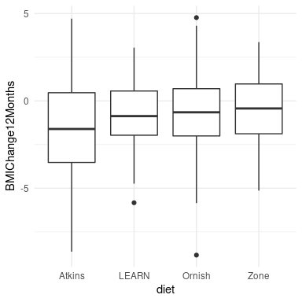
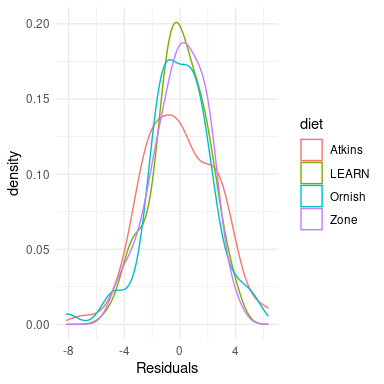
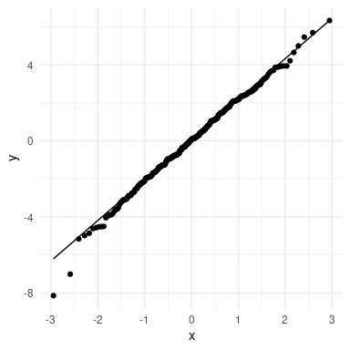

# 17 实用统计建模

在这一章中，我们将把我们所学的知识运用到一个实际的例子中。2007年，Christopher Gardner和来自Stanford的同事在美国医学协会杂志上发表了一项名为“Atkins，Zone，Ornish和LEARN饮食对绝经前超重妇女体重变化和相关风险因素的比较——A到Z减肥研究:随机试验”的研究 ( [Gardner等人，2007年](ch020.xhtml#ref-gard:kiaz:alha:2007) ) 。我们将通过这项研究来展示如何从头到尾分析一个实验数据集。


## 17.1 统计建模的过程

当我们想要使用我们的统计模型来检验一个科学假设时，我们通常会经历一系列步骤:

1.  请具体说明您感兴趣的问题
2.  识别或收集适当的数据
3.  为分析准备数据
4.  确定合适的型号
5.  使模型符合数据
6.  批评模型以确保它合适
7.  测试假设并量化影响大小


### 17.1.1 1:说明您感兴趣的问题

根据作者的说法，他们研究的目标是:

> 比较代表从低到高碳水化合物摄入范围的4种减肥食谱对减肥和相关代谢变量的影响。


### 17.1.2 2:识别或收集适当的数据

为了回答他们的问题，研究人员将311名超重/肥胖女性随机分配到四种不同饮食中的一种(阿特金斯、Zone、Ornish或LEARN)，并随着时间的推移测量她们的体重和许多其他健康指标。作者记录了大量的变量，但对于感兴趣的主要问题，让我们专注于一个变量:身体质量指数(身体质量指数)。此外，由于我们的目标是测量身体质量指数的持久变化，我们将只关注饮食开始后12个月的测量。


### 17.1.3 3:准备用于分析的数据



图17.1:每种情况下的箱线图，第50个百分位数(即中位数)显示为每组的黑线。

从A到Z研究的实际数据是不公开的，所以我们将使用他们论文中报告的汇总数据来生成一些合成数据，这些数据大致与他们研究中获得的数据相匹配，每组的均值和标准差都相同。一旦我们有了数据，我们可以将它们可视化，以确保没有异常值。箱线图有助于观察分布的形状，如图 [17.1](#fig:AtoZBMIChangeDensity) 所示。这些数据看起来相当合理——在单个组中有几个异常值(由方框图外的点表示),但对于其他组来说，它们似乎并不极端。我们还可以看到，这些分布的方差似乎有点不同，阿特金斯比其他人显示出更大的可变性。这意味着任何假设组间方差相等的分析都可能是不合适的。幸运的是，我们计划使用的方差分析模型对此相当稳健。


### 17.1.4 4。确定合适的型号

为了给我们的分析确定合适的统计模型，我们需要问几个问题。

*   什么样的因变量？
    *   身体质量指数:连续，大致正态分布
*   我们在比较什么？
    *   四个饮食组的平均身体质量指数
    *   方差分析是合适的
*   观察是独立的吗？
    *   随机分配应确保独立性假设是适当的
    *   差异分数的使用(在这种情况下是开始体重和12个月后体重之间的差异)有些争议，特别是当各组之间的起点不同时。在这种情况下，各组之间的起始权重非常相似，因此我们将使用差异分数，但一般来说，在将这种模型应用于实际数据之前，人们会希望咨询统计学家。


### 17.1.5 5。使模型符合数据

让我们对身体质量指数变化进行方差分析，以比较这四种饮食。大多数统计软件会自动将一个名义变量转换成一组虚拟变量。指定统计模型的一种常见方式是使用*公式符号*，其中使用以下形式的公式指定模型:

<math display="block"><semantics><mrow><mtext mathvariant="normal">因变量</mtext><mo>∩</mo><mtext mathvariant="normal">自变量</mtext></mrow><annotation encoding="application/x-tex">\ text {因变量} \ sim \ text {自变量}</annotation></semantics></math>

在这种情况下，我们希望将身体质量指数的变化(存储在名为 *BMIChange12Months* 的变量中)视为饮食(存储在名为*diet的变量中)的函数，因此我们使用公式:

<semantics><mrow>【B3】【b】<mi>【m】</mi><mi>【I】<mi>【c】<mi><mi>【a】</mi></mi></mi></mi></mrow></semantics>

大多数统计软件(包括R)会在模型包含一个名义变量时自动创建一组哑变量(比如 *diet* 变量，包含每个人接受的饮食名称)。以下是该模型与我们的数据相吻合的结果:

```
## 
## Call:
## lm(formula = BMIChange12Months ~ diet, data = dietDf)
## 
## Residuals:
##    Min     1Q Median     3Q    Max 
##  -8.14  -1.37   0.07   1.50   6.33 
## 
## Coefficients:
##             Estimate Std. Error t value Pr(>|t|)    
## (Intercept)   -1.622      0.251   -6.47  3.8e-10 ***
## dietLEARN      0.772      0.352    2.19   0.0292 *  
## dietOrnish     0.932      0.356    2.62   0.0092 ** 
## dietZone       1.050      0.352    2.98   0.0031 ** 
## ---
## Signif. codes:  0 '***' 0.001 '**' 0.01 '*' 0.05 '.' 0.1 ' ' 1
## 
## Residual standard error: 2.2 on 307 degrees of freedom
## Multiple R-squared:  0.0338, Adjusted R-squared:  0.0243 
## F-statistic: 3.58 on 3 and 307 DF,  p-value: 0.0143
```

请注意，软件自动生成了与四种饮食中的三种相对应的虚拟变量，使得阿特金斯饮食没有虚拟变量。这意味着截距代表阿特金斯饮食组的平均值，其他三个变量模拟了每种饮食的平均值与阿特金斯饮食的平均值之间的差异。选择Atkins作为未建模的基线变量仅仅是因为它在字母顺序中是第一个。


### 17.1.6 6。批评模型以确保它合适

我们要做的第一件事是评论这个模型，以确保它是合适的。我们可以做的一件事是查看模型的残差。在图 [17.2](#fig:residualPlot) 中，我们绘制了按饮食分组的每个人的残差。不同条件下的残差分布没有明显的差异，我们可以继续分析。



图17.2:每种条件下的残差分布

我们应用于线性模型的统计检验的另一个重要假设是模型的残差是正态分布的。线性模型要求*数据*呈正态分布，这是一种常见的误解，但事实并非如此；正确统计的唯一要求是残差呈正态分布。图 [17.3](#fig:diagnosticQQPlot) 的右侧面板显示了Q-Q(分位数-分位数)图，该图根据残差在正态分布中的分位数，绘制了残差与其期望值的关系。如果残差呈正态分布，那么数据点应该沿着虚线分布，在这种情况下，它看起来很好，除了在底部很明显的几个异常值，因为该模型对违反正态分布的情况也相对稳健，这些异常值相当小，我们将继续使用结果。



图17.3:实际残差值与理论残差值的Q-Q图


### 17.1.7 7。测试假设并量化影响大小

首先，让我们回顾一下方差分析的结果汇总，如上面的步骤5所示。显著性f检验表明饮食之间存在显著差异，但我们也应该注意到该模型实际上并没有解释数据中的太多差异；R平方值仅为0.03，表明该模型仅解释了体重减轻差异的百分之几。因此，我们不想过度解读这个结果。

综合F检验的显著结果也没有告诉我们哪种饮食不同于其他饮食。通过比较不同条件下的平均值，我们可以发现更多信息。因为我们要进行几次比较，所以需要对这些比较进行校正，这需要使用一种称为Tukey方法的程序来完成，该方法由我们的统计软件实现:

```
##  diet   emmean    SE  df lower.CL upper.CL .group
##  Atkins  -1.62 0.251 307    -2.11    -1.13  a    
##  LEARN   -0.85 0.247 307    -1.34    -0.36  ab   
##  Ornish  -0.69 0.252 307    -1.19    -0.19   b   
##  Zone    -0.57 0.247 307    -1.06    -0.08   b   
## 
## Confidence level used: 0.95 
## P value adjustment: tukey method for comparing a family of 4 estimates 
## significance level used: alpha = 0.05 
## NOTE: Compact letter displays can be misleading
##       because they show NON-findings rather than findings.
##       Consider using 'pairs()', 'pwpp()', or 'pwpm()' instead.
```

最右边一栏中的字母显示了哪些组彼此不同，使用的方法是根据正在进行的比较次数进行调整；共享一个字母的条件彼此之间没有显著差异。这表明阿特金斯饮食法和学习饮食法彼此没有区别(因为它们共享字母a)，学习饮食法、欧尼斯饮食法和区域饮食法彼此没有区别(因为它们共享字母b)，但是阿特金斯饮食法不同于欧尼斯饮食法和区域饮食法(因为它们没有共享字母)。


### 17.1.8 可能的混杂因素是什么？

如果我们更仔细地看看加德纳的论文，我们会发现他们还报告了每组中有多少人被诊断患有*代谢综合征*的统计数据，这是一种以高血压、高血糖、腰部脂肪过多和胆固醇水平异常为特征的综合征，与心血管问题的风险增加有关。加德纳论文的数据在表 [17.1](#tab:metsymData) 中列出。

<caption>Table 17.1: Presence of metabolic syndrome in each group in the AtoZ study.</caption>
| 规定饮食 | 普通 | 代谢综合征 |
| --- | --- | --- |
| 任何组织的基层人员 | Seventy-seven | Zero point two nine |
| 学习 | Seventy-nine | Zero point two five |
| 奥尼什语 | Seventy-six | Zero point three eight |
| 地区 | Seventy-nine | Zero point three four |

从数据来看，似乎各组之间的比率略有不同，在Ornish和Zone饮食中有更多的代谢综合征病例——这正是结果较差的饮食。假设我们对测试各组之间代谢综合征的发生率是否有显著差异感兴趣，因为这可能会使我们担心这些差异可能会影响饮食结果的结果。


#### 17.1.8.1确定合适的型号

*   什么样的因变量？
    *   比例
*   我们在比较什么？
    *   四个饮食组中患代谢综合征的比例
    *   拟合优度的卡方检验适用于无差异的零假设

让我们首先使用统计软件中卡方检验函数来计算统计数据:

```
## 
##  Pearson's Chi-squared test
## 
## data:  contTable
## X-squared = 4, df = 3, p-value = 0.3
```

该测试表明，平均值之间没有显著差异。然而，它并没有告诉我们有多确定没有差别；请记住，在NHST理论下，我们总是在假设零为真的情况下工作，除非数据向我们展示了足够的证据，使我们拒绝零假设。

如果我们想量化支持或反对零的证据呢？我们可以用贝叶斯因子来做这件事。

```
## Bayes factor analysis
## --------------
## [1] Non-indep. (a=1) : 0.058 ±0%
## 
## Against denominator:
##   Null, independence, a = 1 
## ---
## Bayes factor type: BFcontingencyTable, independent multinomial
```

这向我们表明，替代假设比零假设的可能性高0.058倍，这意味着在给定这些数据的情况下，零假设比替代假设的可能性高1/0.058 ~ 17倍。这是相当有力的，如果不是完全压倒性的，支持零假设的证据。


## 17.2 求助

每当分析真实数据时，与训练有素的统计学家一起检查你的分析计划是有用的，因为真实数据中可能出现许多潜在的问题。事实上，在你开始这个项目之前，最好和统计学家谈谈，因为他们关于研究的设计或实施的建议可以让你在今后省去很多麻烦。大多数大学都有统计咨询办公室，为大学社团成员提供免费帮助。理解这本书的内容不会阻止你在某些时候需要他们的帮助，但它会帮助你与他们进行更明智的对话，并更好地理解他们提供的建议。


