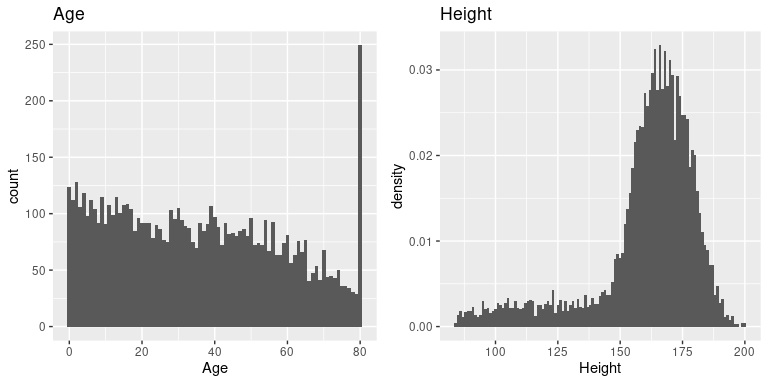

# 三、概率

概率论是处理机会和不确定性的数学分支。它是统计基础的重要组成部分，因为它为我们提供了描述不确定事件的数学工具。概率的研究部分是由于人们对机会游戏的理解感兴趣，如纸牌或骰子。这些游戏提供了许多统计概念的有用例子，因为当我们重复这些游戏时，不同结果的可能性（大部分）保持不变。然而，关于概率的含义有一些深层次的问题，我们在这里不讨论；如果您有兴趣进一步了解这个迷人的主题及其历史，请参阅结尾处的建议阅读资料。

## 3.1 什么是概率？

非正式地，我们通常认为概率是一个描述某些事件发生可能性的数字，范围从零（不可能）到一（确定）。有时概率会用百分比表示，从 0 到 100 不等，正如天气预报预测今天有 20%的可能下雨一样。在每种情况下，这些数字表示特定事件的可能性。

为了将概率论形式化，我们首先需要定义一些术语：

*   实验是产生或观察结果的任何活动。例如，掷硬币、掷 6 面骰子，或者尝试新的工作路线，看它是否比旧路线快。
*   **样本空间**是一个实验的可能结果集。对于硬币翻转，样本空间为 h，t，其中括号代表样本空间，h/t 代表头部/尾部。对于模具，样本空间为 1,2,3,4,5,6。对于工作所需的时间量，样本空间都是可能大于零的实数（因为它不能用负的时间到达某个地方，至少目前还不能）。
*   **事件**是示例空间的子集。在这里，我们将主要关注 _ 基本事件 _，这些事件恰好包含一个可能的结果，例如掷硬币时的头部、掷骰子时的 4 个骰子，或通过新路线回家的 21 分钟。

既然我们有了这些定义，我们就可以概括概率的形式特征，这是俄罗斯数学家安德烈·科尔莫戈罗夫首先定义的。如果是事件概率：

*   概率不能为负：

*   样本空间中所有结果的总概率为 1。我们可以使用求和符号来表示它：

这被解释为“把所有的 n 个基本事件，我们从 1 到 n，加起来它们的概率。这些必须加为 1。“这意味着任何单个事件的概率不能大于 1:

## 3.10 概率是什么意思？

你可能会觉得，根据测试结果谈论一个人患癌症的几率有点奇怪；毕竟，这个人要么患了癌症，要么没有。历史上，概率有两种不同的解释方式。第一种解释（被称为 _ 频率主义者 _ 解释）用长期频率解释概率。例如，在硬币翻转的情况下，它将反映出大量翻转之后，头部在长期内的相对频率。虽然这种解释可能对像掷硬币一样可以重复多次的事件有意义，但对于只会发生一次的事件，如个人的生活或特定的总统选举，则没有意义；正如经济学家约翰·梅纳德·凯恩斯（John Maynard Keynes）著名地说的，“在从长远来看，我们都死定了。”

可能性的另一种解释（称为 _ 贝叶斯 _ 解释）是对特定命题的一种信仰程度。如果我问你“到 2026 年美国重返月球的可能性有多大”，你可以根据你的知识和信仰来回答这个问题，即使没有相关的频率来计算频率概率。我们经常用一种方法来界定主观概率，那就是根据一个人愿意接受一个特定的赌博。例如，如果你认为美国在 2026 年登陆月球的概率是 0.1（即几率为 9:1），那么这意味着你应该愿意接受一场赌博，如果这一事件发生的话，它将以超过 9:1 的几率获得回报。

正如我们将看到的，概率的这两个不同定义与统计学家考虑检验统计假设的两种不同方式非常相关，我们将在后面的章节中遇到这两种方式。

## 3.11 阅读建议

*   酒鬼之行：随机性如何支配我们的生活

## 3.2 我们如何确定概率？

既然我们知道了概率是什么，那么我们如何才能真正知道任何特定事件的概率是什么呢？

#

## 3.2.1 个人意见

假设我问你，如果伯尼·桑德斯获得民主党提名而不是希拉里·克林顿的话，他在 2016 年赢得美国总统大选的可能性有多大。这里的样本空间是桑德斯赢了，桑德斯输了，但我们实际上不能做实验来找到结果。然而，大多数了解选举的人都愿意对这一事件的可能性进行猜测。在许多情况下，个人知识和/或意见是我们确定事件发生概率的唯一指南，但这在科学上并不令人满意。

#

## 3.2.2 经验频率

另一种确定事件发生概率的方法是多次进行实验，并计算每个事件发生的频率。根据不同结果的相对频率，我们可以计算出每个结果的概率。比如说，我们有兴趣知道旧金山下雨的可能性。首先，我们必须定义实验---假设我们将在 2017 的每一天查看国家气象服务数据（可以从 [HTTPS://www. NCDC.NOAAGOV/](https://www.ncdc.noaa.gov/)下载），并确定在旧金山市中心的气象站是否有雨。

```r
# load data on rain in San Francisco and compute probability
SFrain <- read_csv("data/SanFranciscoRain/1329219.csv")

# create a new variable indicating whether it rained on each day
SFrain <- 
  SFrain %>%
  mutate(rainToday = as.integer(PRCP > 0))

SFrain_summary <- 
  SFrain %>%
  summarize(
    nRainyDays = sum(rainToday),
    nDaysMeasured = n(),
    pRainInSF = nRainyDays / nDaysMeasured
  ) 

pander(SFrain_summary)
```

<colgroup><col style="width: 18%"> <col style="width: 22%"> <col style="width: 15%"></colgroup> 
| 每天 | 标准测量值 | 普拉宁斯 |
| --- | --- | --- |
| 73 | 365 个 | 0.2 条 |

根据这些数据，2017 年有 73 个雨天。为了计算旧金山的降雨概率，我们简单地将雨天数除以（365），给出 P（SF 的雨在 2017）＝0.2。

我们怎么知道经验概率给了我们正确的数字？这个问题的答案来自于 _ 大数定律 _，它表明随着样本量的增加，经验概率将接近真实概率。我们可以通过模拟大量的硬币翻转来看到这一点，并查看我们对每次翻转后头部概率的估计。在后面的章节中，我们将花费更多的时间讨论模拟；现在，假设我们有一种计算方法来为每个硬币翻转生成随机结果。


图 3.1 大数定律的演示。一枚硬币被翻转了 30000 次，每次翻转后，头部的概率是根据收集到的头部和尾部的数量来计算的。以 0.5 的真实概率结算的概率大约需要 15000 次翻转。

图[3.1](#fig:FlipSim)显示，随着样本数量（即硬币翻转试验）的增加，头部的估计概率收敛到 0.5 的真实值。但是，请注意，当样本量较小时，估计值可能与真实值相差甚远。在 2017 年佐治亚州美国参议院特别选举中，看到了一个现实世界的例子，这场选举让共和党人罗伊·摩尔与民主党人道格·琼斯相提并论。图[3.2](#fig:ElectionResults)显示了随着越来越多的选票被计算在内，当晚每个候选人所报告的选票的相对数量。晚上早些时候，投票数特别不稳定，从琼斯最初的领先优势到摩尔领先的很长一段时间，直到琼斯最终领先赢得比赛。


图 3.2 2017 年 12 月 12 日美国佐治亚州参议院席位特别选举的投票相对比例，与选区报告百分比的函数关系。这些数据摘自[https://www.ajc.com/news/national/alabama-senate-race-live-updates-roy-moore-doug-jones/kpfkdaweixicw3fhjxqi/](https://www.ajc.com/news/national/alabama-senate-race-live-updates-roy-moore-doug-jones/KPRfkdaweoiXICW3FHjXqI/)

这两个例子表明，虽然大样本最终会收敛于真实概率，但小样本的结果可能会相差很远。不幸的是，许多人忘记了这一点，并曲解了小样本的结果。心理学家丹尼·卡尼曼和阿莫斯·特沃斯基（Danny Kahneman and Amos Tversky）称之为“小数字定律”（HTG0），他们发现人们（甚至是受过训练的研究人员）的行为通常就好像大数字定律甚至适用于小样本一样，对小数据集的结果给予了过多的信任。.在整个过程中，我们将看到一些例子，说明在小样本的基础上生成统计结果会有多不稳定。

#

## 3.2.3 经典概率

我们中的任何一个人都不太可能投过几万次硬币，但我们仍然愿意相信，倒头的概率是 0.5。这反映了另一种计算概率的方法的使用，我们称之为 _ 经典概率 _。在这种方法中，我们直接根据我们对形势的了解来计算概率。

经典概率源于对骰子和纸牌等机会游戏的研究。一个著名的例子来自一个法国赌徒遇到的一个问题，这个赌徒的名字是“chevalier de m_r_”。德玛 _r_ 玩了两种不同的骰子游戏：第一种是在六面骰子的四个骰子上赌至少一个六的机会，第二种是在两个骰子的 24 个骰子上赌至少一个六的机会。他希望在这两次赌博中都能赢，但他发现，尽管他在第一次赌博中平均赢了钱，但在第二次赌博中却多次输了钱。为了理解这一点，他求助于他的朋友，数学家布莱斯·帕斯卡，他现在被公认为概率论的创始人之一。

我们如何用概率论来理解这个问题？在经典概率论中，我们首先假设样本空间中的所有基本事件都同样可能发生；也就是说，当您滚动一个骰子时，所有可能的结果（1,2,3,4,5,6）都同样可能发生。（不允许加载骰子！）考虑到这一点，我们可以将任何单个结果的概率计算为：


对于六面模具，每个单独结果的概率为 1/6。

这很好，但是 de m_r_ 对更复杂的事件感兴趣，比如多个骰子掷骰子时发生的事情。我们如何计算复杂事件（单个事件的联合）的概率，比如在第一个 _ 或 _ 中滚动一个事件或第二个事件？De M_r_ 认为（错误地，我们将在下面看到），他可以简单地将单个事件的概率相加，以计算组合事件的概率，这意味着在第一卷或第二卷上滚动一个事件的概率将计算如下：


De M_r_ 基于此推断，四卷中至少六卷的概率是每个单卷的概率之和：。同样地，他推断，因为掷骰子时两个 6 的概率是 1/36，那么两个骰子的 24 卷骰子中至少一个 6 的概率是。然而，尽管他总是在第一次下注中赢了钱，但在第二次下注中却输了钱。什么给予？

为了理解 de m_r_ 的误差，我们需要引入概率论的一些规则。第一个是减法规则（htg0），即：


其中表示“非 a”。这个规则直接从我们上面讨论的公理中推导出来；因为 a 和是唯一可能的结果，所以它们的总概率必须加为 1。例如，如果在一次投掷中滚动一个物体的概率是，那么滚动除一个物体以外的任何物体的概率是。

第二条规则告诉我们如何计算联合事件的概率——也就是说，两个事件同时发生的概率。这个版本的规则告诉我们，在特殊情况下，当两个事件彼此独立时，如何计算这个量；我们稍后将确切地了解 _ 独立性 _ 的概念意味着什么，但现在我们可以想当然地认为这两个掷模是不独立的。ndent 事件。


因此，向两个辊中的每一辊投掷六个辊的概率是。

第三条规则告诉我们如何将概率相加——这里我们看到了 de m_r_ 错误的来源。加法规则告诉我们：


也就是说，A 或 B 发生的概率是通过将单个概率相加，然后减去两者同时发生的可能性来确定的。在某种意义上，这会阻止我们将这些实例计数两次。假设我们想找出在两个投掷中的任何一个上滚动 6 的概率。根据我们的规则：


图 3.3 这个矩阵中的每个单元格表示一个 die 的两次 throw 的一个结果，其中列表示第一次 throw，行表示第二次 throw。浅蓝色显示的单元格表示第一次或第二次投掷中有一个单元格的单元格；其余的单元格显示为深蓝色。

让我们使用一个图形化的描述来获得这个规则的不同视图。图[3.3](#fig:ThrowMatrix)显示了一个表示所有可能抛出的矩阵，并突出显示了在第一次或第二次抛出中涉及一个抛出的单元格。如果你用浅蓝色数数这些细胞，你会发现有 11 个这样的细胞。这说明了为什么加法规则给出了与 de m_r_ 不同的答案；如果我们像他那样简单地把两次掷骰的概率相加，那么我们将对两次掷骰都计算（1,1），而实际上只计算一次。

#

## 3.2.4 解决 de m_r_ 的问题

布莱斯·帕斯卡利用概率法则提出了一个解决德玛·R·_ 问题的方法。首先，他意识到，从一个组合中计算出至少一个事件的概率是很困难的，而计算出某个事件在多个事件中不发生的概率相对来说比较容易——这只是单个事件概率的乘积。因此，他不是计算四卷中至少六卷的概率，而是计算所有卷中没有混乱的概率：


然后，他利用四卷纸中无六个的概率是四卷纸中至少六个六个的补数（因此必须求和为一），并使用减法规则计算利息概率：


德玛 __ 赌他会投至少六分之一的骰子的概率大于 0.5，这解释了德玛 ____ 为什么在这个赌注上平均赚钱。

但是，德姆雷尔的第二个赌注呢？帕斯卡使用了同样的技巧：


这一结果的概率略低于 0.5，这说明了为什么在这场赌博中，de m_r_ 平均赔钱。

## 3.3 概率分布

我们通常希望能够量化实验中任何可能值的概率。例如，在 2018 年 1 月 20 日，篮球运动员斯蒂芬·科里在与休斯顿火箭队的比赛中 4 次罚球中只有 2 次命中。我们知道库里在整个赛季的罚球命中率是 0.91，所以他在一场比赛中只命中 50%的罚球似乎是不太可能的，但这到底有多不可能呢？我们可以使用理论概率分布来确定这一点；在本课程中，我们将遇到许多这样的概率分布，每个概率分布都适合描述不同类型的数据。在这种情况下，我们使用 _ 二项式 _ 分布，它提供了一种方法来计算在给定一些已知的成功概率的情况下，许多“伯努利试验”（即，成功或失败的试验，两者之间没有任何结果）中一些成功的概率。每次审判。此分布定义为：


这是指成功概率为 p 时 n 次试验中 k 次成功的概率。您可能不熟悉，这被称为 _ 二项式系数 _。二项式系数也被称为“n-choose-k”，因为它描述了从 n 个项目中选择 k 个项目的不同方法的数量。二项式系数计算如下：


解释点在哪里！！）指数字的 _ 阶乘 _：


以斯蒂芬·库里的罚球为例：


这表明，考虑到库里的总罚球率，他不太可能在 4 次罚球中只命中 2 次。这只是为了表明不太可能的事情实际上发生在现实世界中。

#

## 3.3.1 累积概率分布

通常我们不仅想知道某个特定值的可能性有多大，而且想知道找到一个和某个特定值一样极端或更极端的值的可能性有多大。为了回答这个问题，我们可以使用 _ 累积 _ 概率分布；而标准概率分布告诉我们某个特定值的概率，而累积分布告诉我们一个值比它大或大（或小或小）的概率。Me 特定值。

在罚球的例子中，我们可能想知道：如果斯蒂芬·库里的罚球概率为 0.91，那么他在四个罚球中命中 2 个（htg0）或更少（htg1）的概率是多少。为了确定这一点，我们可以简单地使用二项式概率方程并插入 k 的所有可能值：


在许多情况下，可能的结果数量对于我们来说太大，无法通过列举所有可能的值来计算累积概率；幸运的是，它可以直接计算。对于二项式，我们可以使用`pbinom()`函数在 r 中执行此操作：

```r
# compute cumulative probability distribution for Curry's free throws

tibble(
  numSuccesses = seq(0, 4)
) %>%
  mutate(
    probability = pbinom(numSuccesses, size = 4, prob = 0.91)
  ) %>% 
  pander()
```

<colgroup><col style="width: 20%"> <col style="width: 20%"></colgroup> 
| 无数次成功 | 可能性 |
| --- | --- |
| 0 | 0 |
| 1 个 | 0.003 个 |
| 二 | 0.043 个 |
| 三 | 0.314 个 |
| 4 | 1 |

由此我们可以看出咖喱在 4 次尝试中 2 次或更少的罚球机会是 0.043。

## 3.4 条件概率

到目前为止，我们只局限于简单的概率——即单个事件或事件组合的概率。然而，我们通常希望确定某些事件发生的概率，因为已经发生了一些其他事件，这些事件被称为 _ 条件概率 _。

让我们以 2016 年美国总统大选为例。我们可以用两个简单的概率来描述选民。首先，我们知道美国选民与共和党有关联的可能性：。我们也知道选民投票支持唐纳德·特朗普的可能性。但是，假设我们想知道以下情况：一个人投给唐纳德·特朗普（Donald Trump）的票的概率是多少，因为他们是共和党人？

要计算给定 b 的条件概率（我们写为，“a 的概率，给定 b”），我们需要知道 _ 联合概率 _（即概率 a 和 b）以及 b 的总体概率：


也就是说，我们想知道两件事都是真的概率，前提是被制约的一件事是真的。



图 3.4 条件概率的图形描述，显示了条件概率如何限制我们对数据子集的分析。

从图形的角度考虑这一点很有用。图[3.4](#fig:conditionalProbability)显示了一个流程图，描绘了全体选民如何分解为共和党和民主党，以及条件概率（对政党的条件）如何根据他们的投票进一步分解每一个政党的成员。

## 3.5 根据数据计算条件概率

对于本课程中的许多例子，我们将使用从国家健康和营养检查调查（NHANES）获得的数据。NHANES 是美国疾病控制中心组织的一项正在进行的大型研究，旨在全面了解美国成人和儿童的健康和营养状况。每年，这项调查都会通过访谈和身体和医学测试，对美国大约 5000 人的样本进行调查。nhanes 数据作为一个包包含在 r 中，使其易于访问和使用。它还为我们提供了一个大型的、现实的数据集，作为许多不同统计工具的示例。

假设我们对以下问题很感兴趣：考虑到某人身体不活跃，他们患糖尿病的可能性有多大？--这就是。nhanes 记录了两个变量，解决了这个问题的两个部分。第一个（`Diabetes`）询问患者是否被告知患有糖尿病，第二个（`PhysActive`）记录患者是否从事至少中等强度的运动、健身或娱乐活动。我们先计算一下简单的概率。

```r
# Summarize NHANES data for diabetes and physical activity

# drop duplicated IDs within the NHANES dataset
NHANES_diabetes_activity <- 
  NHANES %>% 
  distinct(ID, .keep_all = TRUE) %>% 
  drop_na(PhysActive, Diabetes)

pander('Summary data for diabetes')
```

糖尿病汇总数据

```r
NHANES_diabetes_activity %>%
  count(Diabetes) %>% 
  mutate(
    prob = n / sum(n)
  ) %>% 
  pander()
```

<colgroup><col style="width: 15%"> <col style="width: 9%"> <col style="width: 9%"></colgroup> 
| 糖尿病 | N 号 | 问题 |
| --- | --- | --- |
| 不 | 4893 个 | 0.899 个 |
| 是的 | 550 个 | 0.101 个 |

```r
pander('Summary data for physical activity')
```

体育活动汇总数据

```r
NHANES_diabetes_activity %>%
  count(PhysActive) %>%
  mutate(
    prob = n / sum(n)
  ) %>% 
  pander()
```

<colgroup><col style="width: 18%"> <col style="width: 9%"> <col style="width: 9%"></colgroup> 
| 物理激活 | n | prob |
| --- | --- | --- |
| No | 2472 个 | 0.454 个 |
| Yes | 2971 年 | 0.546 个 |

这表明 nhanes 数据集中的某个人患糖尿病的概率是 0.101，而某个人不活跃的概率是 0.454。

为了计算，我们还需要知道糖尿病 _ 和 _ 不活动的联合概率，除了以下两种情况的简单概率：

```r
# compute joint probabilities for diabetes and physical activity

NHANES_diabetes_stats_by_activity <- 
  NHANES_diabetes_activity %>% 
  count(Diabetes, PhysActive) %>% 
  mutate(
    prob = n / sum(n)
  ) 

pander(NHANES_diabetes_stats_by_activity)
```

<colgroup><col style="width: 15%"> <col style="width: 18%"> <col style="width: 9%"> <col style="width: 9%"></colgroup> 
| Diabetes | PhysActive | n | prob |
| --- | --- | --- | --- |
| No | No | 2123 个 | 0.39 分 |
| No | Yes | 2770 个 | 0.509 个 |
| Yes | No | 349 个 | 0.064 个 |
| Yes | Yes | 201 年 | 0.037 个 |

基于这些联合概率，我们可以计算：

```r
# compute conditional probability p(diabetes|inactive)

P_inactive <- 
  NHANES_diabetes_activity %>% 
  summarise(
    mean(PhysActive == "No")
  ) %>% 
  pull()

P_diabetes_and_inactive <-
  NHANES_diabetes_stats_by_activity %>% 
  dplyr::filter(Diabetes == "Yes", PhysActive == "No") %>% 
  pull(prob)

P_diabetes_given_inactive <-
  P_diabetes_and_inactive / P_inactive

P_diabetes_given_inactive
```

```r
## [1] 0.1411812
```

该块中的第一行代码通过测试每个独立的 physactive 变量是否等于“no”来计算。这个技巧是有效的，因为 r 将真/假值分别视为 1/0；因此，如果我们想知道某个事件的可能性，我们可以生成一个布尔变量来测试该事件，然后简单地取该变量的平均值。然后我们用这个值来计算条件概率，我们发现一个人患糖尿病的概率是 0.141。

## 3.6 独立性

“独立”一词在统计学中有着非常具体的含义，这与该词的常用用法有些不同。两个变量之间的统计独立性意味着知道一个变量的值并不能告诉我们关于另一个变量的值。这可以表示为：


也就是说，给定某个 b 值的概率与 a 的总体概率相同。这样看，我们看到世界上许多我们称之为“独立”的情况实际上并不是统计上独立的。例如，目前有一个由加利福尼亚州公民组成的小组宣布成立一个新的独立州杰斐逊，该州将包括加利福尼亚州北部和俄勒冈州的一些县。如果发生这种情况，那么当前加利福尼亚州居民现在居住在杰斐逊州的概率将是，而他们仍然是加利福尼亚州居民的概率将是。新的国家在政治上可能是独立的，但他们在统计上不会是独立的，因为（HTG4）！也就是说，虽然公共语言中的独立性通常指的是排他的集合，但是统计独立性指的是这样一种情况，即人们不能从另一个变量的值中预测关于一个变量的任何东西。例如，知道一个人的头发颜色不太可能告诉你他们喜欢巧克力还是草莓冰淇淋。

让我们来看另一个例子，使用 nhanes 数据：身体健康和心理健康是相互独立的吗？NHANES 包括两个相关问题：【htg0】physactive【htg1】，询问个人是否有体力活动；以及【htg2】daysmenthlthbad【htg3】，询问个人在过去 30 天中有多少天的精神健康状况不佳。我们将定义一个新的变量，称为“不良心理健康”，即在上个月有超过 7 天的不良心理健康，然后通过询问简单的不良心理健康概率是否与不良心理健康的条件概率不同来确定它们是否独立。即使身体很活跃。

```r
# compute probabilities for mental health and physical activity
NHANES_adult <- 
  NHANES %>%
  dplyr::filter(
    Age >= 18,
    !is.na(PhysActive),
    !is.na(DaysMentHlthBad)
  ) %>% 
  mutate(badMentalHealth = DaysMentHlthBad > 7)

NHANES_MentalHealth_summary <-
  NHANES_adult %>%
  summarize(badMentalHealth = mean(badMentalHealth))

pander(NHANES_MentalHealth_summary)
```

<colgroup><col style="width: 23%"></colgroup> 
| 心理健康 |
| --- |
| 0.164 个 |

```r
NHANES_MentalHealth_by_PhysActive <-
  NHANES_adult %>%
  group_by(PhysActive) %>%
  summarize(badMentalHealth = mean(badMentalHealth)) 

pander(NHANES_MentalHealth_by_PhysActive)
```

<colgroup><col style="width: 18%"> <col style="width: 23%"></colgroup> 
| 物理激活 | badMentalHealth |
| --- | --- |
| 不 | 0.2 条 |
| 是的 | 0.132 个 |

由此我们可以看出是 0.1640567，而是 0.1320808。因此，条件概率似乎比总概率小一些，这表明它们不是独立的，尽管我们不能通过观察数字来确定。在课程的后面，我们将遇到一些工具，这些工具将使我们更直接地量化两个变量是否独立。

## 3.7 逆转条件概率：贝叶斯规则

在许多情况下，我们知道，但我们真的想知道。这通常发生在医学筛查中，我们知道（htg2），但我们想知道的是（htg3）。例如，一些医生建议 50 岁以上的男性接受前列腺特异性抗原（PSA）检测，以筛查可能的前列腺癌。在试验被批准用于医疗实践之前，制造商需要测试试验性能的两个方面。首先，他们需要展示（htg4）是如何敏感的（htg5），也就是说，当疾病出现时，它有多大可能找到它。他们还需要展示 _ 的特异性 _ 是如何的：也就是说，当没有疾病存在时，它有多可能产生阴性结果。对于变压吸附试验，我们知道敏感性约为 80%，特异性约为 70%。然而，这些并不能回答医生想要回答的问题：如果检测结果呈阳性，他们患癌症的可能性有多大？这要求我们颠倒定义灵敏度的条件概率：而不是我们想要知道的。

为了逆转条件概率，我们可以使用 _ 贝叶斯规则 _：


根据本章前面所学的概率规则，贝叶斯规则相当容易推导。首先，记住计算条件概率的规则：


我们可以重新排列，得到用条件计算联合概率的公式：


利用这一点，我们可以计算反概率：


如果我们只有两个结果，我们可以用更清晰的方式表达，使用和规则重新定义：


利用这个，我们可以重新定义贝叶斯规则：


我们可以将相关的数字插入到这个方程中，以确定一个 PSA 结果为阳性的个体确实患有癌症的可能性——但要注意，为了做到这一点，我们还需要知道这个人患癌症的总概率，我们通常将其称为 _ 基 r。吃了 _。让我们以一个 60 岁的男人为例，他在未来 10 年中患前列腺癌的概率是。利用我们上面概述的敏感性和特异性值，我们可以通过阳性测试来计算患者患癌症的可能性：


那太小了——你觉得奇怪吗？许多人这样做，事实上，有大量的心理学文献表明，人们在判断时系统地忽视了 _ 基本比率 _（即总体患病率）。

## 3.8 数据学习

另一种看待 Bayes 法则的方法是根据数据更新我们的信仰——也就是说，利用数据了解世界。让我们再看一下贝叶斯法则：


Bayes 规则的不同部分有特定的名称，这与它们在使用 Bayes 规则更新我们信仰中的作用有关。我们首先对 b（）的概率进行初步猜测，我们称之为 _ 先验 _ 概率。在变压吸附的例子中，我们使用了之前的基本速率，因为在我们知道测试结果之前这是我们最好的猜测。然后我们收集一些数据，在我们的示例中是测试结果。数据 A 与结果 B 的一致程度由给出，我们称之为 _ 可能性 _。你可以把这看作是数据的可能性，考虑到特定的假设正在被检验。在我们的例子中，被测试的假设是个体是否患有癌症，可能性是基于我们对测试特殊性的了解。分母（）被称为 _ 边际似然 _，因为它表示数据的总体似然性，在 a 的所有可能值（在我们的示例中是正的和负的测试结果）中取平均值。左边的结果（）被称为 _ 后面的 _——因为它是计算的后端。

有另一种方法来编写贝叶斯规则，使这一点更加清晰：


左边的部分（）告诉我们，相对于数据的总体（边际）可能性，A 被赋予的可能性有多大，或者更少；右边的部分（）告诉我们，我们认为 B（在我们了解数据之前）的可能性有多大。这就更清楚了，贝叶斯定理的作用是根据数据比整体更可能被赋予 b 的程度来更新我们的先验知识。

## 3.9 优势比


最后一节的结果显示，基于阳性的 PSA 测试结果，个体患癌症的可能性仍然相当低，尽管它比我们知道测试结果之前大了两倍多。我们通常希望更直接地量化概率之间的关系，我们可以将它们转换为 _ 概率 _，它表示发生或不发生事件的相对可能性：

在我们的 PSA 例子中，患癌症的几率（假设阳性测试）是：


这告诉我们，即使测试呈阳性，患癌症的几率也相当低。相比之下，在一次掷骰子中掷 6 的几率是：


另一方面，这也是许多医学研究人员越来越担心在相对不常见的情况下使用广泛的筛查测试的原因；大多数阳性结果将被证明是假阳性。

我们也可以通过计算所谓的 _ 比值比 _ 来比较不同的概率，这正是它听起来的样子。例如，假设我们想知道阳性测试会增加患者患癌症的几率。我们可以首先计算 _ 先验概率 _——也就是说，在我们知道这个人做了阳性测试之前的概率。这些是使用基本利率计算的：


然后，我们可以将其与后验概率进行比较，后验概率通过后验概率计算得出：


这告诉我们，鉴于阳性测试结果，患癌症的几率增加了 2.62。