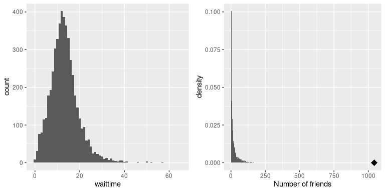
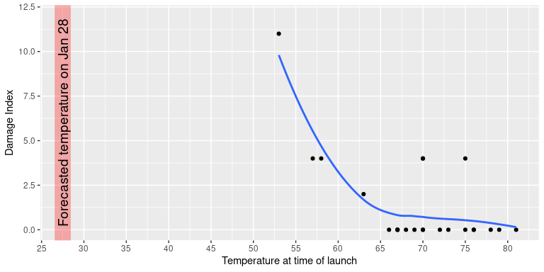

## 4.1 为什么要总结数据？

当我们总结数据时，我们必然会丢弃信息，对此有许多可以想象的反对意见。作为一个例子，让我们回到我们在第 1 章中讨论的纯研究。除了数据集中总结的那些细节之外，我们是否不应该相信每个单独的事物的所有细节？关于如何收集数据的具体细节，如一天中的时间或参与者的心情，如何？当我们总结数据时，所有这些细节都会丢失。

我们一般总结数据，因为它为我们提供了一种概括 _ 的方法，也就是说，使一般性陈述超出特定的观察范围。作家豪尔赫·路易斯·博尔赫斯（JorgeLuisBorges）在其短篇小说《取笑记忆》（funes the memorious）中强调了概括的重要性，该小说描述了一个失去遗忘能力的人。博尔赫斯专注于归纳（即扔掉数据）和思考之间的关系：“思考就是忘记差异，归纳，抽象。在富丽堂皇的 funes 世界里，只有细节。”_

心理学家长期以来研究了归纳法对思维的核心作用。一个例子是分类：我们能够很容易地识别“鸟类”类别的不同例子，即使个别例子在表面特征上可能非常不同（例如鸵鸟、知更鸟和鸡）。重要的是，泛化可以让我们对这些个体做出预测——就鸟类而言，我们可以预测它们会飞和吃蠕虫，它们可能不会开车或说英语。这些预测并不总是正确的，但它们往往足够好，能够在世界上发挥作用。## 4.2 使用表格汇总数据

总结数据的一个简单方法是生成一个表，表示各种类型观测的计数。这种类型的表已经使用了数千年（见图[4.1](#fig:salesContract)）。


图 4.1 卢浮宫的苏美尔平板电脑，显示房屋和田地的销售合同。公共领域，通过维基共享资源。

让我们来看一些使用表的例子，同样使用 nhanes 数据集。在 rstudio 控制台中键入命令`help(NHANES)`，然后滚动查看帮助页面，如果使用 rstudio，该页面将在帮助面板中打开。此页提供有关数据集的一些信息以及数据集中包含的所有变量的列表。让我们来看一个简单的变量，在数据集中称为“physactive”。此变量包含三个不同值中的一个：“是”或“否”（指示此人是否报告正在进行“中等强度或剧烈强度的运动、健身或娱乐活动”），如果该个人缺少数据，则为“不”。有不同的原因导致数据丢失；例如，这一问题不是针对 12 岁以下的儿童提出的，而在其他情况下，成人可能在采访期间拒绝回答这个问题。

### 4.2.1 频率分布

让我们看看每个类别中有多少人。现在不要担心 R 到底是怎么做的，我们稍后再谈。

```r
# summarize physical activity data

PhysActive_table <- NHANES %>%
  dplyr::select(PhysActive) %>%
  group_by(PhysActive) %>%
  summarize(AbsoluteFrequency = n())

pander(PhysActive_table)
```

<colgroup><col style="width: 18%"> <col style="width: 26%"></colgroup> 
| 物理激活 | 绝对频率 |
| --- | --- |
| 不 | 2473 个 |
| 是的 | 2972 年 |
| 不适用 | 1334 年 |

此单元格中的 r 代码生成一个表格，显示每个不同值的频率；有 2473 名回答“否”的人，2972 名回答“是”，1334 名没有回答。我们称之为 _ 频率分布 _，因为它告诉我们每个值是如何分布在样本中的。

因为我们只想与回答问题的人一起工作，所以让我们过滤数据集，使其只包括回答此问题的个人。

```r
# summarize physical activity data after dropping NA values using drop_na()

NHANES %>%
  drop_na(PhysActive) %>%
  dplyr::select(PhysActive) %>%
  group_by(PhysActive) %>%
  summarize(AbsoluteFrequency = n()) %>%
  pander()
```

<colgroup><col style="width: 18%"> <col style="width: 26%"></colgroup> 
| PhysActive | AbsoluteFrequency |
| --- | --- |
| No | 2473 |
| Yes | 2972 |

这向我们展示了两个响应的绝对频率，对于每个实际给出响应的人。从这一点上我们可以看出，说“是”的人比说“不”的人多，但从绝对数上很难分辨出差别有多大。因此，我们通常希望使用 _ 相对频率 _ 来呈现数据，该相对频率是通过将每个频率除以所有频率的和得到的：


在 R 中我们可以这样做，如下所示：

```r
# compute relative frequency of physical activity categories

NHANES %>%
  drop_na(PhysActive) %>%
  dplyr::select(PhysActive) %>%
  group_by(PhysActive) %>%
  summarize(AbsoluteFrequency = n()) %>%
  mutate(RelativeFrequency = AbsoluteFrequency / sum(AbsoluteFrequency)) %>%
  pander()
```

<colgroup><col style="width: 18%"> <col style="width: 27%"> <col style="width: 27%"></colgroup> 
| PhysActive | AbsoluteFrequency | 相对频率 |
| --- | --- | --- |
| No | 2473 | 0.454 个 |
| Yes | 2972 | 0.546 个 |

相对频率提供了一种更简单的方法来判断不平衡的程度。我们还可以通过将相对频率乘以 100 来将其解释为百分比：

```r
# compute percentages for physical activity categories

PhysActive_table_filtered <- NHANES %>%
  drop_na(PhysActive) %>%
  dplyr::select(PhysActive) %>%
  group_by(PhysActive) %>%
  summarize(AbsoluteFrequency = n()) %>%
  mutate(
    RelativeFrequency = AbsoluteFrequency / sum(AbsoluteFrequency),
    Percentage = RelativeFrequency * 100
  )

pander(PhysActive_table_filtered)
```

<colgroup><col style="width: 18%"> <col style="width: 27%"> <col style="width: 27%"> <col style="width: 16%"></colgroup> 
| PhysActive | AbsoluteFrequency | RelativeFrequency | 百分比 |
| --- | --- | --- | --- |
| No | 2473 | 0.454 | 45.418 美元 |
| Yes | 2972 | 0.546 | 54.582 条 |

这让我们看到，NHANES 样本中 45.42%的人说“不”，54.58%的人说“是”。

### 4.2.2 累积分布

我们在上面研究的 physactive 变量只有两个可能的值，但我们通常希望总结出可以有更多可能值的数据。当这些值至少是序数时，总结它们的一个有用方法是通过我们所称的 _ 累积 _ 频率表示：我们不询问对特定值进行多少观察，而是询问有多少个值至少是 _ 某个特定值。_

让我们看一下 nhanes 数据集中的另一个变量，名为 sleephrsnight，它记录了参与者在正常工作日报告睡眠的时间。让我们像上面一样创建一个频率表，在删除了没有对问题作出响应的任何人之后。

```r
# create summary table for relative frequency of different
# values of SleepHrsNight 

NHANES %>%
  drop_na(SleepHrsNight) %>%
  dplyr::select(SleepHrsNight) %>%
  group_by(SleepHrsNight) %>%
  summarize(AbsoluteFrequency = n()) %>%
  mutate(
    RelativeFrequency = AbsoluteFrequency / sum(AbsoluteFrequency),
    Percentage = RelativeFrequency * 100
  ) %>% 
  pander()
```

<colgroup><col style="width: 22%"> <col style="width: 27%"> <col style="width: 27%"> <col style="width: 16%"></colgroup> 
| 睡眠之光 | AbsoluteFrequency | RelativeFrequency | Percentage |
| --- | --- | --- | --- |
| 二 | 9 | 0.002 个 | 0.179 个 |
| 三 | 49 岁 | 0.01 分 | 0.973 个 |
| 4 | 200 个 | 0.04 分 | 3.972 年 |
| 5 个 | 406 个 | 0.081 个 | 8.064 年 |
| 6 | 1172 年 | 0.233 个 | 23.277 页 |
| 7 | 1394 年 | 0.277 个 | 27.686 年 |
| 8 个 | 1405 年 | 0.279 个 | 27.905 年 |
| 9 | 271 个 | 0.054 个 | 5.382 条 |
| 10 个 | 97 | 0.019 个 | 1.927 个 |
| 11 个 | 15 个 | 0.003 个 | 0.298 个 |
| 12 个 | 17 | 0.003 | 0.338 个 |

我们可以通过查看表开始汇总数据集；例如，我们可以看到大多数人报告睡眠时间在 6 到 8 小时之间。让我们绘制数据以更清楚地看到这一点。要做到这一点，我们可以绘制一个 _ 柱状图 _，它显示具有每个不同值的事例数；请参见图[4.2](#fig:sleepHist)的左面板。ggplot2（）库有一个内置的柱状图函数（`geom_histogram()`），我们经常使用它。我们还可以绘制相对频率，我们通常将其称为 _ 密度 _——参见图[4.2](#fig:sleepHist)的右面板。


图 4.2 左：显示报告 sleephrsnight 变量每个可能值的人数（左）和比例（右）的柱状图。

如果我们想知道有多少人报告睡眠 5 小时或更少怎么办？为了找到这个，我们可以计算一个 _ 累积分布 _：


也就是说，为了计算某个值 j 的累积频率，我们将所有值（包括 j）的频率相加。让我们对睡眠变量进行计算，首先对绝对频率进行计算：

```r
# create cumulative frequency distribution of SleepHrsNight data

SleepHrsNight_cumulative <- 
  NHANES %>%
  drop_na(SleepHrsNight) %>%
  dplyr::select(SleepHrsNight) %>%
  group_by(SleepHrsNight) %>%
  summarize(AbsoluteFrequency = n()) %>%
  mutate(CumulativeFrequency = cumsum(AbsoluteFrequency))

pander(SleepHrsNight_cumulative)
```

<colgroup><col style="width: 22%"> <col style="width: 27%"> <col style="width: 29%"></colgroup> 
| SleepHrsNight | AbsoluteFrequency | 累积频率 |
| --- | --- | --- |
| 2 | 9 | 9 |
| 3 | 49 | 58 |
| 4 | 200 | 258 个 |
| 5 | 406 | 664 个 |
| 6 | 1172 | 1836 年 |
| 7 | 1394 | 3230 个 |
| 8 | 1405 | 4635 个 |
| 9 | 271 | 4906 个 |
| 10 | 97 | 5003 个 |
| 11 | 15 | 5018 年 |
| 12 | 17 | 5035 个 |

在图[4.3](#fig:sleepAbsCumulRelFreq)的左侧面板中，我们绘制了数据，以查看这些表示形式的外观；绝对频率值以红色绘制，累积频率以蓝色绘制。我们看到累积频率是单调递增的，也就是说，它只能上升或保持不变，但不能下降。同样，我们通常发现相对频率比绝对频率更有用；这些频率绘制在图[4.3](#fig:sleepAbsCumulRelFreq)的右面板中。



图 4.3 SleephrsNight 可能值的频率（左）和比例（右）的相对（红）和累积相对（蓝）值的图。

### 4.2.3 绘制柱状图


图 4.4 nhanes 中年龄（左）和身高（右）变量的柱状图。

我们在上面研究的变量相当简单，只有几个可能的值。现在让我们来看一个更复杂的变量：年龄。首先，让我们绘制 nhanes 数据集中所有个体的年龄变量（参见图[4.4](#fig:ageHist)的左面板）。你看到了什么？首先，你应该注意到每个年龄组的个体数量随着时间的推移而减少。这是有道理的，因为人口是随机抽样的，因此随着时间的推移死亡导致老年人的数量减少。其次，你可能在 80 岁的时候注意到图表中有一个大的尖峰。你觉得这是怎么回事？

如果您查看 nhanes 数据集的帮助功能，您将看到以下定义：“研究参与者筛选的年龄（年）。注：80 岁或 80 岁以上的受试者被记录为 80 岁。“原因在于，年龄很高的受试者数量相对较少，如果你知道他们的确切年龄，就可能更容易在数据集中识别出特定的人；研究人员通常承诺他们的参与蚂蚁要对自己的身份保密，这是他们能做的有助于保护研究对象的事情之一。这也突显了一个事实，即知道一个人的数据来自何处以及如何处理它们总是很重要的；否则，我们可能会不正确地解释它们。

让我们看看 nhanes 数据集中另一个更复杂的变量：高度。高度值的柱状图绘制在图[4.4](#fig:ageHist)的右面板中。关于这个分布你首先应该注意的是，它的大部分密度集中在 170 厘米左右，但是分布的左侧有一个“尾巴”；有少数个体的高度要小得多。你觉得这是怎么回事？

您可能已经直觉到小高度来自数据集中的子级。检查这一点的一种方法是为儿童和成人绘制单独颜色的柱状图（图[4.5](#fig:heightHistSep)的左面板）。这表明，所有非常短的高度确实来自样本中的儿童。让我们创建一个新版本的 nhanes，它只包含成年人，然后为他们绘制柱状图（图[4.5](#fig:heightHistSep)的右面板）。在这个图中，分布看起来更加对称。正如我们稍后将看到的，这是一个 _ 正态 _（或 _ 高斯 _）分布的很好例子。



图 4.5 nhanes 高度柱状图。A：分别为儿童（蓝色）和成人（红色）绘制的值。B：仅限成人使用。C:与 B 相同，但仓宽=0.1

### 4.2.4 柱状图箱

在我们前面使用睡眠变量的例子中，数据是以整数报告的，我们只计算报告每个可能值的人数。但是，如果您查看 nhanes 中高度变量的一些值，您将看到它是以厘米为单位测量的，一直到小数点后一位：

```r
# take a slice of a few values from the full data frame
NHANES_adult %>%
  dplyr::select(Height) %>%
  slice(45:50) %>%
  pander()
```

<colgroup><col style="width: 11%"></colgroup> 
| 高度 |
| --- |
| 169.6 条 |
| 169.8 条 |
| 167.5 条 |
| 155.2 条 |
| 173.8 条 |
| 174.5 条 |

图[4.5](#fig:heightHistSep)的面板 C 显示了统计每个可能值的密度的直方图。这个柱状图看起来真的参差不齐，这是因为特定的小数位值的可变性。例如，值 173.2 出现 32 次，而值 173.3 只出现 15 次。我们可能不认为这两个权重的流行率真的有如此大的差异；更可能的原因是我们的样本中的随机变异性。

一般来说，当我们创建一个连续的或可能有很多值的数据柱状图时，我们将 _bin_ 这些值，这样我们就不会计算和绘制每个特定值的频率，而是计算和绘制特定范围内的值的频率。e.这就是为什么上面[4.5](#fig:heightHistSep)的面板 B 中的图看起来不那么锯齿状的原因；如果您查看`geom_histogram`命令，您将看到我们设置了“b in width=1”，它告诉命令通过将 b in 中的值与宽度为 1 的值组合来计算柱状图；因此，值 1.3、1.5 和 1.6 would 所有数据都计算在同一个存储单元的频率上，从等于 1 的值到小于 2 的值。


请注意，一旦选择了箱大小，则箱的数量将由数据确定：

如何选择最佳的仓宽没有硬性和快速性的规则。偶尔它会很明显（就像只有几个可能的值一样），但在许多情况下，它需要反复尝试。有一些方法试图找到一个最佳的仓位大小，例如在 r 的`nclass.FD()`函数中实现的 freedman diaconis 方法；我们将在下面的一些示例中使用该函数。## 4.3 分布的理想化表示

数据集就像雪花，因为每一个都是不同的，但尽管如此，在不同类型的数据中经常会看到一些模式。这允许我们使用理想化的数据表示来进一步总结它们。让我们用[4.5](#fig:heightHistSep)中绘制的成人身高数据，并将它们与一个非常不同的变量一起绘制：脉率（每分钟心跳），也用 nhanes 测量（见图[4.6](#fig:NormalDistPlotsWithDist)）。


图 4.6 nhanes 数据集中高度（左）和脉冲（右）的柱状图，每个数据集中的正态分布重叠。

虽然这些情节看起来不完全相同，但都具有在中间圆顶上相对对称的一般特征。这个形状实际上是我们收集数据时常见的分布形状之一，我们称之为 _ 正态 _（或 _ 高斯 _）分布。该分布由两个值（我们称之为分布的 _ 参数 _）定义：中心峰的位置（我们称之为 _ 平均值 _）和分布的宽度（用称为 _ 标准偏差的参数描述）。操作 _）。图[4.6](#fig:NormalDistPlotsWithDist)显示了在每个历史程序顶部绘制的适当正态分布。您可以看到，虽然曲线不完全符合数据，但它们在描述分布方面做得很好——只有两个数字！

正如我们在后面的课程中讨论中心极限定理时所看到的，世界上许多变量呈现正态分布的形式有一个深刻的数学原因。

### 4.3.1 偏斜度

图[4.6](#fig:NormalDistPlotsWithDist)中的例子很好地遵循正态分布，但在许多情况下，数据将以系统的方式偏离正态分布。数据可以偏离的一种方式是不对称的，这样分布的一个尾部比另一个更加密集。我们称之为“歪斜”。偏度通常发生在测量被限制为非负值的情况下，例如我们计算事物或测量经过的时间（因此变量不能取负值）。

斜率的一个例子可以在旧金山国际机场机场安全线的平均等待时间中看到，在图 [4.7 的左侧面板](#fig:SFOWaitTimes)中绘制。您可以看到，虽然大多数等待时间不到 20 分钟，但有许多情况下，它们会更长，超过 60 分钟！这是一个“右偏”分布的例子，其中右尾比左尾长；在查看计数或测量时间时，这些是常见的，不能小于零。看到“左偏”分布不太常见，但它们可能发生，例如，当查看不能取大于 1 的值的分数值时。


图 4.7 右偏和长尾分布示例。左：从[https://awt.cbp.gov/](https://awt.cbp.gov/)获取的 SFO 终端 A 安全的平均等待时间（2017 年 1-10 月）。右图：从斯坦福大型网络数据库中获取的 3663 个人中 Facebook 好友数量的柱状图。朋友最多的人用蓝点表示。

### 4.3.2 长尾分布

历史上，统计数据主要集中在正态分布的数据上，但有许多数据类型看起来与正态分布完全不同。特别是，许多现实世界的分布是“长尾巴”，这意味着右尾巴远远超出了分布中最典型的成员。一种最有趣的数据类型，其中长尾分布发生在社会网络的分析。例如，让我们看看来自斯坦福大网络数据库[的 Facebook 好友数据，并绘制数据库中 3663 人的好友数量柱状图（参见图](https://snap.stanford.edu/data/egonets-Facebook.html)[4.7](#fig:SFOWaitTimes)的右面板）。如我们所见，这个分布有一个很长的右尾——一般人有 24.09 个朋友，而朋友最多的人（用蓝点表示）有 1043 个！

在现实世界中，长尾分布越来越被认可。特别是，复杂系统的许多特征都具有这些分布特征，从文本中的单词频率，到进出机场的航班数量，再到大脑网络的连接。有许多不同的方法可以实现长尾分布，但在基督教圣经中所谓的“马太效应”的情况下会出现一个常见的方法：

> 因为凡有更多的，必被赐给他，他也必富足；但没有的，连他所拥有的，也必被夺去。-马太福音 25:29，修订后的标准版

通常被解释为“富人越富有”。在这种情况下，优势是复合的，这样那些有更多朋友的人可以接触到更多的新朋友，而那些有更多钱的人可以做更多能增加他们财富的事情。

随着课程的发展，我们将看到一些长尾分布的例子，我们应该记住，当面对长尾数据时，统计中的许多工具可能会失败。正如纳西姆·尼古拉斯·塔勒布在其《黑天鹅》一书中指出的那样，这种长尾分布在 2008 年金融危机中起到了至关重要的作用，因为交易员使用的许多金融模型都假设金融系统将遵循正态分布，而他们显然没有遵循正态分布。## 4.4 阅读建议

*   _ 黑天鹅：纳西姆·尼古拉斯·塔勒布（Nassim Nicholas Taleb）的《极不可能的影响》（HTG1）_