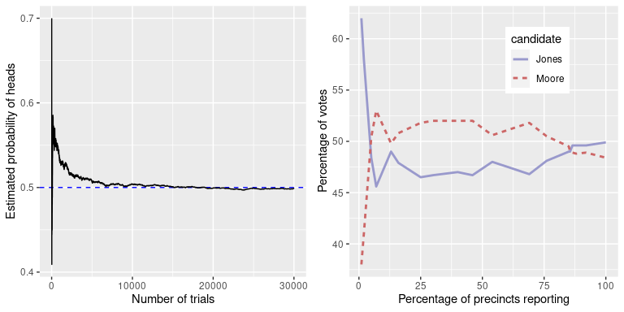
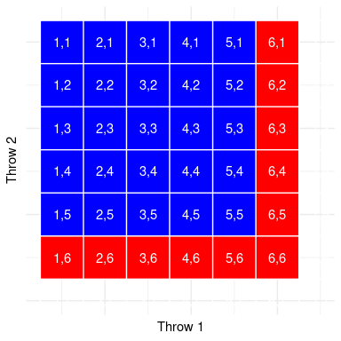
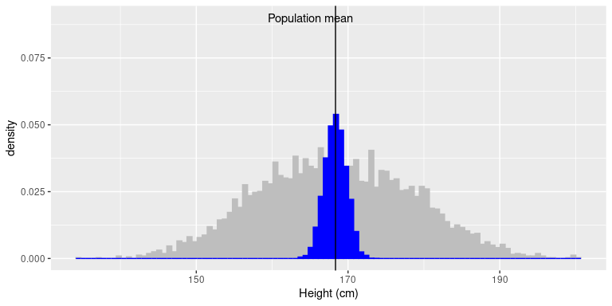

# 六、数据可视化

对于数据集，我们可以做的最重要的事情之一是查看它，但是有许多方法可以查看数据，其中一些方法比其他方法更有效。在本章中，我们将讨论如何有效地可视化数据。

## 6.1 数据可视化如何拯救生命

1986 年 1 月 28 日，挑战者号航天飞机在起飞 73 秒后爆炸，机上 7 名宇航员全部遇难。事故发生后，对事故原因进行了正式调查，发现连接固体火箭助推器两段的 O 形圈发生泄漏，导致大型液体燃料箱接头失效、爆炸（见图[6.1[HTG1 页）。](#fig:srbLeak)

![An image of the solid rocket booster leaking fuel, seconds before the explostion. By NASA (Great Images in NASA Description) [Public domain], via Wikimedia Commons](img/file29.jpg)

图 6.1 爆炸前几秒固体火箭助推器泄漏燃料的图像。由美国国家航空航天局（美国国家航空航天局描述的伟大图像）【公共领域】，通过维基共享资源

调查发现，美国航天局决策过程的许多方面都存在缺陷，特别是在美国航天局工作人员和建造固体火箭助推器的承包商莫顿·齐奥科尔的工程师之间举行的一次会议上。这些工程师特别关注，因为据预测，发射当天早上的温度很低，而且他们从先前发射的数据中发现，O 型环的性能在较低的温度下受到了影响。在发射前一天晚上的一次会议上，工程师们向美国宇航局的管理人员展示了他们的数据，但无法说服他们推迟发射。

可视化专家 EdwardTufte 认为，如果能正确地展示所有数据，工程师们可能会更有说服力。特别是，他们可以展示一个像图[6.2](#fig:challengerTemps)所示的数字，这突出了两个重要事实。首先，它表明，O 型环的损伤量（定义为固体火箭助推器在以前的飞行中从海洋中回收后在环外发现的腐蚀和烟尘量）与起飞时的温度密切相关。第二，它显示 1 月 28 日上午的预测温度范围（显示在红色阴影区域）远远超出了之前所有发射的范围。虽然我们不能确定，但至少似乎可以相信，这可能更有说服力。


图 6.2 复刻凝灰岩损伤指数数据。蓝色的线显示了数据的趋势，红色的补丁显示了发射早晨的预计温度。

## 6.10 其他因素的修正

通常，我们对绘制感兴趣的变量受我们感兴趣的因素以外的其他因素影响的数据感兴趣。例如，假设我们想了解汽油价格随时间的变化。图[6.16](#fig:gasPrices)显示了历史天然气价格数据，绘制了通货膨胀调整或不调整。虽然未经调整的数据显示大幅增长，但经调整的数据显示，这主要是通胀的反映。其他需要根据其他因素调整数据的例子包括人口规模（如前一章中的犯罪率示例所示）和不同季节收集的数据。


图 6.16 美国 1930-201 年汽油价格（从[http://www.thepoplehistory.com/70yearsofpricechange.html](http://www.thepeoplehistory.com/70yearsofpricechange.html)获得），有无通货膨胀修正（基于消费者价格指数）。

## 6.11 建议阅读和视频

*   [_ 数据可视化基础 _](https://serialmentor.com/dataviz/)，克劳斯·威尔克著
*   _ 视觉解释 _，Edward Tufte 著
*   _ 可视化数据 _，作者：William S.Cleveland
*   _ 眼与心的图形设计 _，斯蒂芬·M·科斯林著
*   [_ 人类如何看待数据 _](https://www.youtube.com/watch?v=fSgEeI2Xpdc&feature=youtu.be)，作者：约翰·劳瑟

## 6.2 绘图解剖

绘制数据的目的是以二维（有时是三维）表示形式呈现数据集的摘要。我们将尺寸称为 _ 轴 _——水平轴称为 _X 轴 _，垂直轴称为 _Y 轴 _。我们可以按照突出显示数据值的方式沿轴排列数据。这些值可以是连续的，也可以是分类的。

我们可以使用许多不同类型的地块，它们有不同的优点和缺点。假设我们有兴趣在 nhanes 数据集中描述男女身高差异。图[6.3](#fig:plotHeight)显示了绘制这些数据的四种不同方法。

1.  面板 A 中的条形图显示了平均值的差异，但没有显示这些平均值周围的数据分布有多广——正如我们稍后将看到的，了解这一点对于确定我们认为两组之间的差异是否足够大而重要至关重要。

2.  第二个图显示了所有数据点重叠的条形图——这使得男性和女性的身高分布重叠更加清晰，但由于数据点数量众多，仍然很难看到。

一般来说，我们更喜欢使用一种绘图技术，它可以清楚地显示数据点的分布情况。

1.  在面板 C 中，我们看到一个清晰显示数据点的例子，称为 _ 小提琴图 _，它绘制了每种情况下的数据分布（经过一点平滑处理）。

2.  另一个选项是面板 D 中显示的 _ 方框图 _，它显示了中间值（中心线）、可变性测量值（方框宽度，基于称为四分位范围的测量值）和任何异常值（由线条末端的点表示）。这两种方法都是显示数据的有效方法，为数据的分发提供了良好的感觉。

![Four different ways of plotting the difference in height between men and women in the NHANES dataset.  Panel A plots the means of the two groups, which gives no way to assess the relative overlap of the two distributions.  Panel B shows the same bars, but also overlays the data points, jittering them so that we can see their overall distribution.  Panel C shows a violin plot, which shows the distribution of the datasets for each group.  Panel D shows a box plot, which highlights the spread of the distribution along with any outliers (which are shown as individual points).](img/file31.png)

图 6.3 nhanes 数据集中绘制男女身高差异的四种不同方法。面板 A 绘制了两组的平均值，这无法评估两个分布的相对重叠。面板 B 显示了相同的条，但也覆盖了数据点，使它们抖动，以便我们可以看到它们的总体分布。面板 C 显示了小提琴图，显示了每组数据集的分布。面板 D 显示了一个方框图，它突出了分布的分布以及任何异常值（显示为单个点）。

## 6.3 使用 ggplot 在 R 中绘制

在 R 中有许多不同的绘制数据的工具，但我们将重点关注由名为`ggplot2`的包提供的`ggplot()`函数。ggplot 是非常强大的，但是使用它需要了解它的工作原理。

假设我们要创建一个 _ 散点图 _，该散点图绘制了每个成年人的身高和体重，样本来自 nhanes 数据集的 150 人，不同的标记用于表示男性和女性。首先，我们创建示例：

```r
NHANES_sample <- 
  NHANES_adult %>%
  drop_na(Weight, Gender) %>% #remove rows (individuals) with missing values for Weight and Gender
  sample_n(150) #take a random sample of n = 150 rows (individuals)
```

现在让我们设置`ggplot()`命令。这需要我们具体说明两件事。首先，我们需要告诉它从哪个数据帧获取数据（在本例中是`NHANES_sample`）。其次，我们需要通过 _ 美学 _ 函数`aes()`来告诉它要使用的数据框架中的哪些变量。在这种情况下，我们要绘制 X 轴上的高度和 Y 轴上的权重。结果如图[6.4](#fig:emptyPlot)所示：该命令生成一组绘图轴，但实际上没有显示任何数据。

```r
NHANES_sample %>%
  ggplot(aes(x = Height, y = Weight))
```


图 6.4 由 ggplot（）生成的空图框

接下来我们需要添加数据的表示。我们告诉`ggplot`要显示什么的方法是向主`ggplot()`命令添加各种命令。特别是，我们通常需要添加一个 _ 几何体 _ 或“geom”，它指定如何在绘图中排列数据。例如，为了显示每个数据点，我们可以使用`geom_point()`几何图形，如图[6.5](#fig:simpleGeom)所示。每个数据点代表我们的`NHANES_sample`数据集中的一个单独的行，每个行对应于这个数据集中的一个人。

```r
NHANES_sample %>% 
  ggplot(aes(x = Height, y = Weight)) +
  geom_point()
```


图 6.5 简单散点图

最后，我们要根据不同的性别用不同的颜色绘制点。我们只需在美学中添加一个 _ 颜色 _ 关键字，它告诉`geom_point()`函数按性别分开颜色点。如图[6.6](#fig:colorPoints)所示。这个图还显示了一个示例，说明了如何在一个图中包含多个几何层——在本例中，我们使用`geom_smooth()`分别按性别绘制最能描述身高和体重之间关系的线。线条周围的阴影反映了我们对当时估计的信心。

```r
NHANES_sample %>% 
  ggplot(aes(x = Height, y = Weight, color = Gender)) +
  geom_point() +
  geom_smooth(method = "lm")
```


图 6.6 散点图，各点按性别分别着色。

## 6.4 良好可视化原则

许多书都是关于数据的有效可视化的。有一些原则是大多数作者都同意的，而其他的则更具争议性。这里我们总结了一些主要原则；如果您想了解更多，那么在本章末尾的 _ 建议阅读 _ 部分列出了一些很好的资源。

下面是我们对数据可视化的一些重要原则的提炼。

#

## 6.4.1 展示数据并使其脱颖而出

假设我做了一项研究，研究了牙齿健康和使用牙线的时间之间的关系，我想把我的数据形象化。图[6.7](#fig:dentalFigs)显示了这些数据的四种可能的表示。

1.  在面板 A 中，我们实际上并不显示数据，只是一条表示数据之间关系的线。这显然不是最佳的，因为我们实际上看不到底层数据是什么样子的。

面板 B-D 显示了绘制实际数据的三种可能结果，其中每个绘图显示了可能生成数据的不同方式。

1.  如果我们看到面板 B 中的情节，我们可能会怀疑——真实数据很少会遵循如此精确的模式。

2.  另一方面，面板 C 中的数据看起来像真实的数据——它们显示了一种总体趋势，但是它们是混乱的，就像世界上通常的数据一样。

3.  面板 D 中的数据表明，两个变量之间的明显关系仅仅是由一个个体引起的，我们称之为 _ 离群值 _，因为它们远远超出了组内其他变量的模式。很明显，我们可能不想从由一个数据点驱动的效果得出很多结论。此图强调了为什么 _ 总是 _ 重要的原因，即在过于相信任何数据摘要之前查看原始数据。


图 6.7 牙齿健康示例的四种不同可能数据表示。散点图中的每个点表示数据集中的一个数据点，每个图中的线表示数据中的线性趋势。

## 6.5 最大化数据/墨水比

Edward Tufte 提出了一个称为数据/墨水比的想法：


这样做的目的是最小化视觉混乱，让数据显示出来。例如，以图[6.8](#fig:dataInkExample)中牙齿健康数据的两个演示为例。两个面板显示相同的数据，但面板 A 更容易理解，因为它的数据/墨水比率相对较高。


图 6.8 用两个不同的数据/墨水比绘制的相同数据示例。

## 6.6 避免图表垃圾

特别常见的是，在流行媒体中看到数据的展示，这些展示带有许多视觉元素，这些元素在主题上与内容相关，但与实际数据无关。这被称为 _chartjunk_，应该不惜一切代价避免。

避免图表垃圾的一个好方法是避免使用流行的电子表格程序绘制数据。例如，图[6.9](#fig:chartJunk)（使用 Microsoft Excel 创建）中的图表描绘了美国不同宗教的相对流行程度。这个数字至少有三个问题：

*   它在每根与实际数据无关的条上都覆盖了图形。
*   它有一个分散的背景纹理。
*   它使用三维条形图


图 6.9 图表垃圾示例。

## 6.7 避免数据失真

通常可以使用可视化来扭曲数据集的消息。一个非常常见的方法是使用不同的轴缩放来放大或隐藏数据模式。例如，假设我们有兴趣看看美国的暴力犯罪率是否发生了变化。在图[6.10](#fig:crimePlotAxes)中，我们可以看到这些数据的绘制方式，要么使犯罪看起来保持不变，要么使犯罪率下降。相同的数据可以讲述两个截然不同的故事！



图 6.10 1990 年至 2014 年犯罪数据随时间的推移绘制。面板 A 和 B 显示相同的数据，但具有不同的轴范围。从[获取的数据 https://www.ucrdatatool.gov/search/crime/state/runcrimestatebystate.cfm](https://www.ucrdatatool.gov/Search/Crime/State/RunCrimeStatebyState.cfm)

统计数据可视化中的一个主要争议是如何选择 Y 轴，尤其是它是否应该总是包含零。达雷尔·赫夫在他的著名著作《如何用统计数字撒谎》中强烈主张，在 Y 轴上应该始终包括零点。另一方面，爱德华·塔夫特反对这一观点：

> “一般来说，在一个时间序列中，使用一个显示数据而不是零点的基线；不要花费大量的空白垂直空间试图以隐藏数据行本身所发生的事情为代价达到零点。”（摘自[https://qz.com/418083/its-ok-not-to-start-your-y 轴-at-zero/](https://qz.com/418083/its-ok-not-to-start-your-y-axis-at-zero/)）

在某些情况下，使用零点毫无意义。假设我们有兴趣绘制一个人随时间变化的体温。在图[6.11](#fig:bodyTempAxis)中，我们绘制了 Y 轴上有零或无零的相同（模拟）数据。很明显，通过在 Y 轴（图 A）上绘制这些数据为零，我们在图中浪费了大量的空间，因为活人的体温永远不会降到零！通过包括零，我们也使得 21-30 天明显的温度跃升变得不那么明显。一般来说，我对于线图和散点图的倾向是使用图中的所有空间，除非零点真正重要到需要突出显示。



图 6.11 随时间变化的体温，在 Y 轴上绘制有或没有零点。

## 6.8 谎言因素

爱德华塔夫特引入了“谎言因素”的概念来描述可视化中的物理差异与数据差异大小的对应程度。如果图形的谎言因子接近 1，则它适当地表示数据，而谎言因子远离 1 则反映基础数据的失真。

谎言因素支持这样的论点：在许多情况下，一个人应该总是在条形图中包含零点。在图[6.12](#fig:barCharLieFactor)中，我们绘制了 Y 轴上有零和无零的相同数据。在面板 A 中，两条钢筋之间的面积比例差与值之间的比例差（即：Lie 系数=1）完全相同，而在面板 B（不包括零）中，两条钢筋之间的面积比例差大约是 2.8 倍于值的比例差异，因此它在视觉上夸大了差异的大小。


图 6.12 两个条形图及相关的测谎系数。

## 6.9 记住人的局限性

人类既有知觉的局限性，也有认知的局限性，这使得一些可视化很难理解。在构建可视化时，务必记住这些内容。

#

## 6.9.1 知觉限制

许多人（包括我自己）所遭受的一个重要的知觉限制是色盲。这使得很难感知图形中的信息（如图[6.13](#fig:badColors)中的信息），其中元素之间只有颜色对比，但没有亮度对比。除了颜色之外，使用亮度和/或纹理有很大差别的图形元素总是很有帮助的。还有[“色盲友好型”调色板](http://www.cookbook-r.com/Graphs/Colors_(ggplot2)/#a-colorblind-friendly-palette)可用于 R



图 6.13 仅依赖颜色对比度的坏图形示例。

即使对于拥有完美色觉的人来说，也存在一些知觉上的限制，使得某些情节无效。这就是统计学家从不使用饼图的原因之一：人类很难理解形状体积的差异。图[6.14](#fig:pieChart)中的饼图（显示了与上面显示的宗教信仰相同的数据）显示了这有多复杂。


图 6.14 饼图的一个例子，强调了理解不同饼图切片的相对体积的困难。

这个阴谋很可怕，有几个原因。首先，它需要将大量的颜色与图形底部非常小的补丁区分开。第二，视觉角度扭曲了相对数字，因此天主教的饼状楔形比无饼状楔形要大得多，而事实上，无饼状楔形的数字稍大（22.8%对 20.8%），如图[6.9](#fig:chartJunk)所示。第三，通过将图例与图形分开，它要求查看器将信息保存在工作内存中，以便在图形和图例之间进行映射，并进行许多“表查找”，以便不断将图例标签与可视化匹配。最后，它使用的文本太小，不放大就无法阅读。

使用更合理的方法绘制数据（图[6.15](#fig:religionBars)），我们可以更清楚地看到模式。此图可能不像使用 Excel 生成的饼图那样华丽，但它更有效、更准确地表示了数据。


图 6.15 更清晰地展示了宗教隶属关系数据（摘自[http://www.pewforum.org/steerial-landscape-study/](http://www.pewforum.org/religious-landscape-study/)）。

此图允许查看者根据杆**的**长度**沿公共比例**（Y 轴）进行比较。在基于这些感知元素解码差异时，人类往往比基于区域或颜色更准确。