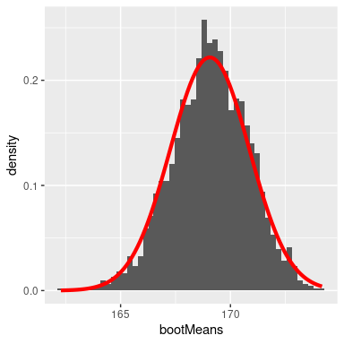

# 七、采样

统计学的一个基本观点是，我们可以根据一个相对较小的样本对整个人口进行推断。在本章中，我们将介绍统计抽样的概念，并讨论它的工作原理。

任何居住在美国的人都将熟悉从政治投票中抽样的概念，这已成为我们选举过程的核心部分。在某些情况下，这些民意测验在预测选举结果方面可能非常准确。最著名的例子来自 2008 年和 2012 年的美国总统选举，当时民意测验专家奈特·西尔弗正确预测了 2008 年 49/50 个州和 2012 年全部 50 个州的选举结果。西尔弗通过结合来自 21 个不同民意调查的数据做到了这一点，这些数据在他们倾向于向共和党或民主党倾斜的程度上各不相同。这些民意调查中的每一项都包含了大约 1000 名可能的选民的数据——这意味着白银几乎能够利用仅有 21000 人的数据以及其他知识（例如，这些州过去的投票方式）完美地预测超过 1.25 亿选民的投票模式。

## 7.1 我们如何采样？

我们的抽样目标是确定感兴趣的全部人群的某些特征，只使用人群的一小部分。我们这样做主要是为了节省时间和精力——为什么要在仅仅一个小样本就足以准确估计兴趣变量的情况下，去测量人口中的每个个体呢？

在选举的例子中，人口都是选民，样本是由投票组织选出的 1000 人组成的集合。我们选择样本的方式对于确保样本是整个人群的 _ 代表性 _ 至关重要，这是统计抽样的主要目标。很容易想象一个没有代表性的样本；如果一个民意测验者只打电话给那些他们从当地民主党收到名字的人，那么投票结果就不太可能代表整个人口。一般来说，我们将代表性投票定义为每个人口成员都有平等的机会被选中。如果这失败了，那么我们必须担心我们对样本计算的统计数据是否有 _ 偏差 _——也就是说，它的值是否系统地不同于总体值（我们称之为 _ 参数 _）。请记住，我们通常不知道这个人口参数，因为如果我们知道，那么就不需要采样了！但是，我们将使用能够接触到整个人口的例子来解释一些关键的想法。

同样重要的是要区分两种不同的采样方式：替换和不替换。在用替换物对 _ 进行采样时，在对某个群体成员进行采样后，将其放回池中，以便再次对其进行采样。在 _ 不替换的采样 _ 中，一旦对某个成员进行了采样，则该成员就没有资格再次进行采样。最常见的是使用不替换的采样，但在某些情况下，我们将使用带替换的采样，例如在[8](#resampling-and-simulation)章中讨论一种称为 _ 引导 _ 的技术。_

## 7.2 采样误差

不管我们的样本有多具有代表性，我们根据样本计算的统计数据很可能至少与总体参数略有不同。我们称之为 _ 采样误差 _。我们的统计估计值也会因样本而异；我们将我们的统计数据在样本间的分布称为 _ 抽样分布 _。

抽样误差直接关系到人口测量的质量。显然，我们希望从样本中获得的估计值尽可能接近总体参数的真实值。然而，即使我们的统计数据是无偏的（也就是说，从长远来看，我们希望它与总体参数具有相同的值），任何特定估计的值都将不同于总体估计，并且当抽样误差较大时，这些差异将更大。因此，减小采样误差是实现更好测量的重要步骤。

我们将使用 nhanes 数据集作为示例；我们将假设 nhanes 是整个总体，然后我们将从总体中随机抽采样本。在下一章中，我们将有更多的话要说，关于“随机”样本的生成是如何在计算机中工作的。

```r
# load the NHANES data library
library(NHANES)

# create a NHANES dataset without duplicated IDs 
NHANES <-
  NHANES %>%
  distinct(ID, .keep_all = TRUE) 

#create a dataset of only adults
NHANES_adult <- 
  NHANES %>%
  filter( 
    !is.na(Height), 
    Age >= 18
  )

#print the NHANES population mean and standard deviation of adult height
sprintf(
  "Population height: mean = %.2f",
  mean(NHANES_adult$Height)
)
```

```r
## [1] "Population height: mean = 168.35"
```

```r
sprintf(
  "Population height: std deviation = %.2f",
  sd(NHANES_adult$Height)
)
```

```r
## [1] "Population height: std deviation = 10.16"
```

在这个例子中，我们知道成年人口的平均值和身高的标准偏差，因为我们假设 nhanes 数据集包含整个成年人口。现在，让我们从 NHANES 人群中抽取 50 个个体的单个样本，并将结果统计数据与人口参数进行比较。

```r
# sample 50 individuals from NHANES dataset
exampleSample <- 
  NHANES_adult %>% 
  sample_n(50)

#print the sample mean and standard deviation of adult height
sprintf(
  'Sample height: mean = %.2f',
  mean(exampleSample$Height)
  )
```

```r
## [1] "Sample height: mean = 169.46"
```

```r
sprintf(
  'Sample height: std deviation = %.2f',
  sd(exampleSample$Height)
)
```

```r
## [1] "Sample height: std deviation = 10.07"
```

样本平均值和标准差相似，但不完全等于总体值。现在，让我们取 50 个个体的大量样本，计算每个样本的平均值，并查看得出的平均值抽样分布。为了更好地估计抽样分布，我们必须决定要采集多少样本——在这种情况下，让我们采集 5000 个样本，以便我们对答案真正有信心。请注意，像这样的模拟有时需要几分钟才能运行，并且可能会使您的计算机变得气喘吁吁。图[7.1](#fig:samplePlot)中的柱状图显示，对 50 个个体的每个样本估计的平均值有所不同，但总体而言，它们集中在人口平均值周围。

```r
# compute sample means across 5000 samples from NHANES data
sampSize <- 50 # size of sample
nsamps <- 5000 # number of samples we will take

# set up variable to store all of the results
sampMeans <- array(NA, nsamps)

# Loop through and repeatedly sample and compute the mean
for (i in 1:nsamps) {
  NHANES_sample <- sample_n(NHANES_adult, sampSize)
  sampMeans[i] <- mean(NHANES_sample$Height)
}

sprintf(
  "Average sample mean = %.2f",
  mean(sampMeans)
)
```

```r
## [1] "Average sample mean = 168.33"
```

```r
sampMeans_df <- tibble(sampMeans = sampMeans)
```


图 7.1 蓝色柱状图显示了来自 nhanes 数据集的 5000 多个随机样本的平均值的抽样分布。完整数据集的柱状图以灰色显示以供参考。

## 7.3 平均值的标准误差

在课程的后面，能够描述我们的样本是如何变化的将变得非常重要，以便对样本统计进行推断。对于平均值，我们使用一个称为平均值（sem）的 _ 标准误差 _ 的量来实现这一点，我们可以将其视为采样分布的标准偏差。如果我们知道总体标准偏差，那么我们可以使用以下公式计算标准误差：


其中是样本的大小。我们通常不知道（总体标准差），因此我们通常会插入我们对的估计，这是根据样本（）计算的标准差：


但是，如果我们的样本很小（少于 30 个），我们必须小心使用估计的标准偏差计算 SEM。

因为我们有许多来自 nhanes 总体的样本，并且我们实际上知道总体参数，所以我们可以确认使用总体参数估计的 SEM 非常接近我们从 nhanes 数据集中采集的样本的观测标准偏差。

```r
# compare standard error based on population to standard deviation 
# of sample means

sprintf(
  'Estimated standard error based on population SD: %.2f',
  sd(NHANES_adult$Height)/sqrt(sampSize)
)
```

```r
## [1] "Estimated standard error based on population SD: 1.44"
```

```r
sprintf(
  'Standard deviation of sample means = %.2f',
  sd(sampMeans)
)
```

```r
## [1] "Standard deviation of sample means = 1.43"
```

平均值的标准误差公式表明，我们的测量质量涉及两个量：总体变异性和样本大小。当然，因为样本大小是 sem 公式中的分母，当保持总体变异性常数时，较大的样本大小将产生较小的 sem。我们无法控制种群的变异性，但是我们 _ 确实可以控制样本的大小。因此，如果我们希望改进样本统计（通过减少样本变异性），那么我们应该使用更大的样本。然而，这个公式也告诉我们关于统计抽样的一些非常基本的东西——也就是说，较大样本的效用随样本大小的平方根而减小。这意味着双倍的样本量将 _ 而不是 _ 使统计数据的质量加倍；相反，它将把统计数据的质量提高一倍。在[10.3 节](#statistical-power)中，我们将讨论与此观点密切相关的统计能力。_

## 7.4 中心极限定理

中心极限定理告诉我们，随着样本大小的增大，即使每个样本中的数据不是正态分布的，平均值的抽样分布也将变为正态分布。

我们也可以在真实数据中看到这一点。让我们来研究一下 nhanes 分布中的可变醇年，它是高度倾斜的，如图[7.2](#fig:alcoholYearDist)所示。



图 7.2 NHANES 数据集中可变酒精年的分布，反映了个人一年内饮酒的天数。

由于缺少更好的单词，这种分布方式很奇怪，而且绝对不是正态分布。现在让我们看看这个变量的平均值的抽样分布。图[7.3](#fig:alcDist50)显示了该变量的采样分布，该分布是通过从 nhanes 数据集中重复抽取大小为 50 的样本并取平均值获得的。尽管原始数据具有明显的非正态性，但采样分布与正态分布非常接近。


图 7.3 NHANES 数据集中醇年平均值的抽样分布，通过绘制尺寸为 50 的蓝色重复样本获得。具有相同平均值和标准偏差的正态分布以红色显示。

## 7.5 置信区间

大多数人都熟悉政治民意调查“误差幅度”的概念。这些民意测验通常试图提供一个准确率在+/-3%以内的答案。例如，当一个候选人被估计以 9 个百分点赢得选举，误差幅度为 3 时，他们将赢得的百分比被估计在 6-12 个百分点之内。在统计学中，我们将这一范围的值称为 _ 置信区间 _，它提供了对我们的估计与总体参数的接近程度的不确定性程度的度量。条件区间越大，我们的不确定性就越大。

在上一节中我们看到，有了足够的样本量，平均值的抽样分布是正态分布的，标准误差描述了这个抽样分布的标准偏差。利用这些知识，我们可以问：我们期望在什么范围内获取所有平均值估计值的 95%？为了回答这个问题，我们可以使用正态分布，我们知道我们期望 95%的样本均值在正态分布之间下降。具体来说，我们使用正态分布的 _ 分位数 _ 函数（`qnorm()`in r）来确定正态分布在分布中 2.5%和 97.5%点的值。我们选择这些点是因为我们想要找到分布中心的 95%的值，所以我们需要在每个端部截取 2.5%个，以便最终在中间有 95%个。图[7.4](#fig:normalCutoffs)显示了发生在上的情况。


图 7.4 正态分布，中间橙色部分表示我们预计所有值 95%会下降的范围。绿色部分显示了分布中更极端的部分，我们希望在不到 5%的时间内发生。

使用这些截止值，我们可以为平均值的估计创建一个置信区间：


让我们计算 nhanes 高度数据的置信区间，

```r
# compute confidence intervals

NHANES_sample <- sample_n(NHANES_adult,250)

sample_summary <- NHANES_sample %>%
    summarize(mean=mean(Height),
            sem=sd(Height)/sqrt(sampSize)) %>%
    mutate(CI_lower=mean-1.96*sem,
           CI_upper=mean+1.96*sem)
pander(sample_summary)
```

| 意思是 | 扫描电镜 | Ci_ 下 | Ci_ 上部 |
| --- | --- | --- | --- |
| 166.869 年 | 1.446 个 | 164.036 年 | 169.702 个 |

置信区间是出了名的混乱，主要是因为它们并不代表我们希望它们的含义。很自然地认为，95%的置信区间告诉我们，人口平均值有 95%的概率落在区间内。然而，正如我们将在整个课程中看到的，统计中的概念通常并不意味着我们认为它们应该意味着什么。在置信区间的情况下，我们不能用这种方式解释它们，因为总体参数有一个固定值——要么在区间内，要么不在区间内。95%置信区间的正确解释是，它将捕获 95%时间的真实总体平均值。我们可以通过重复对 nhanes 数据重新采样并计算间隔包含真实总体平均值的频率来确认这一点。

```r
# compute how often the confidence interval contains the true population mean
nsamples <- 2500
sampSize <- 100

ci_contains_mean <- array(NA,nsamples)

for (i in 1:nsamples) {
  NHANES_sample <- sample_n(NHANES_adult, sampSize)
  sample_summary <- 
    NHANES_sample %>%
    summarize(
      mean = mean(Height),
      sem = sd(Height) / sqrt(sampSize)
    ) %>%
    mutate(
      CI_upper = mean + 1.96 * sem,
      CI_lower = mean - 1.96 * sem
    )
  ci_contains_mean[i] <- 
    (sample_summary$CI_upper > mean(NHANES_adult$Height)) & 
    (sample_summary$CI_lower < mean(NHANES_adult$Height))
}

sprintf(
  'proportion of confidence intervals containing population mean: %.3f',
  mean(ci_contains_mean)
)
```

```r
## [1] "proportion of confidence intervals containing population mean: 0.953"
```

这证实了置信区间确实捕获了 95%左右的人口平均值。

## 7.6 阅读建议

*   信号和噪音：为什么这么多的预测都失败了——但有些预测却失败了，作者是 Nate Silver。